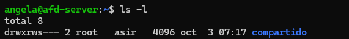
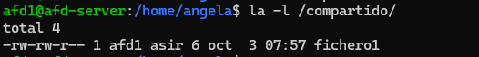
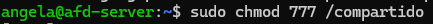
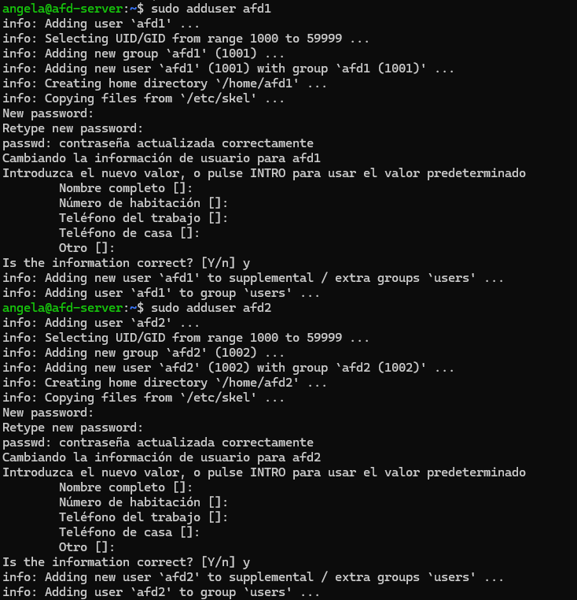
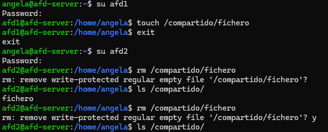
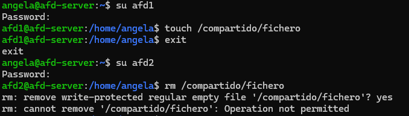

#### [Volver a Unidad 2](../index.md)

------------

# Unidad 2 - Práctica 1: Usuarios y permisos

## Ejercicio 1 - Permisos de usuario.

### Apartado 1. 

Primero crearemos el directorio "pr0201" usando el comando 'mkdir'. Dentro de este, crearemos otros 2 directorios. En mi caso lo he hecho con un solo comando. Para comprobarlo, empleamos el comando "ls".

Los permisos que tienen los directorios son todos para el usuario y grupo propietario y solo de lectura y ejecución para el resto de usuarios.
De esta menera solo yo puedo modificarlo (mi usuario es el único en el grupo, si hubiesen más en el grupo, esos también podrían), y el resto de usuarios solo pueden ver las carpetas y abrirlas pero no pueden modificarlas ni añadir archivos.

### Apartado 2. 

Cambiaremos los permisos usando notación simbólica. Empleando el comando "chmod".
   

### Apartado 3. 

Ahora deberemos añadirle los paermisos especificados usando notación octal.
   

### Apartado 4. 

Observando los permisos, el usuario propietario y el grupo propietario solo pueden leer y ejecutar. Y el resto de usuarios solo podrían ejecutar el directorio.

### Apartado 5. 

Si intetnas crear una carpeta dentro de la carpeta dir2, da error de acceso denegado, esto se debe a que como nos hemos quitado permisos de escritura sobre el directorio, no nos permite crear una carpeta.

### Apartado 6. 

Si nos volvemos a conceder permisos de escritura, ya nos permitirá crear el directorio.

## Ejercicio 2 - Notación octal y simbólica.
### 1. Notación simbólica:
Partiendo de que tenemos estos permisos: rw-r--r--

rwxrwxr-x:   `chmod u+w,g+w file`

rwxr--r--: `chmod u+x file`

r--r-----: `chmod u-w,a-w file`

rwxr-xr-x: `chmod u+x,g+x,a+x file`

r-x--x--x: `chmod u-w,u+x,g-r,g+x,a-r.a+x file`

-w-r----x: `chmod u-r,a-r.a+x file`

### 1. Notación octal.
Partiendo de que tenemos estos permisos: rw-r--r--

rwxrwxrwx: `chmod 777 file`

--x--x--x: `chmod 111 file`

r---w---x: `chmod 421 file`

-w-------: `chmod 200 file`

rw-r-----: `chmod 640 file`

rwx--x--x: `chmod 711 file`

rwxr-xr-x: `chmod 755 file`

r-x--x--x: `chmod 511 file`

-w-r----x: `chmod 241 file`

-----xrwx: `chmod 017 file`

## Ejercicio 3 - El bit setgid.

### Apartado 1. 

Creamos el grupo "asir".
   

Creamos los usuarios.

Ahora los añadimos al grupo asir con los siguientes comandos:

`sudo usermod -g asir afd1`

`sudo usermod -g asir afd2`

### Apartado 2. 

Creamos el directorio con el comando mkdir:

`mkdir compartido`

Ahora cambiamos al usuario y grupo propietario:

`chown root:asir compartido/`

Si hacemos un listado en formato largo `ls -l` verificamos que lo hemos hecho correctamente.

### Apartado 3. 

Cambiamos los permisos: 

`sudo chmod 770 compartido/`

Si volvemos a hacer un listado en formato largo, comprobaremos que lo hemos hecho bien.

### Apartado 4. 

Asignamos el bit setgid

`sudo chmod g+s compartido/`

### Apartado 5. 

Iniciamos sesión con afd1

`su afd1`

Y creamos un fichero en la carpeta "compartido"

`touch /compartido/fichero1`

Y editamos y añadimos algo de contenido

`nano /compartido/fichero1`

Comprobamos los permisos haciendo un listado en formato largo.

### Apartado 6. 

Iniciamos sesión con afd2. Primero salimos del otro usuario escribiendo `exit` e iniciamos sesión con el otro de la misma manera:

`su afd2`

Comprobamos si tenemos acceso y si podemos añadir contenido intentando editar el fichero que creamos antes.

`nano /compartido/fichero1`

El resultado es que si podemos acceder y si podemos modificar ficheros que se encuentren dentro de la carpeta "/compartido".

### Apartado 7. 

#### ¿Qué ventajas tiene usar el bit setgid en entornos colaborativos?

Como ventaja principal es la capacidad de que varios usuarios trabajen de froma cooperativa en el mismo directorio, de esta manera no existen problemas de que no puedes acceder a un fichero que necesitas porque no tienes permisos y así no se ve comprometido el resto de ficheros personales de los usuarios que estén fuera del directorio con el bit setgid.

#### ¿Qué sucede si no se aplica el bit setgid en un entorno colaborativo?

Si no se aplica, se podría solucionar creando grupos y asignandolo a los usuarios y a los directorios y ficheros. Pero este método es más tedioso.
Como cada usuario tiene su grupo principal, cada fichero que cree por defecto aparecerá como propietario ese grupo, de froma que puede haber conflictos de permisos y el resto de usuarios del entorno colaboativo no puedan acceder ni modificar los ficheros.

### Apartado 8. 

Eliminamos el directorio:

`sudo rm -dr /compartido`

Ahora eliminamos los usuarios

`sudo deluser -r afd1`

`sudo deluser -r afd2`

Como le pusimos el grupo "asir" como grupo principal, los grupos "afd1" y "afd2" no se han eliminado, así que deberemos eliminarlos manualmente.

`sudo delgroup afd1, afd2`

## Ejercicio 4 -

### Apartado 1. 

Creamos la carpeta "compartido" en el directorio raíz usando el comando mkdir

`sudo mkdir /compartido`

Ahora, le cambiamos los permisos para que todos los usuarios tengan todos los permisos usando el comando chmod.

### Apartado 2. 

Creamos 2 usuarios con mis iniciales, en mi caso "afd1" y "afd2"

### Apartado 3. 

Probaremos a crear un fichero con afd1 y eliminarlo con afd2.
Para ello, iniciaremos sesión empleando el comando `su`. Crearemos el fichero vacío con el comando `touch`, y lo eliminaremos con `rm`.

### Apartado 4. 

Ahora pondremos el "sticky bit" en el direcorio /compartido

`sudo chmod +t /compartido`

Si hacemos un `ls -l` veremos que se ha añadido el sticky bit, que corresponde a la t al final de todos los permisos estándar

### Apartado 5.

Si repetimos el proceso de crear un fichero con el usuario "afd1" e intentamos borrarlo con "afd2", nos daremos cuenta de que no existe problema al crearlo pero al intentar borrarlo con el segundo usuario, no tenemos permisos para ello.

### Apartado 6.

 #### ¿Qué efecto tiene el sticky bit en un directorio?

 Impide que los usuarios borren o renombren archivos de los que no son propietarios aunque tengan permisos para ello. Es una medida de seguridad.

#### Si tienes habilitado el sticky bit, ¿cómo tendrías que hacer para eliminar un fichero dentro del directorio?

Como está el sticky bit activado, solo desde el usuario root o el usuario propietario podrían eliminar el fichero

------------

#### [Volver a Unidad 2](../index.md)