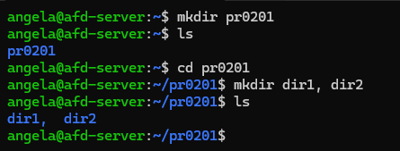
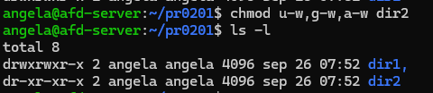
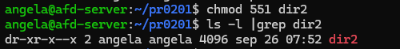
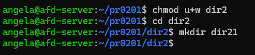
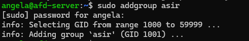
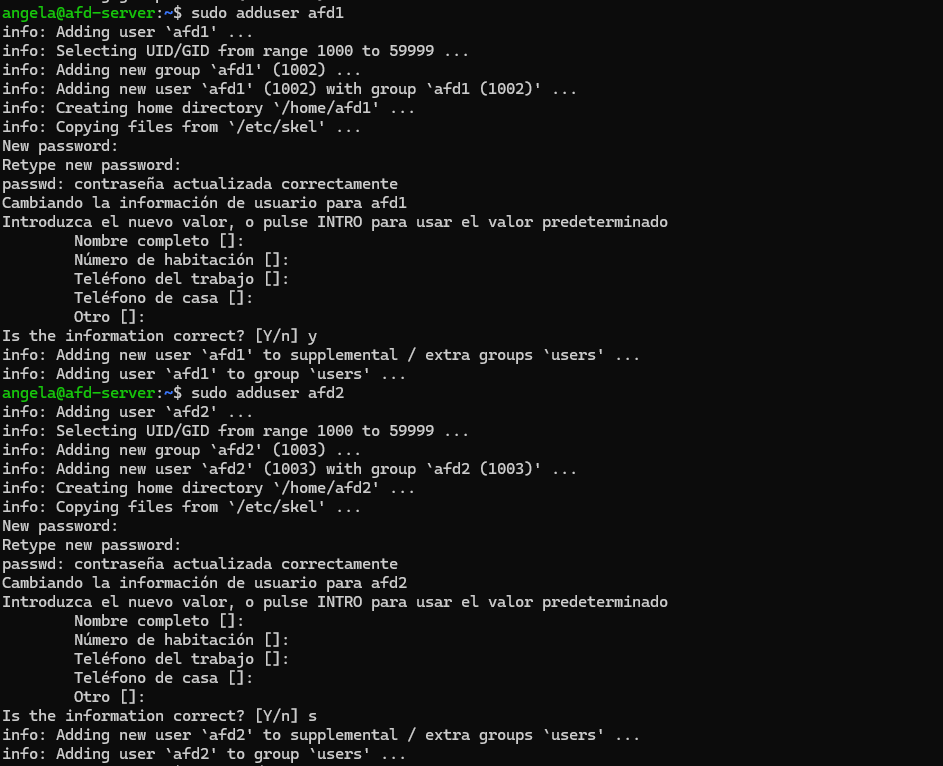
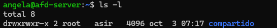
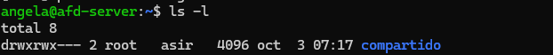

# Unidad 2 - Práctica 1

## Ejercicio 1 - Permisos de usuario.
1. Primero crearemos el directorio "pr0201" usando el comando 'mkdir'. Dentro de este, crearemos otros 2 directorios. En mi caso lo he hecho con un solo comando. Para comprobarlo, empleamos el comando "ls".

Los permisos que tienen los directorios son todos para el usuario y grupo propietario y solo de lectura y ejecución para el resto de usuarios.
De esta menera solo yo puedo modificarlo (mi usuario es el único en el grupo, si hubiesen más en el grupo, esos también podrían), y el resto de usuarios solo pueden ver las carpetas y abrirlas pero no pueden modificarlas ni añadir archivos.

2. Cambiaremos los permisos usando notación simbólica. Empleando el comando "chmod".
   

3. Ahora deberemos añadirle los paermisos especificados usando notación octal.
   

4. Observando los permisos, el usuario propietario y el grupo propietario solo pueden leer y ejecutar. Y el resto de usuarios solo podrían ejecutar el directorio.

5. Si intetnas crear una carpeta dentro de la carpeta dir2, da error de acceso denegado, esto se debe a que como nos hemos quitado permisos de escritura sobre el directorio, no nos permite crear una carpeta.

6. Si nos volvemos a conceder permisos de escritura, ya nos permitirá crear el directorio.

## Ejercicio 2 - Notación octal y simbólica.
### 1. Notación simbólica:
Partiendo de que tenemos estos permisos: rw-r--r--

rwxrwxr-x:   `chmod u+w,g+w file`

rwxr--r--: `chmod u+x file`

r--r-----: `chmod u-w,a-w file`

rwxr-xr-x: `chmod u+x,g+x,a+x file`

r-x--x--x: `chmod u-w,u+x,g-r,g+x,a-r.a+x file`

-w-r----x: `chmod u-r,a-r.a+x file`

### 1. Notación octal.
Partiendo de que tenemos estos permisos: rw-r--r--

rwxrwxrwx: `chmod 777 file`

--x--x--x: `chmod 111 file`

r---w---x: `chmod 421 file`

-w-------: `chmod 200 file`

rw-r-----: `chmod 640 file`

rwx--x--x: `chmod 711 file`

rwxr-xr-x: `chmod 755 file`

r-x--x--x: `chmod 511 file`

-w-r----x: `chmod 241 file`

-----xrwx: `chmod 017 file`

## Ejercicio 3 - El bit setgid.
1. 
Creamos el grupo "asir".
   

Creamos los usuarios.

Ahora los añadimos al grupo asir con los siguientes comandos:

`sudo usermod -g asir afd1`

`sudo usermod -g asir afd2`

2. 
Creamos el directorio con el comando mkdir:

`mkdir compartido`

Ahora cambiamos al usuario y grupo propietario:

`chown root:asir compartido/`

Si hacemos un listado en formato largo `ls -l` verificamos que lo hemos hecho correctamente.

3. 
Cambiamos los permisos: 

`sudo chmod 770 compartido/`

Si volvemos a hacer un listado en formato largo, comprobaremos que lo hemos hecho bien.

4. 
Asignamos el bit setgid

`sudo chmod g+s compartido/`

5. 
Iniciamos sesión con afd1
## Ejercicio 4 -