#### [Volver a Unidad 2](../index.md)

------------

# Unidad 2 - Práctica 2: Conexión SSH

## Ejercicio 1 - Preparación de la máquina y configuración de la red

### Apartado 1.

Desde la interfaz de VirtualBox añadimos un adaptador en modo solo anfitrión para poder conectarnos desde nuestra máquina física.

### Apartado 2.

Encendemos la máquina y comprobamos la IP que tenemos usando el comando `ip a`.
Como no nos da IP, deberemos acceder al archivo de configuración de las interfaces de red para ver que está activado el dhcp.
Accedemos haciendo `sudo nano /etc/netplan/50-cloud-init.yaml`
Deberemos añadir el segundo adaptador de la siguiente manera:

Ahora aplicamos los cambios: `sudo netplan apply`
Ahora por último comprobaremos de nuevo que ip nos da usanod el comando `ip a`

### Apartado 3.

Para probar la conectividad entre máquina virtual y máquina anfitriona, haremos un `ping` desde nuestra máquina virtual a nuestra anfitriona o viceversa.
Si el resultado del ping no es error, las máquinas están conectadas entre sí.

### Apartado 4.

Para cambiar el nombre del host cambiaremos el nombre desde un archivo de configuración, haremos:

`sudo nano /etc/hostname`

Aquí cambiaremos el nombre que teniamos que era "asoserver" y lo cambiaremos por "afd_server"

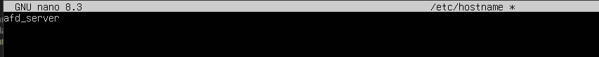

Para comprobarlo, podemos ejecutar el comando `sudo hostnamectl`. Esto nos dará una serie de datos siento el primero el 'hostname'. Verificamos que ahí pone afd_server.

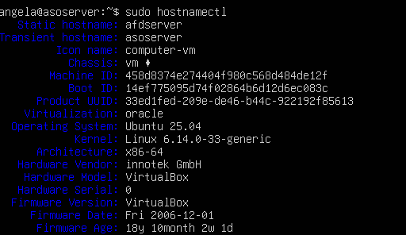

Para comprobar si lo he hemos hecho bien, podemos usar el comando `hostname`. Si vemos que nuestro nombre de host no ha cambiado, deberemos usar el comando `sudo hostnamectl set-hostname afd_server` para cambiar el nombre de host.

### Apartado 5.

Para resolver localmente el nombre del servidor deberemos ir al archivo de configuración en C:\Windows\System32\Drivers\etc\hosts
Ahí, al final del documento escribiremos la ip de nuestra máquina virtual con el nombre de host.

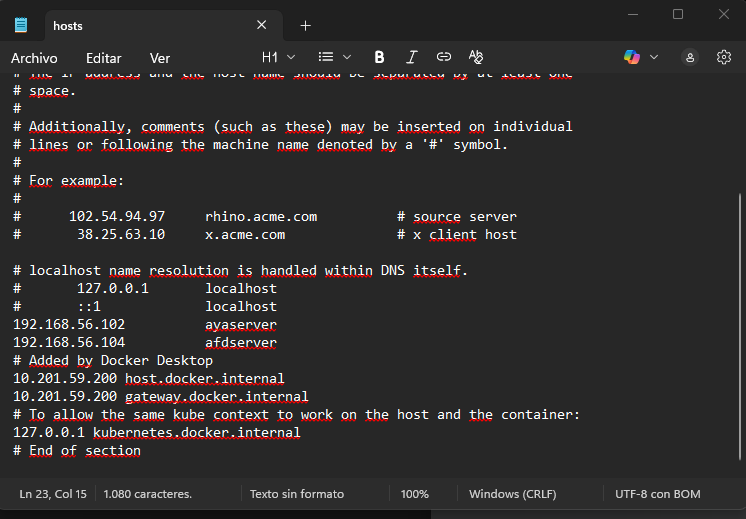

Ahora si intentamos conectarnos por ssh pero en vez de poner la ip ponemos el nombre de host, funcionará como si hubiesemos escrito la ip

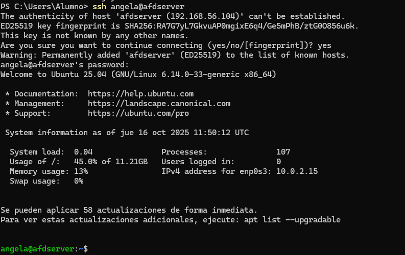

## Ejercicio 2 - Creación del usuario y conexión SS

### Apartado 1. 

Desde nuestra máquina Ubuntu Server crearemos el usuario afd_ssh, para ello emplearmeos el comando `adduser`

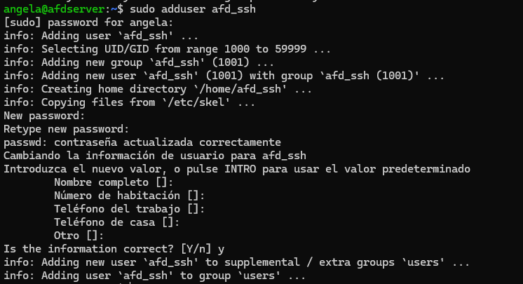

### Apartado 2.

Comprobamos que podemos conectarnos por ssh a ese usuario desde PowerShell escribiendo `ssh sfd_ssh@<ip\nombrehost>`:

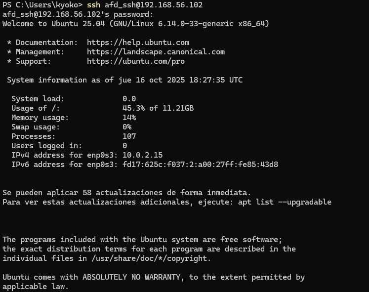

En este caso nos podemos conectar correctamente.
Si no pudiesemos sería coveniente comprobar el estado del servicio ssh, y activarlo por si se diese el casso de que no está activado. Para ello se usan los siguientes comandos:

`sudo systemctl status ssh`

`sudo systemctl enable ssh`

### Apartado 3.

Desde Windows, usamos el comando `ssh-keygen` desde PowerShell, eso nos genera 2 claves, una publica y otra privada, que nos las genera en C:\users\alumno.ssh siendo alumno el nombre del usuario con el que estemos iniciados sesión.
Saldrán dos claves con un nombre similar a `id_ed25519` y `id_ed25519.pub`. 
El que tiene extensión .pub corresponde a la clave publica, esa es la que deberemos enviar a nuestra máquina virtual.
Para enviar la clave usamos scp, que funciona parecido al comando cp, lo ejecutaremos desde nuestro PowerShell:
`scp .\id_ed25519.pub angela@<ipmaquina>:~`

Si ahora accedemos a nuestra máquina virtual y hacemos un ls en el directorio personal, veremos que ahí está la clave pública.

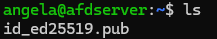

Si hacemos un `ls -a` veremos que tenemos una carpeta llamada .ssh

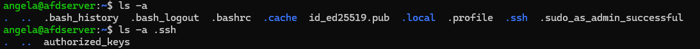

Hay que añadir el contenido de la clave publica a authorized_keys, para ello usamos 

`cat id_ed25519.pub > .ssh\authorized_keys`

(Usaremos el redireccionamiento ">>" si el fichero de authorized_keys no estuviese vacío y así añadiríamos el contenido)

>💡 Un buen habito ahora es desactivar el inicio de sesión sin contraseña
Eso se hace desde `sudo nano /etc/ssh/sshd_config`
Deberemos buscar en el archivo una opción que etsá comentada que es PasswordAunthentication, la desconectaremos y luego añadiremos "no".
De esta manera cada vez que accedamos no nos pedirá contraseña porque revisará las claves público y privada.

## Ejercicio 3 - Conexión transparente a Github.

Desde el navegador de nuestro ordenador, accedemos a GitHub.
En Configuración de nuestro perfil, si nos fijamos en el menú lateral izquierdo existe la opción SSH and GPG keys.

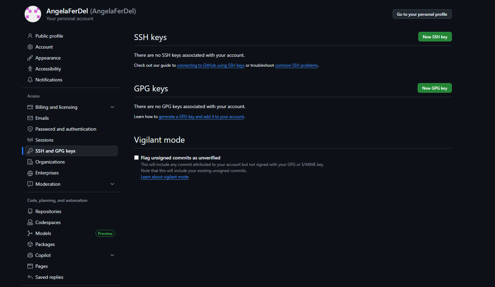

Desde aquí podremos añadir nuestra clave pública que hayamos generado con SSH o con GPG. en este caso como tenemos la de ssh, le daremos a New SSH Key.

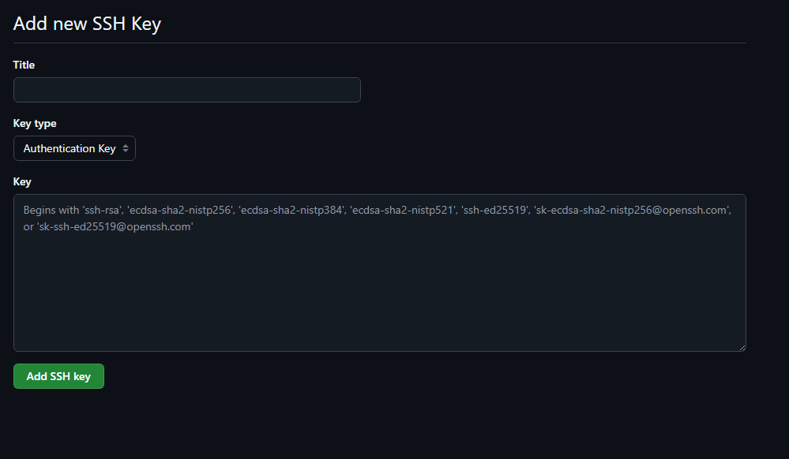

Aquí podremos ponerle un título para identificar mejor de donde es esta clave, seleccionar el tipo de clave, y escribimos nuestra clave pública donde hay un cuadro de texto grande.
Una vez lo hemos puesto aparecerá algo parecido a esto:

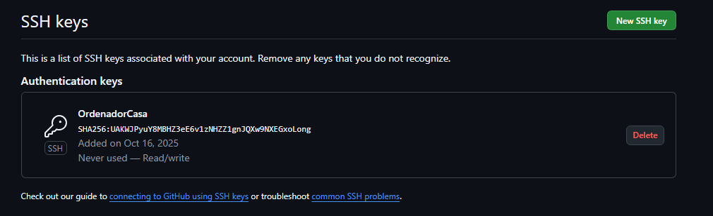

------------

#### [Volver a Unidad 2](../index.md)