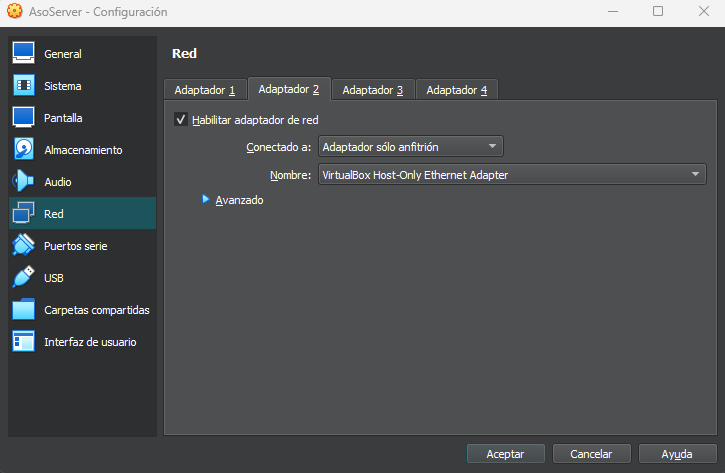
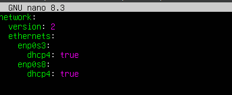
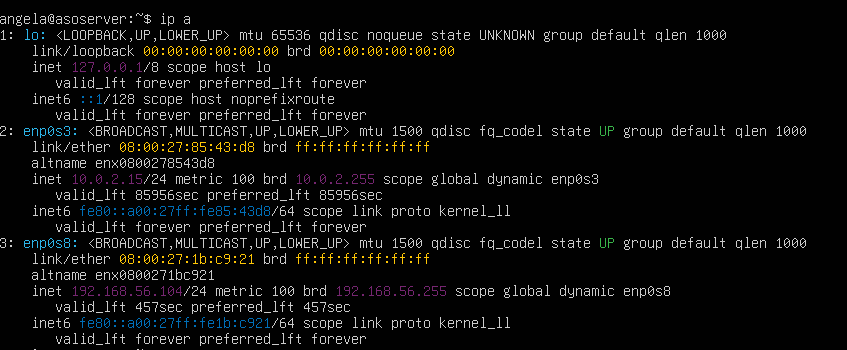
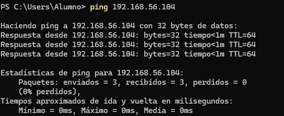

#### [Volver a Unidad 2](../index.md)

------------

# Unidad 2 - Práctica 2: Conexión SSH

#### 1. Preparación de la máquina y configuración de la red

1.

Desde la interfaz de VirtualBox añadimos un adaptador en modo solo anfitrión para poder conectarnos desde nuestra máquina física.

2.

Encendemos la máquina y comprobamos la IP que tenemos usando el comando `ip a`.
Como no nos da IP, deberemos acceder al archivo de configuración de las interfaces de red para ver que está activado el dhcp.
Accedemos haciendo `sudo nano /etc/netplan/50-cloud-init.yaml`
Deberemos añadir el segundo adaptador de la siguiente manera:

Ahora aplicamos los cambios: `sudo netplan apply`
Ahora por último comprobaremos de nuevo que ip nos da usanod el comando `ip a`

3.

Para probar la conectividad entre máquina virtual y máquina anfitriona, haremos un `ping` desde nuestra máquina virtual a nuestra anfitriona o viceversa.
Si el resultado del ping no es error, las máquinas están conectadas entre sí.

4.

5.

#### 2. Creación del usuario y conexión SS

------------

#### [Volver a Unidad 2](../index.md)