#### [Volver a Unidad 2](../index.md)

------------

# Unidad 2 - Práctica 3: Conexión SSH de varios usuarios

## Preparación del entorno.

Será necesario 3 máquinas virtuales:
- Servidor A
- Servidor B
- Servidor C

Necesitaremos una red solo-anfitrión que se conectará a SERVER-A.

También necesitarás dos redes internas: 10.20.0.0/16 y 10.30.0.0/16.

Las máquinas SERVER-A y SERVER-B estarán conectadas a la primera red, mientras que SERVER-B (que tendrá 2 adaptadores de red) y SERVER-C estarán conectadas a la segunda red.

El equipo SERVER-A tendrá un usuario con mi nombre (angela)

Los equipos SERVER-B y SERVER-C tendrán un usuario llamado sysadmin

## Configuración de máquinas virtuales.

Las máquinas de los 3 servidores serán **Ubuntu Server 25.04**. 

Durante la instalación deberemos marcar la instalación del servidor **Open-SSH**.

Los nombres de usuario y hostnmame serán los indicados por el ejercicio:

- Server-A: angela
- Server-B: sysadmin
- Server-C: sysadmin

En la máquina virtual de Server-A pondremos 4 adaptadores de red: 1 adaptador en NAT y 3 en Host-Only (Solo-Anfitrión).

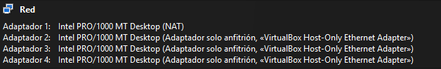

En las máquinas virtuales de Server-B yt Server-C tendrán 2 adaptadores de red cada una: 1 adaptador de red en modo NAT y 1 adaptador de red en modo Host-Only (Solo-Anfitrion).

## Configuración de red.

### Server-A.

Como tenemos un adaptador en NAT, , si empleamos el comando `ip a` podremos ver que este es el único adaptador de red que tiene IP, en este caso tenemos la IP: **10.0.2.15**.
Nos apuntaremos el nombre del resto de adaptadores de red, el resto de adaptadores de red tienen los nombres:

- enp0s8.
- enp0s9.
- enp0s10.

Para que el resto de adaptadores de red tengan IP deberemos editar el archivo de configuración: `sudo nano /etc/netplan/50-cloud-init.yaml`.

En este archivo deberemos añadir unas líneas en la configuración referentes a cada adaptador de red.

>💡 Es importante tener en cuenta que cada tabulación corresponde a dos espacios escritos.

Deberá quedar el archivo de configuración de la siguiente manera:

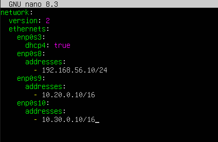

Para aplicar los cambios escribiremos el comando `sudo netplan apply`.

Comprobaremos las IPs usando el comando `ip a`. Las IPs deberían quedar así:

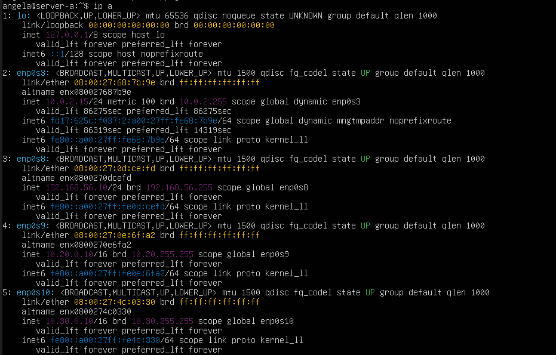

Podemos comprobar que los adaptadores tienen las IPs:
- 192.168.56.10/24
- 10.20.0.10/16
- 10.30.0.10/16

Para comprobar que funciona nos conectaremos por SSH a la IP 192.168.56.10/24

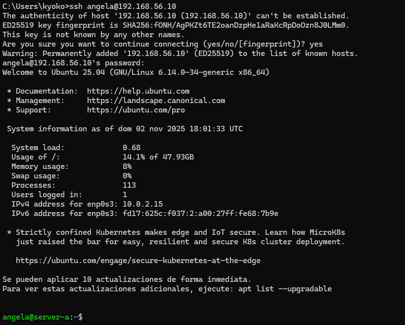

Veremos que se ha conectado con éxito.

### Server-B y Server-C.

Primero deberemos comprobar el nombre de los adaptadores usando el comando `ip a`.
Configuraremos el archivo: `sudo nano /etc/netplan/50-cloud-init.yaml` para darles IPs a los adaptadores de red quee stán en modo Host-Only.

- Resultado del archivo de configuración en el Server-B:

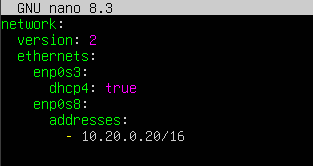

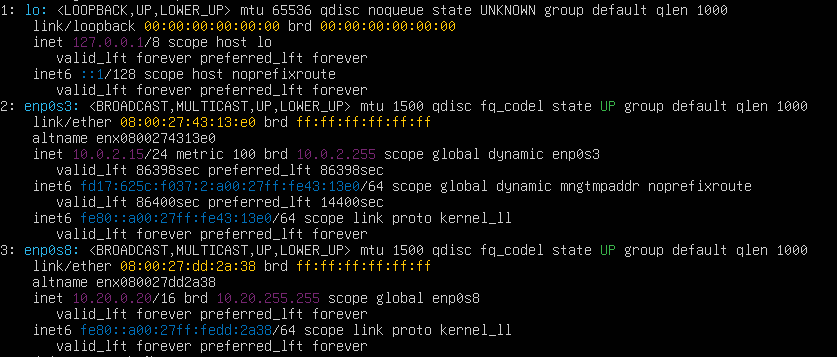

- Resultado del archivo de configuración en el Server-C:

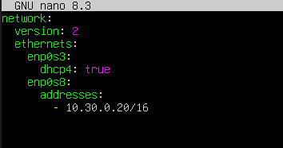

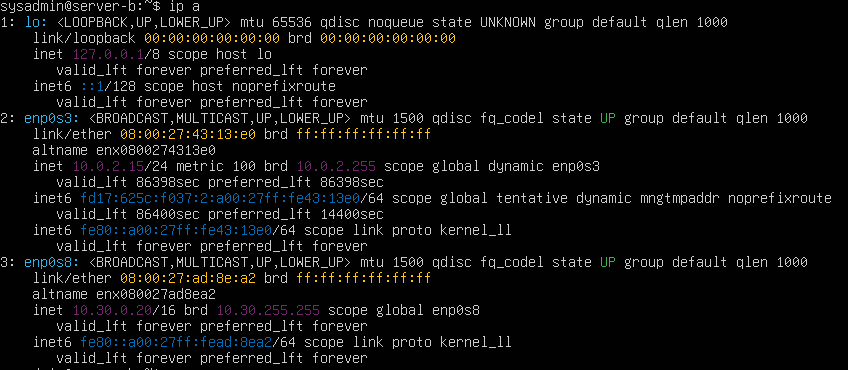

### Prueba de conectividad.

Ahora con toda la red configurada deberemos comprobar las siguientes conexiones:

- Desde Server-B haremos `ping` a 10.20.0.10 (adaptador de Server-A)

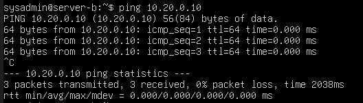

- Desde Server-C: haremos `ping`a 10.30.0.10 (adaptador de Server-A)

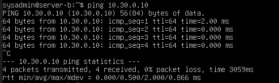

- Conectarnos por SSH a el Server-B y el Server-C desde nuestra máquina anfitriona.
>💡 Debería dar error.

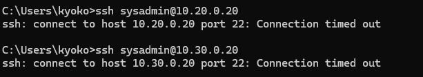

**Si todo esto funciona correctamente, tenemos la red bien configurada.**

## Configuración de claves SSH.

Generaremos claves SSH para poder acceder a las maquinas sin una contraseña.

1. Generamos las claves desde la máquina anfitriona usando el comando `ssh-keygen`. Esto generará un par de claves, una pública y otra privada. La pública termina con la extensión .pub

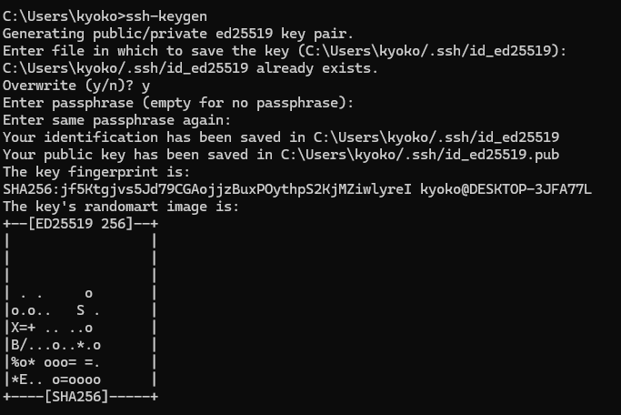

2. Usando el comando `scp` copiaremos la clave pública a nuestro Server-A de la siguiente manera:

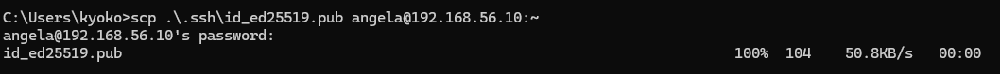

3. Nos conectamos por ssh a nuestro Server-A. Desde ahí, moveremos el archivo de la clave pública que hemos puesto en el directorio personal para añadirlo al documento **.ssh/authorized_keys**

>💡 Si ahora comprobamos a salir y volver a acceder mediante ssh, ahora no nos pedirá la contraseña.

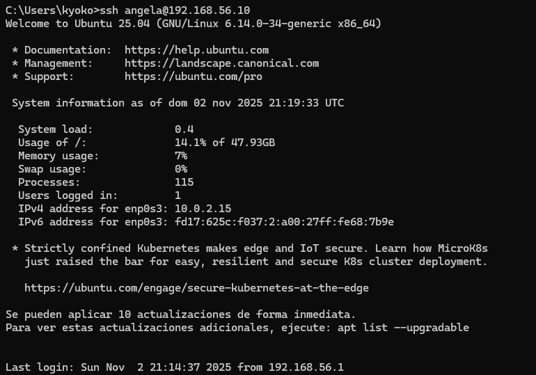

4. Desde el Server-A, generamos otro par de claves usando el comando `ssh-keygen -b 1024`

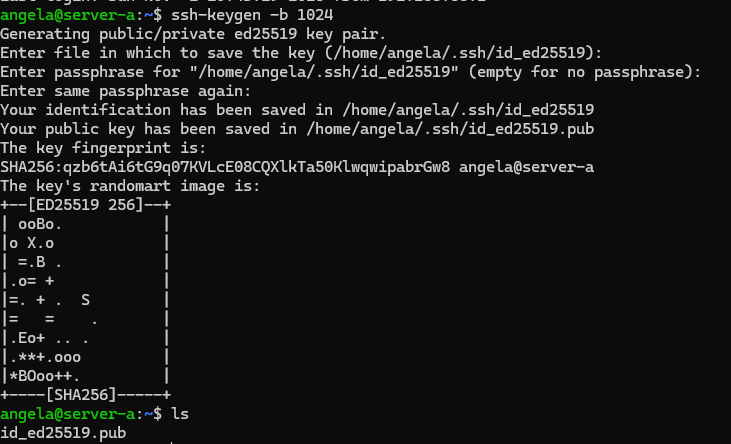

5. Esto genera un par de claves, una pública y privada, deberemos copiar la clave pública a el Server-B y al Server-C. para ello usaremos de nuevo el comando `scp`.

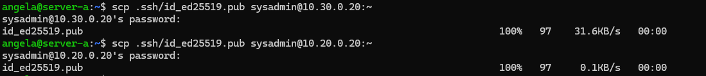

6. Entraremos ahora por ssh al Server-B, añadiremos el contenido de la clave al fichero `.ssh/authorized_keys`

>💡 Si ahora comprobamos a salir y volver a acceder mediante ssh, ahora no nos pedirá la contraseña.

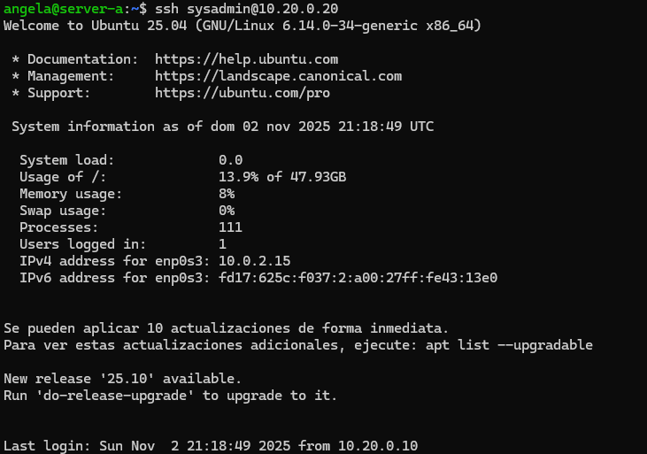

8. Ahora repetiremos el proceso desde el Server-C, primero accedemos desde ssh y copiamos el contenido de la clave pública en el fichero `.ssh/authorized_keys`.

> Aunque en la captura el nombre sea server-b, se trata del server-c, para agilizar el proceso de creación de máquinas cloné la máquina server-b para no tener que hacer dos y olvidé cambiar el hostname.

>💡 Si ahora comprobamos a salir y volver a acceder mediante ssh, ahora no nos pedirá la contraseña.

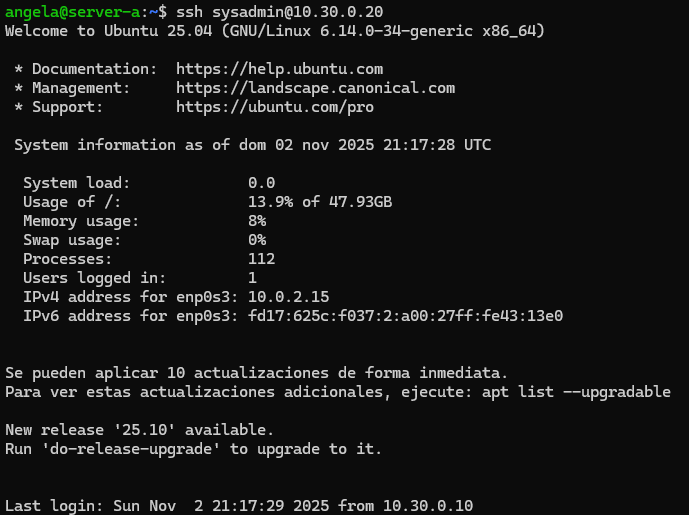

------------

#### [Volver a Unidad 2](../index.md)