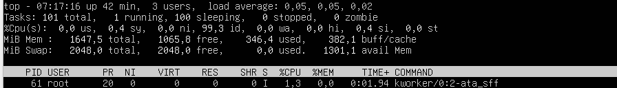
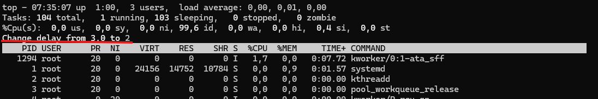
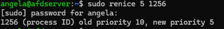
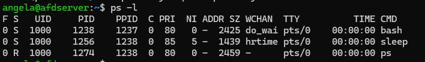
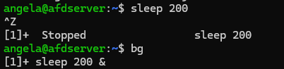
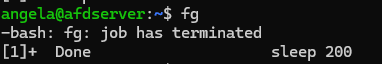
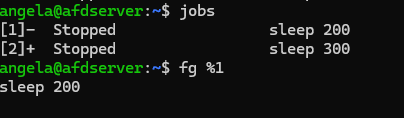
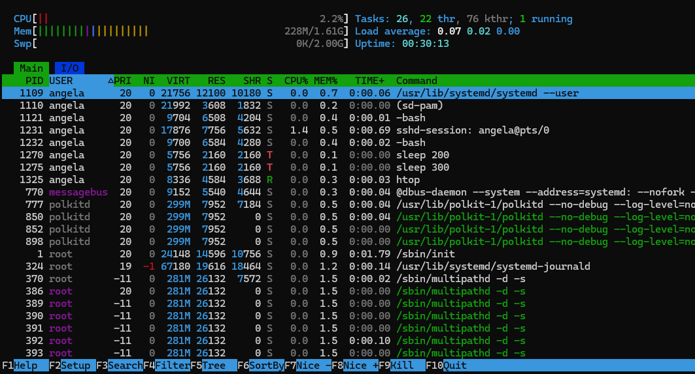
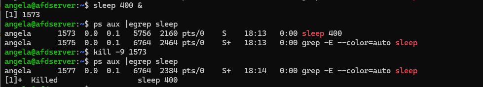

#### [Volver a Unidad 2](../index.md)

------------

# Unidad 2 - Práctica 4: Gestión de procesos en Linux

## Ejercicio 1 - Exploración básica de procesos.

### Apartado 1.

Usando el comando `ps` en mi caso solo muestra 2 procesos, para poder listar 3 habría que poner otro proceso a ejecutarse.
Los PID de los 2 únicos procesos que me salen son: 1222 y 1282, correspondientes a `bash`y a `ps`.

### Apartado 2.

Empleamos el comando `ps aux` desde la terminal, en la lista de todos los procesos podemos observar por ejemplo procesos hechos por el usuario root, su PID es el siguiente: 896, que corresponde a **login --angela**

### Apartado 3.

#### ¿Qué diferencia hay entre el comando ps y ps aux?

`ps` es el comando base, sin ningún tipo de modificador, solo permite ver los procesos que ese estén ejecutando en la temrinal en la que estemos trabajando, mientras que `ps aux`  corresponde a listar todos los procesos (`ps a`), mostrar los propietarios de los procesos (`ps u`) y mostrar los procesos que no tengan una terminal asignada (`ps x`)

#### Cuando decimos que un proceso pertenece a un usuario, ¿qué implicaciones tiene? Es decir, ¿en qué afecta eso al proceso?

El usuario propietario del proceso implica que ese usuario es el que ha ejecutado dicho proceso.
Además, ese proceso tendrá los permisos del propietario, es decir, un proceso con un usuario normal no podrá eliminar directorios del directorio raíz por mucho que queramos ejecutar el proceso. Ese proceso deberá hacerlo el usuario root.

## Ejercicio 2 - Monitorización de procesos en tiempo real.

### Apartado 1.

Usando el comando `top` en nuestra terminal nos muestra el listado de procesos activos pero de forma dinámica.
Qué proceso ocupa más porcentaje de la CPU cambia cada aproximadamente 5 segundos.
Así que en el momento actual es este:

Su PID es: **61**

### Apartado 2.

Si mientras se está ejecutando `top` pulsamos la tecla `M`en nuestro teclado, además de ordenarse por porcentaje de CPU, se ordenará por porcentaje de memoria usada. En este caso, el proceso que ocupa más memoria es el siguiente:

Su nombre es: **systemd**

### Apartado 3.
#### ¿Qué columnas de información se muestran en top y cuál es su significado?

Las columnas que muestran el comando top son las siguientes:

- **PID**: Identificador del proceso.
- **USER**: Usuario propietario/que ejecuta el proceso.
- **PR**: Prioridad con la que se ejecuta el proceso en el kernel.
- **NI**: Prioridad del proceso.
- **VIRT**: Cantidad de memoria virtual utilizada para este proceso. 
- **RES**: Cantidad de memoria residente ocupada por este proceso.
- **SHR**: Cantidad de memoria compartida empleada para el proceso.
- **S**: *"State"*, el estado del proceso
- **%CPU**: Porcentaje de CPU que ocupa el proceso.
- **%MEM**: Porcentaje de memoria que ocupa el proceso.
- **TIME+**: Tiempo que lleva ejecutandose el proceso.
- **COMMAND**: Nombre del proceso.

#### ¿Cómo puedes cambiar el intervalo de actualización de top?

Para cambiar la frecuencia de muestreo del comando `top`, mientras este se esté ejecutando pulsaremos la letra `d`en nuestro teclado. Ahora deberemos introducir el tiempo de muestreo en segundos y le daremos a Enter para aplicar los cambios.

## Ejercicio 3 - Detener y reanudar procesos.

### Apartado 1.

Ejecutamos el comando `sleep 300 &`, con esto crearemos un proceso de 300 segundos.

### Apartado 2.

Si ejecutamos el comando `jobs`, nos mostrará todos los procesos en segundo plano, en este caso, nos aparece el proceso que creamos antes, para que nos muestre el id deberemos añadirle le modificafor `-l`, de forma que para que nos muestre su ID deberemos ejecutar `jobs -l`
El ID del proceso es: **1963**

### Apartado 3.

Para detener el proceso usaremos el comando `kill` añadiendo como modificador el número de la señal que queremos enviarle.
En este caso haremos `kill -n 20 1963`

### Apartado 4.

Para ahora reanudar el proceso, enviaremos la señal 18 con el comando kill usando el comando:
`kill -n 18 1963`

### Apartado 5.
#### ¿Qué efecto tiene la señal SIGSTOP sobre un proceso?

Detiene temporalmente el proceso, como si hubiésemos pulsado Ctrl+Z mientras ejecutamos un proceso.
Deja el proceso preparado para poder continuarlo en cualquier momento con la señal SIGCONT(18).

#### ¿Cómo puedo verificar si un proceso está detenido o en ejecución?

Tanto en el comando `ps` como en `top` existe una columna que hace referencia al estado del proceso, que está representado con una letra. Esto indica si está:
- Detenido -> **S**
- En ejecución -> **R**
- Dormido -> **D**
- Haciendo trazas o parado -> **T**
- Zombie -> **Z**

## Ejercicio 4 - Terminar procesos.

### Apartado 1.

De la misma forma que en el ejercicio anterior, creamos un proceso usando el comando `sleep 600 &`.

### Apartado 2.

Usamos el comando `ps aux` para observar el PID del proceso.
Para que la búsqueda sea más fácil, usaremos `ps aux | egrep "sleep 600"`
En el resultado que nos sale veremos nuestro proceso con su PID, que es el **2000**.

### Apartado 3.

Mataremos el proceso usando el comando `kill` junto con la señal SIGKILL que es el número 9.
De forma que si ejecutamos:  `kill -n 9 2000` mataremos el proceso.

### Apartado 4.
#### ¿Qué diferencia hay entre las señales SIGTERM y SIGKILL?

SIGTERM envía una petición a los procesos para que finalicen de forma ordenada. 
Mientras que SIGKILL manda la señal que fuerza a que finalicen inmediatamente.

#### ¿Por qué es preferible utilizar SIGTERM antes que SIGKILL para terminar un proceso?

Porque es posible que al mandar finalizar a los procesos de forma abrupta ocurran errores por procesos que se queden a medias. Si se emplea SIGNTERM, ese problema se soluciona pues antes de finalizar terminan de hacer su función y se cierran ordenadamente.

## Ejercicio 5 - Prioridades de procesos.

### Apartado 1.

Emplearemos el comando `nice -n 10 sleep 300 &` para crear un proceso con prioridad baja.

### Apartado 2.

Emplearemos el comando `ps -l` para ver la propridad del proceso.
Miraremos el valor de NI que en este caso es **10**.

### Apartado 3.

Cambiaremos la prioridad del proceso usando el comando `renice` para que sea 5 de la siguietne manera:
`renice <valor> <PID>`

Comprobamos que hemos realizado correctamente los cambios con un `ps -l`

### Apartado 4.

#### ¿Para qué sirve el comando `nice`?

Nice es el comadno que sirve para crear un proceso con un valor de prioridad concreto.

#### ¿Qué rango de valores puede tomar la prioridad (nice value) de un proceso y qué significa cada extremo?

Los valores deprioridad en Linux van desde -20 , que es la prioridad más alta hasta 19 que es la prioridad nás baja.

#### ¿Qué ocurre si intentas cambiar la prioridad de un proceso que no te pertenece?

Da automáticamente error por falta de permisos Si quieres cambniar la prioridad de un proceso que no ha creado tu  usuario deberás cambiarlo desde el root empleando sudo.

## Ejercicio 6 - Procesos en primer y segundo plano.

### Apartado 1.

Ejecutamos el comando `sleep 200` y después detenmos el proceso pulsando Ctrl+ Z.

### Apartado 2.

Usamos el comanodo `bg` qeue significa literalmente *background*. Este comando mueve todos los procesos detenidos para que se ejecuten en segundo plano. Si lo ejecutamos veremos el comando **sleep 200** que ejecutamos antes.

### Apartado 3.

Para trare el proceso desde segundo plano a primer plano usamos el comanod `fg`. Al hacerlo, todos los procesos que estaban en segundo planan pasarán al primero para termianrse.

### Apartado 4.

#### ¿Qué significa que un proceso está en segundo plano?

Significa que ese proceso se está ejecutando sin la necesidad de que el usuario interactue directamente con él.

#### ¿Qué comando utilizarías para mover un proceso detenido a segundo plano?

Primero el proceso deberá estar detenido (Ctrl+Z). EL comando para moverlo a segundo plano es `bg`.

#### ¿Cómo puedes traer un proceso de segundo plano a primer plano si tienes múltiples trabajos en segundo plano?

El comando para traer un proceso a primer plano es `fg`. Si queremos mover un proceso en concreto primero observaremos con el comando `jobs` y veremos su identificador.
Una vez lo hemos observado, usaremos el comando `fg`con el modificador `%N` donde N es el número identificador del proceso. Por ejemplo:

## Ejercicio 7 - Uso de `pstree` y `htop`.

### Apartado 1.

Procederemos con el uso del comando `htop`. Comprobaremos o instalaremos este servicio usando el comando tipico para instalación en Linux:

`sudo apt install htop`

### Apartado 2.

Si empelamos el comando `htop` veremos una tabla de procesos con la que se puede interactuar. Si hacemos clic en los titulos de las columnas se nos filtrará por lo que hayamos hecho clic. Por ejemplo:

### Apartado 3.

Con el comando `pstree` podemos ver en forma de árbol con ramificaciones de dependencia que procesos dependen de otros.
En mi caso, el proceso **bash** hace de padre para los siguientes procesos hijos: **pstree** y **2*sleep**.

### Apartado 4.
#### ¿Qué ventaja tiene utilizar pstree frente a ps para visualizar procesos?

La ventaja principal es poder ver directamente y de forma visual las dependencias que tienen los procesos. De esta forma si vamos a trastear con procesos sabremos cuales no debemos tocar para que los procesos hijos no se detengan.

#### ¿Cómo puedes filtrar procesos por usuario en htop?

Con el comando `htop` es tan facil como hacer clic en la parte de la columna referente al usuario donde pone **USER**. De esta menera se ordena por usuarios.

## Ejercicio 8 - Matar procesos de manera forzosa.

### Apartado 1.

Para probar la forma de matar procesos deberemos crear uno, para ello emplearemos el comando `sleep 400 &`

### Apartado 2.

Para matar un proceso usaremos el comando `kill -9`, deberemos mirar primero el PID del proceso para poder añadirlo al final del comando de la siguiente manera:

### Apartado 3.

#### ¿En qué casos sería necesario usar kill -9 en lugar de kill sin opciones?

El comando `kill` sin ningún tipo de modificador envía una petición **SIGTERM 15**, este tipo de solicitud pide que cuando sea seguro se detenga el proceso.
Sin embargo, el comando `kill -9` lo que envía es una señal **SIGKILL 9**, esta pide que de forma imediata y forzosa se detenga el proceso sin importar su estado.

#### ¿Qué riesgos implica usar SIGKILL para terminar un proceso?

**SIGKILL** es una señal que envía para finalizar un proceso de forma inmediata y forzosa. Esto puede suponer el riesgo principal de que el proceso se quede a medias en lo que esté haciendo y produzca bugs o errores en el sistema.

------------

#### [Volver a Unidad 2](../index.md)