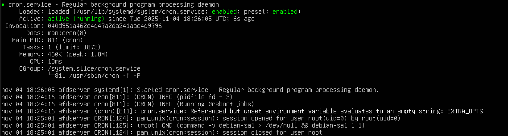
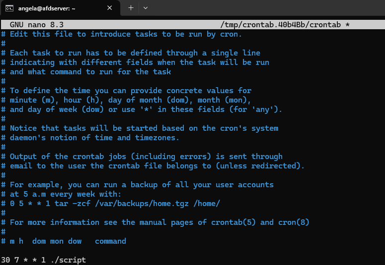
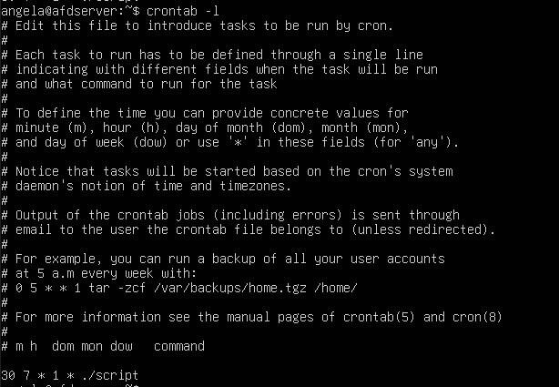
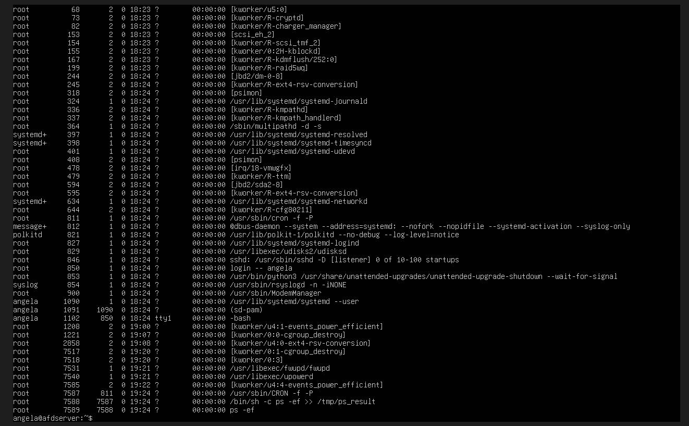
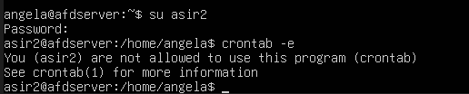
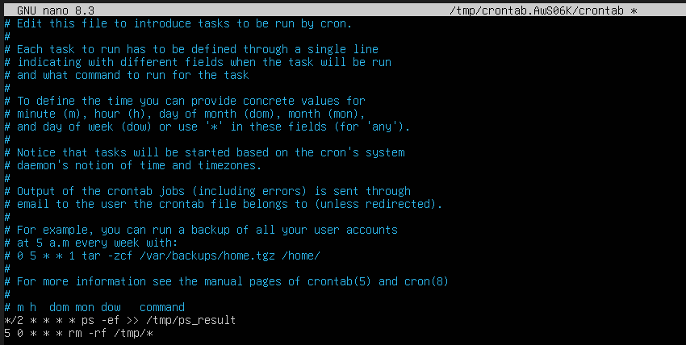

#### [Volver a Unidad 2](../index.md)

------------

# Unidad 2 - Práctica 5: Programación de tareas con `cron`.

## Ejercicio 1 - ¿Qué orden pondrías en crontab en los siguientes casos?

### La tarea se ejecuta cada hora

`0 * * * * comando`

### La tarea se ejecuta los domingos cada 3 horas

`0 */3 * * 0 comando`

### La tarea se ejecuta a las 12 de la mañana los días pares del mes.

`0 12 2-30/2 * * comando`

### La tarea se ejecuta el primer día de cada mes a las 8 de la mañana y a las 8 de la tarde.

`0 8,20 1 * * comando`

### La tarea se ejecuta cada media hora de lunes a viernes.

`*/30 * * * 1-5 comando`

### La tarea se ejecuta cada cuarto de hora, entre las 3 y las 8, de lunes a viernes, durante todo el mes de agosto.

`*/15 3-8 * 8 1-5 comando`

### La tarea se ejecuta cada 90 minutos

No se puede poner en una sola linea de crontab 90 minutos porque 90 minutos = 1 hora y 30 minutos. Si analizamos el caso, nos damos cuenta que se ejecutaria a las siguientes horas: 00:00, 01:30, 03:00, 04:30, 06:00, 07:30, 09:00, 10:30, 12:00, 13:30, 15:00, 16:30, 18:00, 19:30, 21:00, 22:30
Podemos observar que se ejecuta a horas en punto cada tres horas, eso podemos hacerlo. Y que se ejecuta a horas y media cada 3 horas también empezando a la 1 de la mañana, eos también podemos hacerlo. De forma que podemos dividir esto en 2 líneas de crontab:

`0 */3 * * * comando`

`*/30 1-23/3 * * * comando`

## Ejercicio 2 - ¿Cómo compruebas si el servicio cron se está ejecutando?

Usaremos la línea de comando `sudo systemctl status cron`.

El resultado que nos muestra nos fijaremos en el texto que aparece en color, si está verde pondrá que está *enabled* que significa que está habilitado y miraremos si pone *acrive(running)*, esto quiere decir que el servicio está activo y ejecutandose.

## Ejercicio 3 - ¿Cuál es el efecto de la siguiente línea crontab?

    */15 1,2,3 * * * who > /tmp/test

Esta linea de crontab indica que a la 1:15, 2:15 y 3:15, todos los días de todos los meses se ejecuta el comando `who` que devuelve qué usuarios están conectados al sistema, y el resultado del comando se redirecciona a la ruta: `/tmp/test`, al estar redireccionado solo con un símbolo `>` cada vez que se ejecute sobreescribirá el anterior.

## Ejercicio 4 - Indica la ruta del fichero crontab del sistema

El fichero crontab en el sistema se encuentra en `/etc/crontab`.

También existe otro fichero crontab correspondiente a cada usuario, cada usuario puede encontrarlo en: `/var/spool/cron/crontabs/` aunque no se edita desde ahí, se edita usando el comando `crontab -e`

## Ejercicio 5 - ¿Qué ficheros controlan los usuarios que pueden utilizar el crontab?

Los archivos que controlan el acceso son:
- `/etc/cron.allow`: Aquí pondremos la lista de usuarios autorizados a usar crontab.
- `/etc/cron.deny`: Aqui pondremos la lista de usuarios no autorizados a usar crontab.

No es necesario que existan los 2 archivos a la vez.
Si solo tenemos el archivo cron.allow, por defecto el resto de usuarios tendrán el acceso restringido. Por el contrario, si solo tenemos el archivo cron.deny, por defecto todos tendrán acceso a excepción de los que aparezcan en ese fichero.

## Ejercicio 6 - Excepcionalmente se debe iniciar una tarea llamada script.sh todos los lunes a las 07:30h antes de entrar en clase ¿Cómo lo harías?

Con esa descripción de la tarea la línea que deberemos añadir a crontab es la siguiente, hay que tener en cuenta la ruta donde se encuentra el script, como es un caso hipotetico no lo tengo en ningún sitio así que la ruta me la invento:

`30 7 * 1 * ./script.sh`

Para añadir esto a crontab emplearemos el comando `crontab -e`. Cuando lo ejecutemos nos hará elegir seleccionando un número del 1 al 4 que editor queremos emplear, el recomendado es nano (1).
Una vez se nos ha abierto el fichero añadiremos la línea al final del fichero, sin comentar.

## Ejercicio 7 - Se ha cancelado la tarea. ¿Cómo listar y luego, suprimir la tarea?

Para listar las tareas se emplea el comando `crontab -l`. Este comando nos enseña las tareas que tenemos activas en este momento. Si lo ejecuto, por ejemplo, saldría esto:

> Las lineas que empiezan por *#* están comentadas, esas no se ejecutan, nos fijaremos en las no comentadas.

Para eliminarla o bien la borramos del fichero usando `crontab -e` o podemos borrar todas las tareas con un solo comando `crontab -r`

## Ejercicio 8 - Ejecuta el comando ps -ef para el usuario root cada 2 minutos y redirecciona el resultado a /tmp/ps_result sin sobrescribir los antiguos.

Para crear una tarea programada para root deberemos ejecutar el comando para añadir tareas a crontab pero desde root. Es decir, ejecutaremos `sudo crontab -e`.

La línea que deberemos añadir será la siguiente:

`*/2 * * * * ps -ef >> /tmp/ps_result`

## Ejercicio 9 - Verifica la lista de tareas en crontab

Para verificar la lista de tareas de crontab usaremos `crontab -l`.
Si queremos ver las del root, usaremos `sudo crontab -l`.

Tam bién podemos filtrar por usuario de la siguiente manera `crontab -l -u root` ó `crontab -l -u angela`, para usar el modificar -u nos pedirá privilegios, por lo que hay que ejecutarlo con `sudo` delante.

## Ejercicio 10 - Espera unos minutos y comprueba el resultado en /tmp

Si ahora hacemos un `ls /tmp` veremos que el fichero **ps_result** existe, si comprobamos su contenido haciendo `cat /tmp/ps_result` veremos que tiene contenido.

## Ejercicio 11 - Crea el usuario asir2 y prohíbele utilizar el crontab.

Creamos el usuario **asir2** empleanos el comando `adduser asir2`.

Editamos el archivo cron.deny empleando el comando `sudo nano /etc/cron.deny`,

Dentro de ese fichero simeplemente escribiremos el nombre de usuario **asir2**.

## Ejercicio 12 - Verifica que el usuario asir2 realmente no puede utilizar crontab.

Para verificarlo iniicaremos desde asir2 escribiendo `su asir2`. E intentaremos usar el comando `crontab -e`. Nos debería salir un error de que no estamos autorizados a usar crontab.

## Ejercicio 13 - Programa crontab para que cada día a las 0:05 se eliminen todos los ficheros que se encuentran en el directorio /tmp.

Para este ejercicio al tratarse de una acción que pretende eliminar archivos de los cuales no sabemos sus permisos y es de administración del sistema, lo programaremos con root. Para ello usaremos el comando `sudo crontab -e`. Añadiremos debajo de la última tarea que creamos la siguiente:

`5 0 * * * rm -rf /tmp/*`

## Ejercicio 14 - Programa una tarea en el sistema que se lance de lunes a viernes a las 9 de la mañana durante los meses de verano (julio, agosto y septiembre) que escriba en un fichero la hora actual (comando date, aunque tienes que mirar la ayuda para elegir un formato comprensible) seguido del listado de usuarios que hay conectados en ese momento en el sistema (comando who)

`0 9 * 7-9 1-5 date +"%H:%M:%S"; who` esta es la tarea concreta que pide el ejercicio, para que tenga algo de sentido y podamos revisar la información que le estamnos pidienod sacar habría que añadirle un redireccionamiento a un archivo que luego podamos comprobar, por ejemplo quedaría así:

`0 9 * 7-9 1-5 date +"%H:%M:%S"; who >> /home/angela/usuarios_contectados`

## Ejercicio 15 - El servicio cron se ayuda de una serie de ficheros y directorios que se encuentran en el directorio /etc. Explica la función de cada uno de los siguientes ficheros/directorios:

- **cron.d:** Contiene archivos de configuración adicionales de tareas cron del sistema

- **cron.allow:** Permite listar los usuarios que queremos que puedan emplear crontab

- **cron.deny:** Permite listar los usuarios que queremos que no puedan emplear crontab

- **cron.daily:** Contiene scripts que se ejecutan una vez al día, normalmente de forma automática

- **cron.hourly:** Contiene scripts que se ejecutan una vez cada hora

- **cron.monthly:** Contiene scripts que se ejecutan una vez al mes, normalmente el primer día del mes

------------

#### [Volver a Unidad 2](../index.md)