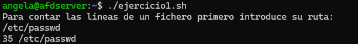
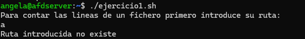
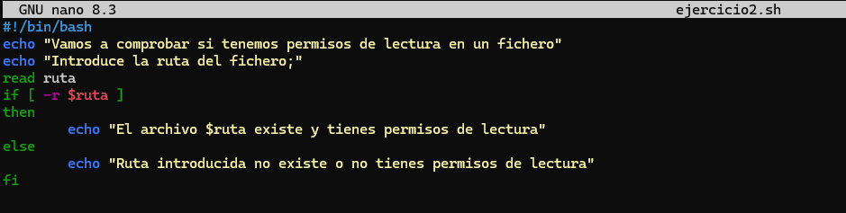
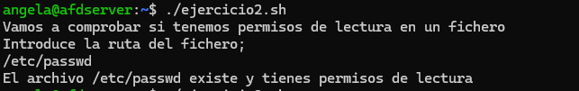
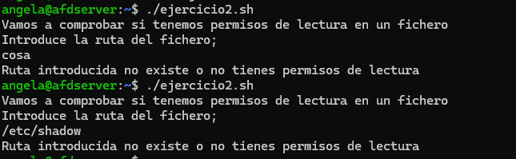
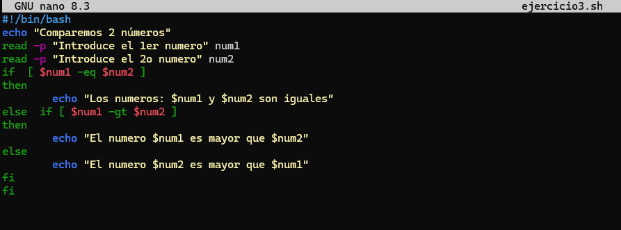
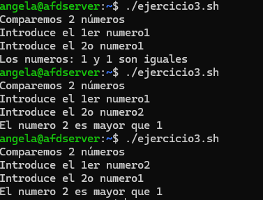

#### [Volver a Unidad 3](../index.md)

------------

# Unidad 3 - Práctica 1: Ejercicios con el comando `if`.

Para cada ejercicio se creará un fichero con el nombre **ejerciciox.sh** donde x será el númeor del ejercicio. Para ello directamente escribimos: `nano ejercicio1.sh` y passaremos a crear y editar ese fichero.

Para que posteriormente el escript se pueda ejecutar hay que darle los permisos correspondientes, por lo que deberemos usar el comanod `chmod a+x ejercicio1.sh` 

## Ejercicio 1 - Contar líneas de un archivo.

Se ha escrito un script que solicita la ruta de un archivo.
La ruta se solicita mediante el comando `read`. Después se hace un if donde los corchetes actúan como el comando `test` por lo que dentro ponemos el modificador `-e`para que compruebe que existe la ruta que pondremos a continuación. 

La comprobación del script es la siguiente:
- Lo comprobamos introduciendo una ruta existente:

- Lo comprobamos introduciendo una ruta que no existe:
  

## Ejercicio 2 - Verificación de archivo.

Crearemos un script que usando el modificador `-r` comprobamos directamente is el archivo existe y tiene permisos de lectura.

La comprobación del script es la siguiente:
- Lo comprobamos introduciendo una ruta existente:

- Lo comprobamos introduciendo una ruta que no existe y un fichero que no tengamos permisos de lectura ocmo puede ser **/etc/passwd**:
  

## Ejercicio 3 -  Comparación de dos números.

## Ejercicio 4 - Validación de contraseña.

## Ejercicio 5 - Comprobación de directorio.

## Ejercicio 6 - Verificar si el usuario es root.

## Ejercicio 7 - Calificación de un examen.

## Ejercicio 8 - Comprobación del espacio en disco.

## Ejercicio 9 - Menú de opciones.

## Ejercicio 10 - Evaluación de edad.

------------

#### [Volver a Unidad 3](../index.md)