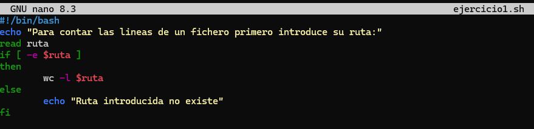

#### [Volver a Unidad 3](../index.md)

------------

# Unidad 3 - Práctica 1: Ejercicios con el comando `if`.

Para cada ejercicio se creará un fichero con el nombre **ejerciciox.sh** donde x será el númeor del ejercicio. Para ello directamente escribimos: `nano ejercicio1.sh` y passaremos a crear y editar ese fichero.

Para que posteriormente el escript se pueda ejecutar hay que darle los permisos correspondientes, por lo que deberemos usar el comanod `chmod a+x ejercicio1.sh` 

## Ejercicio 1 - Contar líneas de un archivo.

Se ha escrito un script que solicita la ruta de un archivo.
La ruta se solicita mediante el comando `read`. Después se hace un if donde los corchetes actúan como el comando `test` por lo que dentro ponemos el modificador `-e`para que compruebe que existe la ruta que pondremos a continuación. 

La comprobación del script es la siguiente:
- Lo comprobamos introduciendo una ruta existente:

- Lo comprobamos introduciendo una ruta que no existe:
  

## Ejercicio 2 - Verificación de archivo.

Crearemos un script que usando el modificador `-r` comprobamos directamente is el archivo existe y tiene permisos de lectura.

La comprobación del script es la siguiente:
- Lo comprobamos introduciendo una ruta existente:

- Lo comprobamos introduciendo una ruta que no existe y un fichero que no tengamos permisos de lectura ocmo puede ser **/etc/passwd**:
  

## Ejercicio 3 -  Comparación de dos números.

En este script solicitaremos que introduzca dos números empleando el comando `read -p`, lo que nos permite poner un mensaje.
Hacemos las condicionales pertinentes para que compruebe si es igual, mayor o en caso de que no sea ni igual ni num1 mayor que num2, será num2 quien sea mayor a num1.

Lo comprobamos poniendo diferentes números en las variables, pondremos números que sean iguales, que num1 sea mayor, y que num2 sea menor.

## Ejercicio 4 - Validación de contraseña.

Para este ejercicio crearemos una variable que contenga un valor para la contraseña. A continuación, mediante un `read`pediremos que inserte la contraseña y la validaremos mediante una condicional, haciendo que si es correcta salga un mensaje y si no es correcta, un mensaje diferente.

La forma de comprobar este script es añadiendo la contraseña de manera correcta e incorrecta para ver que el ´if´ está bien hecho y nos puede devolver ambos mensajes.

## Ejercicio 5 - Comprobación de directorio.

En primer lugar haremos que introduzca la ruta del directorio mediante un comando `read`, la forma de comprobar que es un directorio será mediante un ´if´ añadiendo dentro de los corchetes el modificador `-d`. Si el resultado sale verdadero, mostrará un mensaje de que el directorio existe y pasará a evaluar mediante otro if si tenemos permisos de lectura para este directorio, esto de hace mediante otro ´if´ que debe tener dentro de sus corchetes el modificador `-w`. Si el resultado es positivo (si tenemos permisos) saldrá un mensaje afirmativo, si no tenemos permisos saldrá otro diferente.

En el caso de que el directorio no exista el directorio se creará sólo usando el comanod mkdir, si el comando sale bien saldrá un mensaje, sino, saldrá un mensaje de error.

La forma de comprobar este script ha sido introduciendo un directorio que exista y no tengamos permisos de lecura, introduciendo un directorio que no existe y no tenemos permisos para crear el directorio e introduciendo uno que no existe pero si tenemos permisos para crear el directorio. Faltó un caso por probar, que es el de que el directorio exista y tengamos permisos de lectura.

## Ejercicio 6 - Verificar si el usuario es root.

Para comprobar quien es el usuario ejecutando el script podemos emplear la variable de entorno $EUID, si el valor de esta variable es 0, significará que somos root, sino, no somos root.

Para comprobarlo simplemente basta con ejecutar el script de manera normal y ejecutar el script como root (con un `sudo` delante)

## Ejercicio 7 - Calificación de un examen.

En estre script pediremos en primer lugar mediante un `read` que introduzca la nota. Aunque nosotros indiquemos que introduzca valores entre 1-10, el usuario puede no hacerlo, así que primero hay que insertar un `if` que valide que los datos introducidos son un número de 1 o 2 dígitos. Si no lo es mostrará un mensaje de error y terminará el script (`exit 1`), si sí lo es seguirá con el siguiente if.

En el siguiente if tendremos un if que comprobará que el número se encuentra entre los valores 1 y 10. De la misma manera, si está bien introducido seguiremos con el siguiente if, sino saldrá un mensaje de error y el script acabará (`exit 1`)

Por último, deberemos comprobar el valor de la nota para que si es mayor o igual que 5 muestre que ha aprobado y sino que ha suspendido

> El primer if que valida los datos no hacía falta. Aunque tiene sentido que esté, es más complejo de hacer y entender.

La manera de comprobarlo es poniendo todas las opciones posibles:
- Letras.
- Un número de más de 2 dígitos
- Un número fuera del rango 0-10 de 2 dígitos
- Un número válido (de 2 dígitos entre 0 y 10)

## Ejercicio 8 - Comprobación del espacio en disco.

En primer lugar, meteremos en una variable el valor numerico referente al espacio libre del disco, para ello lo haremos usando el comando, buscando con `egrep`, normalizando los espacios con `tr` y cortando el valor que necesitemos.

Con este valor que hemos conseguido, podemos hacer un if de forma que si el espacio libre en disco es menor de 10 salte una advertencia, y si es mayor de 10 salga un espacio menos alarmante.

Para comprobarlo simplemente ejecutaremos el scritp, se resolverá solo, este script no es interactivo.

## Ejercicio 9 - Menú de opciones.

Crearemos un menú, para ello con unos echos enseñaremos al usuario las diferentes opciones que puede elegir mostrando los diferentes números asociados a ellas. Después mediante un `read`pediremos que introduzca la opción que quiera, el valor numérico.  Mediante un id validaremos si la opción introducida es 1, que mostrará un mensaje; 2, que mostrará otro; o 3, que mostrará otro diferente (para ello empleamos `else if`), si la opción introducida no es ninguna de esas mostrará un mensaje de error (`else`).

Debremos abarcar todas las opciones posibles para comprobar el script, probaremos a introducir lo siguiente:

- El número 1
- El núemro 2
- El número 3
- Cualquier otro número o letra

## Ejercicio 10 - Evaluación de edad.

Mediante el comando `read`pediremos que introduzca su edad. Deberemos validar mediante un if que lo que se ha introducido se trata de un número entero, si no lo es, saldrá un mensaje de error y finalizará el script (`exit 1`).

Si el valor de la edad es correcto, evaluaremos si la edad es menor de 18, en cuyo caso mostraremos un mensaje; evalaremos si la edad es menor o igual a 65, en cuyo caso mostraremos un mensaje diferente, y cualquier otro número (los números mayores de 65) mostrarán otro mensaje diferente.

> El primer if que valida los datos no hacía falta. Aunque tiene sentido que esté, es más complejo de hacer y entender.

Para compribarlo simplemente probaremos a ejecutarlo 3 veces, cada una de esas veces indroduciremos edades diferentes en cada rangop diferente, por ejemplo: 7, 20 y 70.

> Hubiese sido buena idea probar a introducir un valor no numérico o un numero decimal para comprobar el mensaje de error.

------------

#### [Volver a Unidad 3](../index.md)