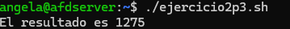
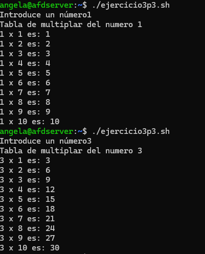

#### [Volver a Unidad 3](../index.md)

------------

# Unidad 3 - Práctica 3: Ejercicios sobre los comandos `while`, `until` y `for`.

## Ejercicio 1 - Contar hasta 10 con for

```

    #!/bin/bash

    for numero in {1..10}
    do
            echo "Numero: $numero"
    done

```

Comprobación:


## Ejercicio 2 - Sumar los primeros 50 números

```
    #!/bin/bash

    resultado=0

    for numero in {1..50}
    do
            resultado=$(( $resultado+$numero ))
    done

    echo "El resultado es $resultado"
```

Comprobación:



## Ejercicio 3 - Tabla de multiplicar

```
    #!/bin/bash

    read -p "Introduce un número" numero

    echo "Tabla de multiplar del numero $numero"
    for factor in {1..10}
    do
            resultado=$(( numero*factor ))
            echo "$numero x $factor es: $resultado"
    done
```

Comprobación:



## Ejercicio 4 - Imprimir cada letra


## Ejercicio 5 - Contar números pares del 1 al 20 con while:

```
    #!/bin/bash

    numero=1

    while [ $numero -le 20 ]
    do
            if [ $(( $numero % 2 )) -eq 0 ]
            then
                    echo "$numero"
            fi
            numero=$(( $numero + 1 ))
    done
```

Comprobación:


## Ejercicio 6 - Suma de dígitos


## Ejercicio 7 - Cuenta regresiva


## Ejercicio 8 - Imprimir solo archivos .txt


## Ejercicio 9 - Factorial de un número


## Ejercicio 10 - Verificar contraseña


------------

#### [Volver a Unidad 3](../index.md)