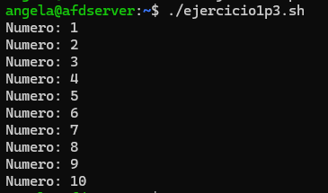
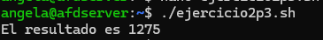
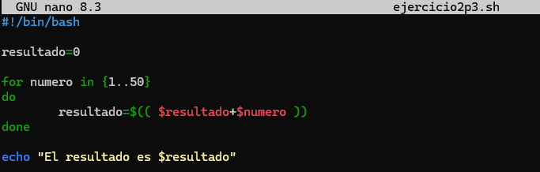
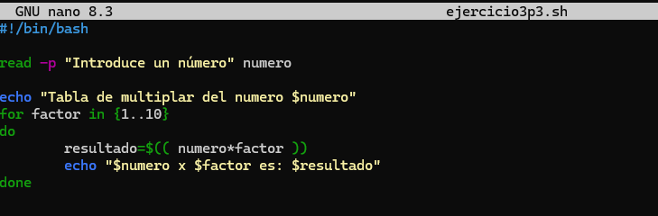
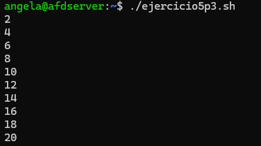
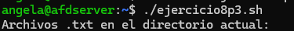
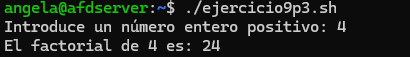
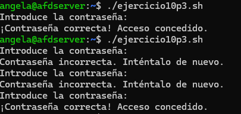

#### [Volver a Unidad 3](../index.md)

------------

# Unidad 3 - Práctica 3: Ejercicios sobre los comandos `while`, `until` y `for`.

## Ejercicio 1 - Contar hasta 10 con for.

```
    #!/bin/bash

    for numero in {1..10}
    do
            echo "Numero: $numero"
    done
```

Comprobación:



## Ejercicio 2 - Sumar los primeros 50 números.

```
    #!/bin/bash

    resultado=0

    for numero in {1..50}
    do
            resultado=$(( $resultado+$numero ))
    done

    echo "El resultado es $resultado"
```

Comprobación:



## Ejercicio 3 - Tabla de multiplicar.

```
    #!/bin/bash

    read -p "Introduce un número" numero

    echo "Tabla de multiplar del numero $numero"
    for factor in {1..10}
    do
            resultado=$(( numero*factor ))
            echo "$numero x $factor es: $resultado"
    done
```

Comprobación:



## Ejercicio 4 - Imprimir cada letra.

> ❌ Para este ejercicio es necesario subdividir cadenas, todavia no hemos llegado a ese contenido

## Ejercicio 5 - Contar números pares del 1 al 20 con while.

```
    #!/bin/bash

    numero=1

    while [ $numero -le 20 ]
    do
            if [ $(( $numero % 2 )) -eq 0 ]
            then
                    echo "$numero"
            fi
            numero=$(( $numero + 1 ))
    done
```

Comprobación:



## Ejercicio 6 - Suma de dígitos.

> ❌ Para este ejercicio es necesario subdividir cadenas, todavia no hemos llegado a ese contenido

## Ejercicio 7 - Cuenta regresiva.

```
    #!/bin/bash

    read -p "Introduce un número inicial para la cuenta regresiva: " num

    until [ $num -lt 0 ]
    do
    echo "$num"
    echo " "
    num=$((num - 1))
    done

    echo "Cuenta regresiva finalizada"
```

Comprobación:



## Ejercicio 8 - Imprimir solo archivos .txt.

```
    #!/bin/bash

    echo "Archivos .txt en el directorio actual:"
    for archivo in *.; do
    if [[ -f "$archivo" && "$archivo" == *.txt ]]; then
        echo "$archivo"
    fi
    done
```

Comprobación:



## Ejercicio 9 - Factorial de un número.

```
    #!/bin/bash

    read -p "Introduce un número entero positivo: " num

    factorial=1

    for (( i=1; i<=num; i++ )); do
    factorial=$((factorial * i))
    done

    echo "El factorial de $num es: $factorial"
```

Comprobación:



## Ejercicio 10 - Verificar contraseña.

```
    #!/bin/bash

    correcta="1234"
    entrada=""

    until [ "$entrada" = "$correcta" ]; do
    read -sp "Introduce la contraseña: " entrada
    echo
    if [ "$entrada" != "$correcta" ]; then
        echo "Contraseña incorrecta. Inténtalo de nuevo."
    fi
    done

    echo "¡Contraseña correcta! Acceso concedido."
```

Comprobación:



------------

#### [Volver a Unidad 3](../index.md)