#### [Volver a Unidad 4](../index.md)

------------

# Unidad 4 - Práctica 1: Administración remota en Windows.

## Entorno virtualizado.

Para la realización de la práctica se han utilizado 3 máquinas virtuales:

- `AFD-2019`: Windows Server 2019 - Con enorno gráfico 
- `AFD-CORE-2019`: Windows Server 2019 - Sin entorno gráfico (versión core)
- `AFD-CORE-2016`: Windows Server 2016 - Sin entorno gráfico (versión core)

> Para la instalación de AFD-2019 se ha tenido que instalar la versión *Datacenter*, porque la *Standard* dejaba la máquina congelada y no procedía a la instalación.

Se les ha puesto a las máquinas virtuales un adaptador puente a cada una.

## Preparación de las máquinas.

Para poder ejecutar comodamente comandos de Poweshell sin que de error, deberemos desde las core primero ejecurar el comando `powershell`, para así que ejecute los comandos desde powershell y no desde cmd.

### Parte I. Configuración de IPs

Como la IP la da un servidor DHCP, deberemos asegurarnos de que nuestra máquina siempre va a tener la misma IP, para ello, le pondremos una IP estática.

La IP estática será la misma que le ha dado el servidor DHCP.

El comando para poner la IP de manera estática es el siguiente:

`New-NetIPAdress -InterfaceIndex 4 -IPAdress 10.201.59.106 -PrefixLength 16 -DefaultGateway 10.102.59.1`

>La IP cambiará y para saber la IP de DefautGateway deberemos mirando usando el comando `Get-NetIPConfiguration`

Desde la máquina cliente (la que tiene entorno gráfico) también deberemos ponerla como estática, eso lo hacemos desde el Panel de control > Red e Internet y yendo a Propiedades del adaptador de red.

### Parte II. Desactivar el Firewall.

Desde las máquinas CORE emplearemos el siguiente comando para desactivar el firewall, que suele dar problemas en este tipo de prácticas.

Para ello usaremos el comando:

`Set-NetFirewallProfile -Profile Domain,Public,Private -Enabled False`

Desde la máquina cliente, buscaremos desde la barra de tareas "Firewall", nos aparecerá como opción **Firewall de Windows Defender**. Una vez hayamos hecho clic, a la izquierda hay unas opciones como menú lateral, hacemos clic en **Activar o Desactivar el Firewall de Windows Defender**, una vez ahí, desactivaremos todos los perfiles del firewall de forma que quede así:

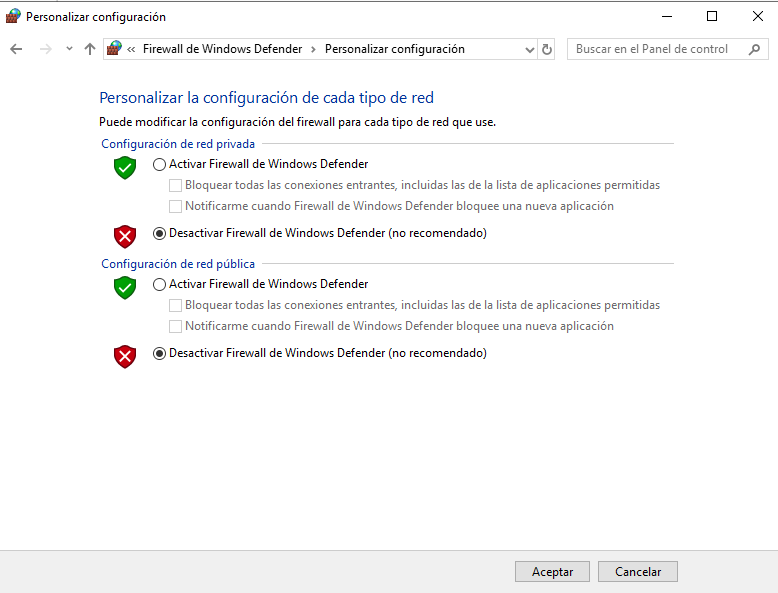

## Configuración.

### Parte I. Lista de *TrustedHosts*.

Desde la máquina cliente añadiremos los servidores a la lista de *TrustedHosts*, esto nos permitirá poder conectarnos a los servidores. 

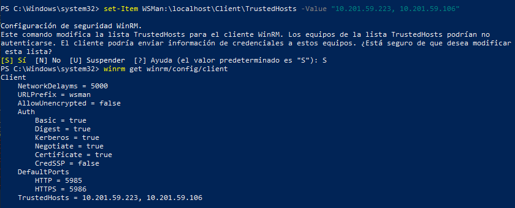

### Parte II. Acceso remoto.

Podemos ejecutar comandos desde el cliente en las máquinas servidores, como se pide, se creará un usuario llamado admin-afd.

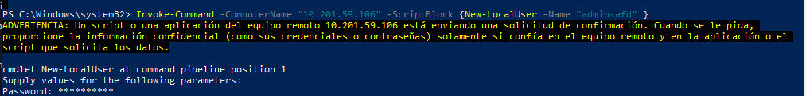

> En la ejecuión del comando falta que el usuario creado sea administrador, para ello en el comando anterior habría que añadir `-Group "Administrators"`.

>❗Se realiza el mismo proceso de creación de usuario para ambas máquinas.

## Configuracion del acceso remoto sobre HTTPS.

### Parte I. Creacion del Certificado Autofirmado.

Para que sea HTTPS es necesario tener un certificado. Como no podemos conseguir un certificado de terceros, crearemos un certificado autofirmado. Para ello, nos ubicaremos en la máquina servidor y ejecutaremos el siguiente comando:

`New-SelfSignedCertificate -DnsName "AFD-CORE-2016" -CertStoreLocation Cert\LocalMachine\My -KeyLength 2048`

> En el -DnsName deberemos poner el hostname de la maquina donde estamos creando el certifiado. Si no sabemos cual es, usaremos el comando `hostname` antes para comprobarlo.

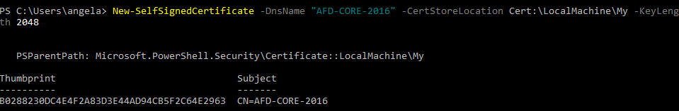

### Parte II. Listeners.

Deberemos eliminar el *Listener* actual para crear uno para el certificado

Eliminamos el Listener con el comando:

`Remove-Item -Path WSMan:\localhost\Listener\Listener*`

Volvemos a crearlo con las especificaciones que necesitamos:

`New-Item -Path WSMan:\localhost\Listener -Transport HTTPS -Address * -CertificateThumbPrint <hash del certificado>`

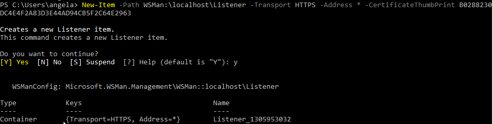

### Parte III. Firewall.

Crearemos una regla concreta para permitir el acceso por el puerto necesario:

`netsh advfirewall firewall add rule name="WinRM HTTPS" protocol=TCP dir=in localport=5986 action=allow`

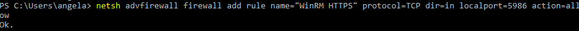

### Parte IV. Exportar certificado.

Exportaremos en el formato correcto en la ruta que especifiquemos:

`Export-Certificate -Cert Cert:\LocalMachine\My\<hash del certificado> -FilePath C:\servercert.cer`

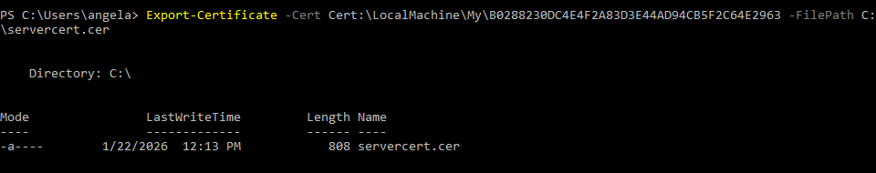

### Parte V. Carpeta compartida.

Necesitaremos una carpeta compartida qque sea accesible desde el servidor para poder pasarnos el certificado al cliente.

Desde el cliente, en el entorno gráfico crearemos una carpeta en C:\.

En propiedades de la carpeta > Compartir > Uso Compartido Avanzado

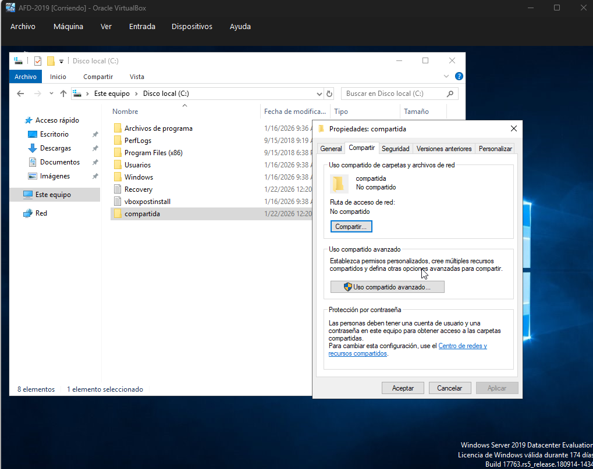

Marcaremos la casilla **Compartir esta carpeta**, nos aseguraremos de que en **Nombre del recurso compartido** ponga **compartida**

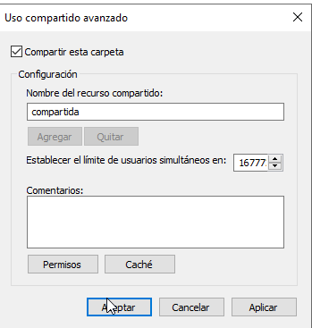

En esta misma ventana le damos al botón **Permisos**. Haremos click en **Todos** y les damos todos los permisos.

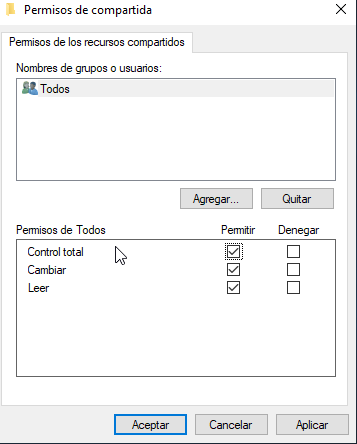

Para asegurarnos de que todos pueden acceder, desde Propiedades de la carpeta vamos a **Seguridad**, le damos al botón de **Editar**. Añadimos a **Todos** y les damos todos los permisos

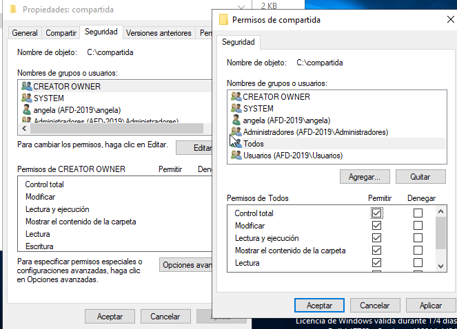

### Parte VI. Copiar el certificado en la carpeta

Copiamos el certificado en la carpeta compartida con el siguiente comando

`Copy-Item -Path C:\servercert.cer -Destination "\\<ip del cliente\compartida"`

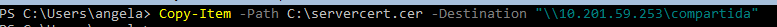

Ahora desde el cliente comprobaremos que tenemos el certificado en la carpeta. Lo podemos comprobar de forma gráfica, que es más cómodo. Pero en este caso lo miramos en modo comando:

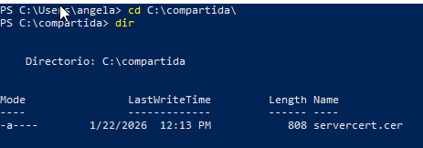

### Parte VII. Importar Certificado y acceso remoto por HTTPS

Utilzaremos el siguiente comando para importar el certificado a los certificados del equipo:

`Import-Certificate -FilePath C:\compartida|servercert.cer -CertStoreLocation Cert:\LocalMachine\Root`

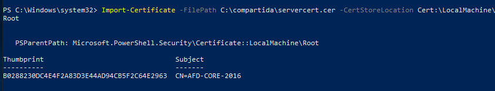

Para comprobar que se ha añadido podemos ejecutar Win+R -> certmgr.msc.

Cuando le demos a Enter nos abrirá los certificados del equipo, si accedemos a las mismas carpetas de la imagen, nos encontraremos con nuestro certificado.

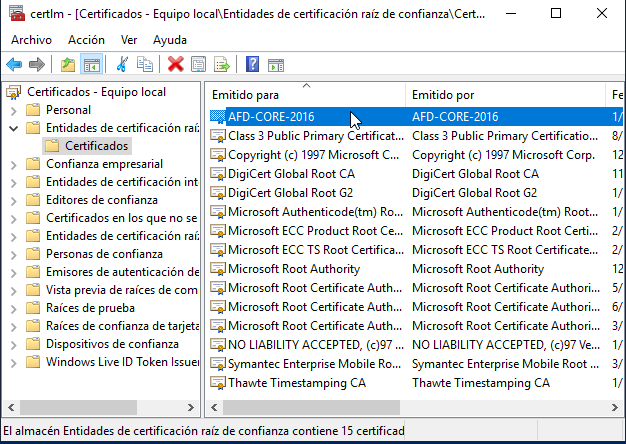

### Parte VIII. Prueba de conexion

Probaremos a conectarnos usando el siguiente comando:

`Enter-PSSession -ComputerName AFD-CORE-2016 -Credential angela -UseSSL`

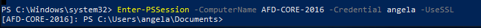

> Repetimos el proceso con la otra máquina:

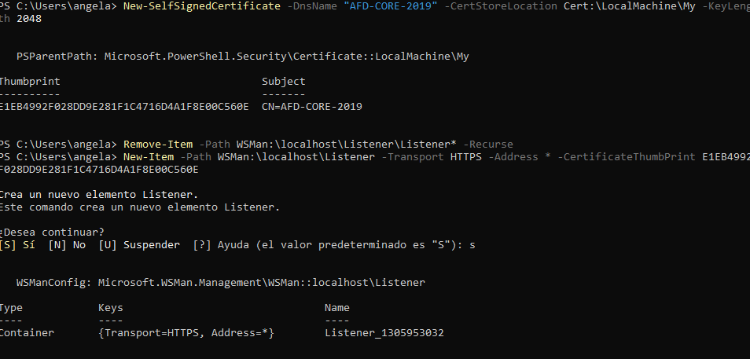

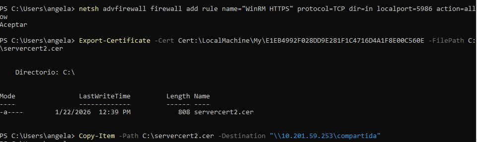

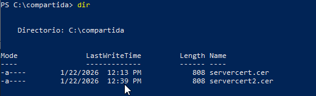

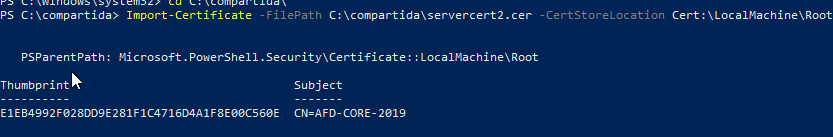

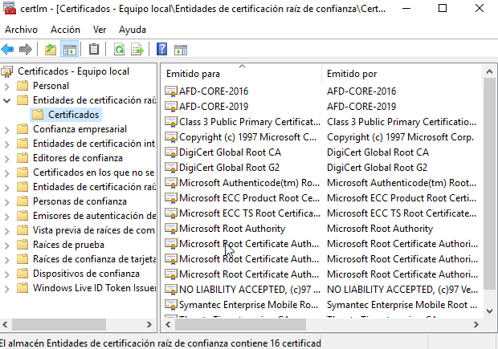

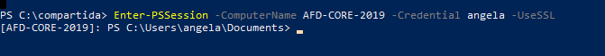

## Configuración remota con Windows Admin Center.

Accedemos a la web: https://www.microsoft.com/es-es/windows-server/windows-admin-center para instalar Windows Admin Center.

Para poder descargarlo, en Ajustes del navegador deberemos buscar Opciones de Internet e iremos a la pestaña de Seguridad.

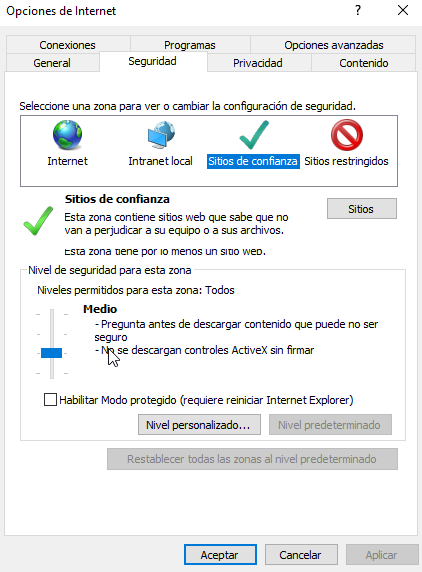

Haremos click en **Sitios** y nos llevará a una ventana donde deberemos introducir `https://www.microsoft.com` (aparece ya por defecto escrito).

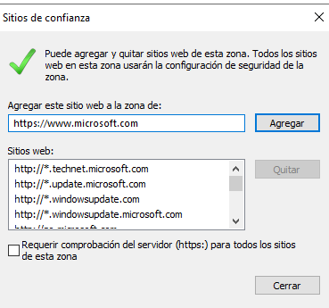

Una vez hayamos descargado en instalador, lo ejecutamos para empezar la instalación. En la primera ventana le damos a Siguiente.

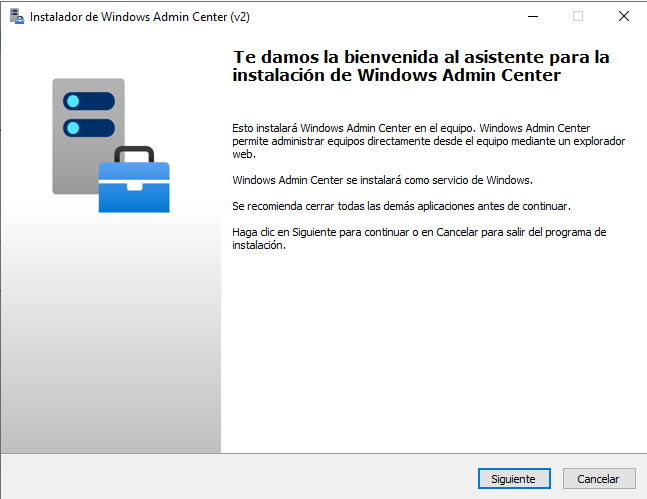

Aceptamos los términos y le damos al botón de Siguiente.

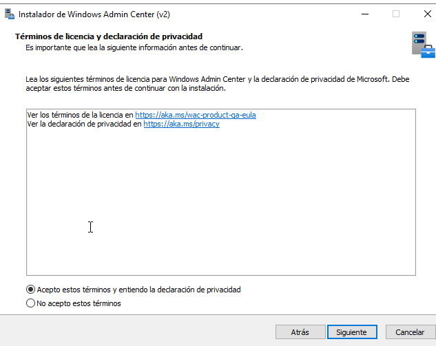

Seleccionamos el botón de radio que indica Configuración rápida y seguimos.

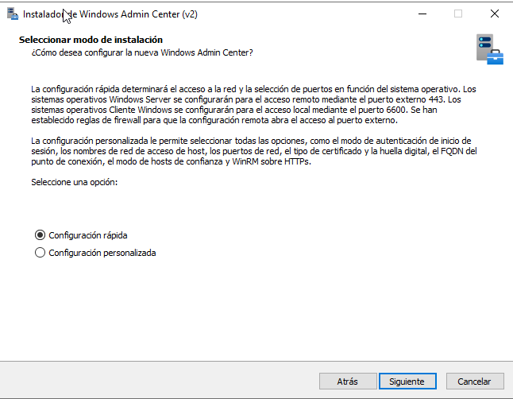

Como no tenemos un certificado TLS, le diremos que genere uno automáticamente, así que seleccionamos la segunda opción.

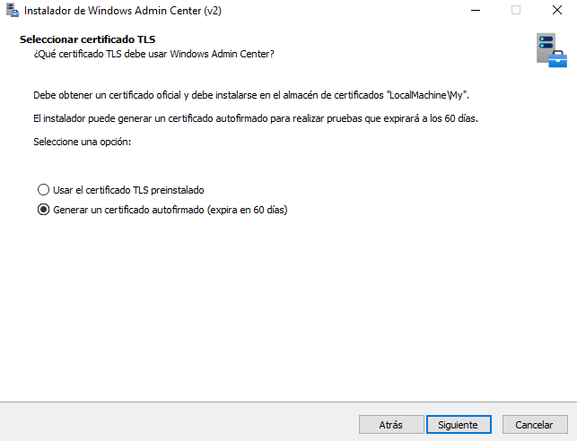

Deshabilitamos las actualizaciones automáticas, es decir, seleccionamos la última opción. Y le damos al botón para continuar.

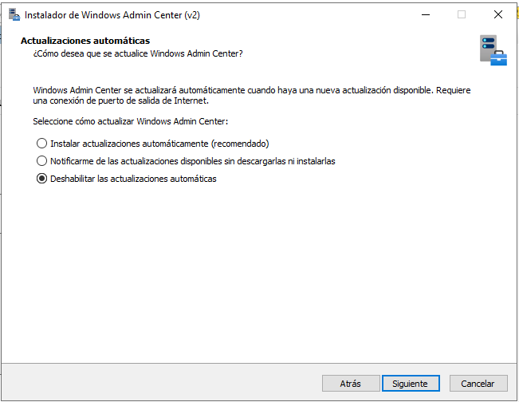

Dejamos el valor por defecto de Datos de diagnóstico necesarios.

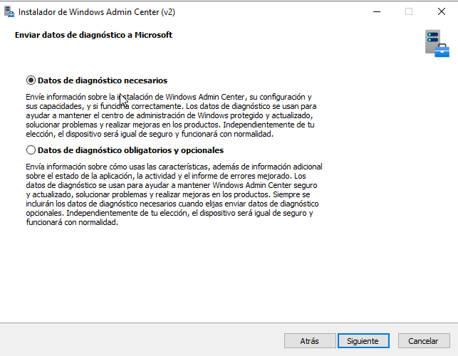

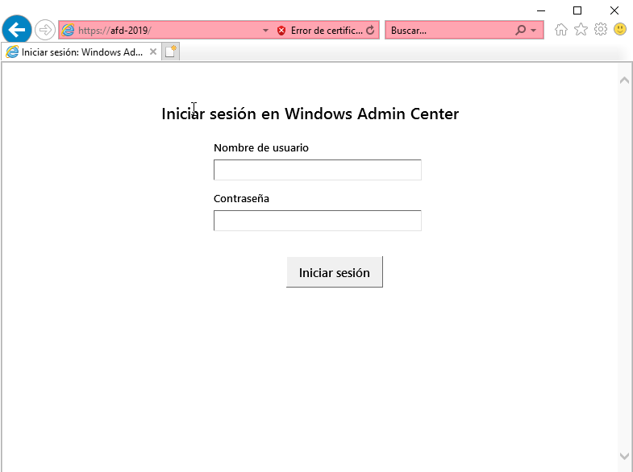

Con esto se habrá instalado y en el navegador aparecerá para iniciar sesión.
Como el navegador por defecto y el único que tiene Windows Server es el Explorer, y Windows Admin Center no es soportado por Explorer, no nos dejará iniciar sesión. Tenemos 2 opciones:

1. Instalar otro navegador en Windows Server.
2. Desde un Windows10 acceder a esta máquina.

A pesar de que la opción 1 parece más fácil, lo normal es hacer la 2.

-----

Desde una máquina Windows10, lo primero que haremos será añadir los nombres e IPs en el fichero hosts.
`C:\Windows\System32\drivers\etc\hosts`
Lo editamos con el bloc de notas en modo administrador y lo añadimos y lo guardamos:

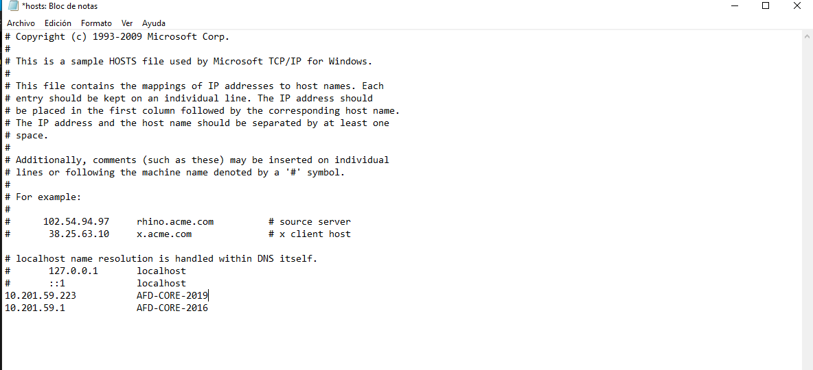

Si ahora abrimos el navegador y en la barra de busqueda ponemos la IP de nuestro Windows Server, en mi caso 10.201.59.253 apareceremos en la web de Windows Admin Center para inciar sesión.

Por defecto nos aparecerá el servidor al que estamos conectaos pero podemos añadir más, en este caso los CORE.

Le damos el botón de Agregar que está arriba a la izquierda. Esto nos abrirá un panel donde podemos elegir qué tipo de equipo queremos añadir, en este caso Servidor.

Ponemos el nombre del servidor.

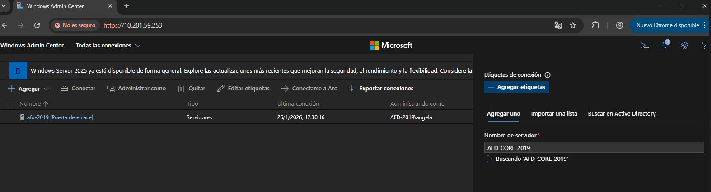

Nos pedirá las credenciales con las que poder conectarnos a ese equipo.

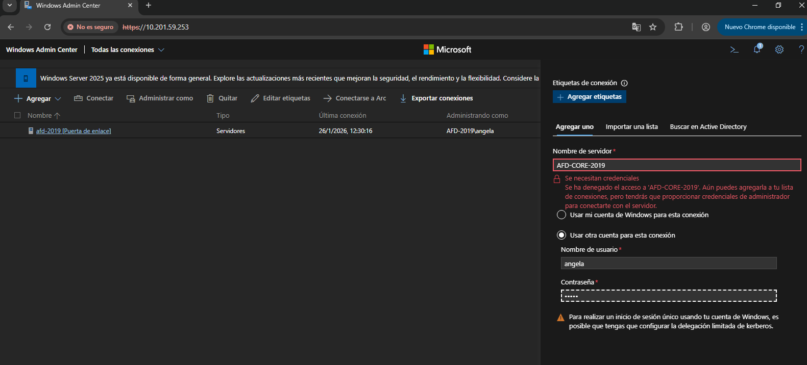

Las ponemos. Con ambos servidores. Si ahora hiciesemos click podríamos conectarnos, pero da error.

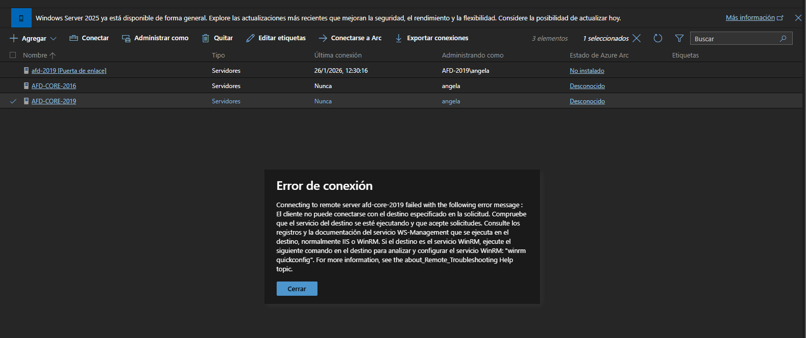

------------

#### [Volver a Unidad 4](../index.md)