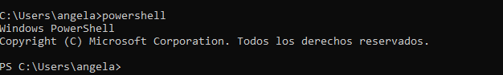
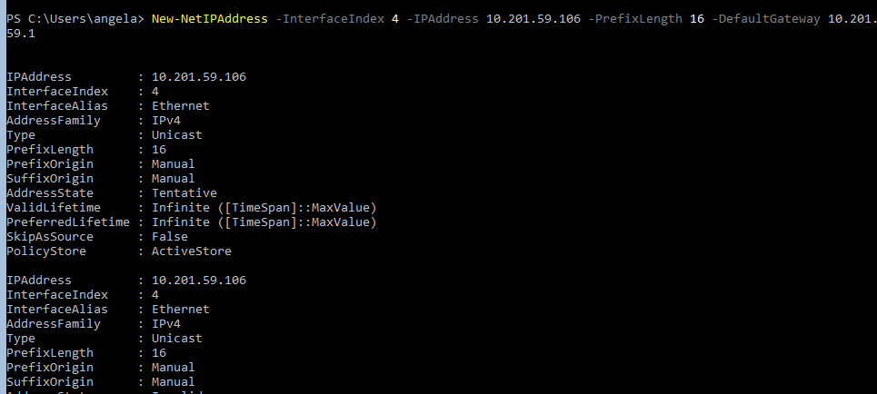
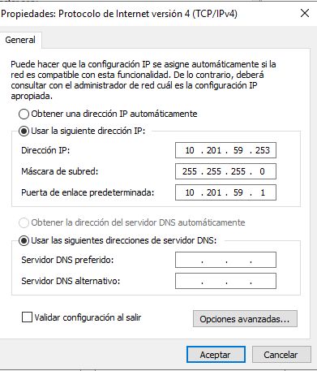

#### [Volver a Unidad 4](../index.md)

------------

# Unidad 4 - Práctica 1: Administración remota en Windows.

## Entorno virtualizado.

Para la realización de la práctica se han utilizado 3 máquinas virtuales:

- `AFD-2019`: Windows Server 2019 - Con enorno gráfico 
- `AFD-CORE-2019`: Windows Server 2019 - Sin entorno gráfico (versión core)
- `AFD-CORE-2016`: Windows Server 2016 - Sin entorno gráfico (versión core)

> Para la instalación de AFD-2019 se ha tenido que instalar la versión *Datacenter*, porque la *Standard* dejaba la máquina congelada y no procedía a la instalación.

Se les ha puesto a las máquinas virtuales un adaptador puente a cada una.

## Preparación de las máquinas.

Para poder ejecutar comodamente comandos de Poweshell sin que de error, deberemos desde las core primero ejecurar el comando `powershell`, para así que ejecute los comandos desde powershell y no desde cmd.

### Parte I. Configuración de IPs

Como la IP la da un servidor DHCP, deberemos asegurarnos de que nuestra máquina siempre va a tener la misma IP, para ello, le pondremos una IP estática.

La IP estática será la misma que le ha dado el servidor DHCP.

El comando para poner la IP de manera estática es el siguiente:

`New-NetIPAdress -InterfaceIndex 4 -IPAdress 10.201.59.106 -PrefixLength 16 -DefaultGateway 10.102.59.1`

>La IP cambiará y para saber la IP de DefautGateway deberemos mirando usando el comando `Get-NetIPConfiguration`

Desde la máquina cliente (la que tiene entorno gráfico) también deberemos ponerla como estática, eso lo hacemos desde el Panel de control > Red e Internet y yendo a Propiedades del adaptador de red.

------------

#### [Volver a Unidad 4](../index.md)