#### [Volver a Unidad 5](../index.md)

------------

# Unidad 5 - Práctica 1: Implantación del dominio.

Para la ejecución de esta práctica será necesaria una máquina virtual de Windows Server. 
Deberá tener 2 adaptadores:
- Uno en solo-anfitrión.
- Uno en NAT.
Lo primero que deberemos de hacer es configurarle una IP estática en el adaptador solo-anfitrión, siendo esta la que nos da VirtualBox, de esta manera estamos protegidos de que nos pueda cambiar la IP el DHCP de Virtualbox.
Además. tambien pondremos que el DNS es nuestro propia máquina (172.0.0.1)

## Ejercicio 1 - Promoción del controlaor de dominio.

Una vez tenemos la máquina lista, desde Administrador del Servidor (se abre automáticamente al iniciar Windows Server). Deberemos ir a menú superior a la derecha donde pone **Herramientas > Agregar roles** y características.

Dejaremos los valores por defecto a excepción del apartado de **Roles del servidor**. Donde debemos marcar la casilla de: **Servicios de dominio de Active Directory**.

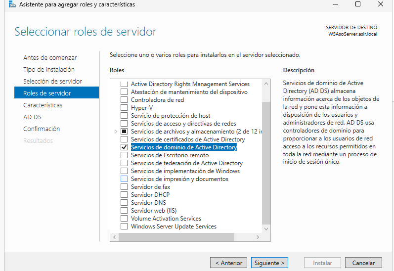

Después de que le demos al botón de instalar, esperaremos hasta que se instale.

Cuando haya terminado, si nos fijamos, en el icono de la bandera tenemos un símbolo de advertencia. El aviso que nos muestra contiene un enlace en azul: **Promover este servidor a controlador de dominio**. Hacemos clic ahí.

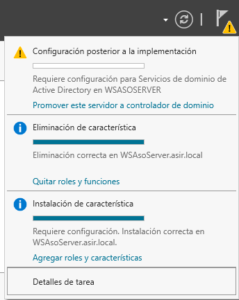

Se nos abrirá una ventana para configurar el servicio de domino de Active Directory.
En el primer apartado indicaremos que queremos crear un nueov árbol seleccionando el último botón de radio e indicaremos el dominio raíz escribiendolo en el cuadro de texo, en este caso: "iessanadres.local".

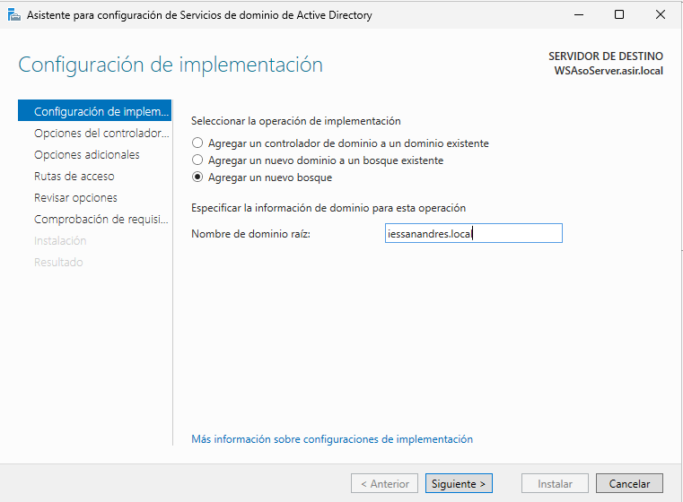

En el siguiente apartado dejaremos los deplegables referentes a Nivel funcional con su valor por defecto y tampoco modificaremos las casillas de debajo. Deveremos abajo indicar una contraseña para el modo restauración.

>💡 Al tener la directiva de complejidad de contraseña activada por defecto, hay que tener en cuenta que la contraseña debe tener 8 carácteres como mínimo y debe tener números y letras.

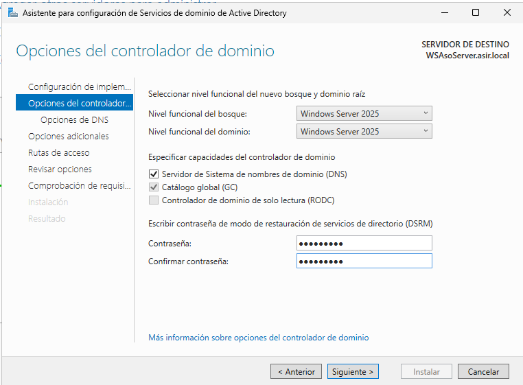

En el siguiente apartado lo dejamos tal cual está y le damos a Siguiente.

En la siguiente parte de la configuración debermos asignarle un nombre de dominio NetBIOS. Por defecto nos pondrá uno en base al nombre de dominio que pusimos nosotros pero quitanod la extensión ".local" y en mayúsculas.

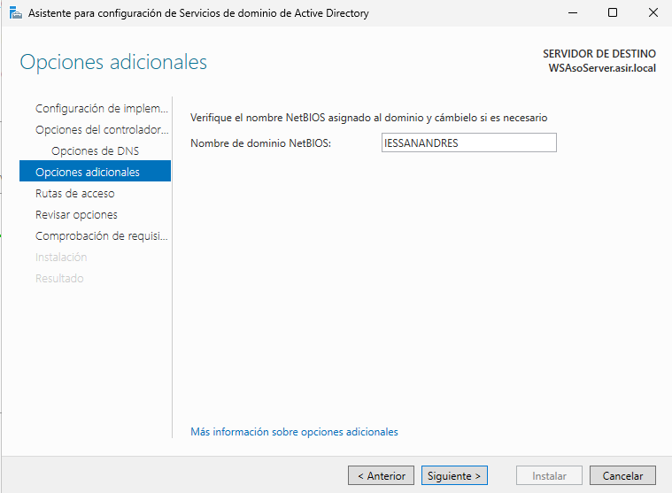

La siguiente parte aparecen las rutas, que las dejaremos por defecto y le daremos a Siguiente.

Ahora aparecerá un resumen de las opciones que hemos seleccionado, las revisamos por si acaso y continuamos.

Ahora hará una comprobación de requisitos previos donde nos aparecerán algunos avisos. Al no ser demasiado relevantes, podemos darle a Instalar.

Al instalarse, pedirá que reiniciemos el sistema,esto suele tomarse su tiempo así que tendremos paciencia.

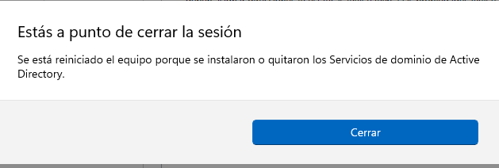

Cuando se reinicie la máquina ya al iniciar sesión veremos que nos indica el dominio en que se encuentra el usuario antes de su nombre

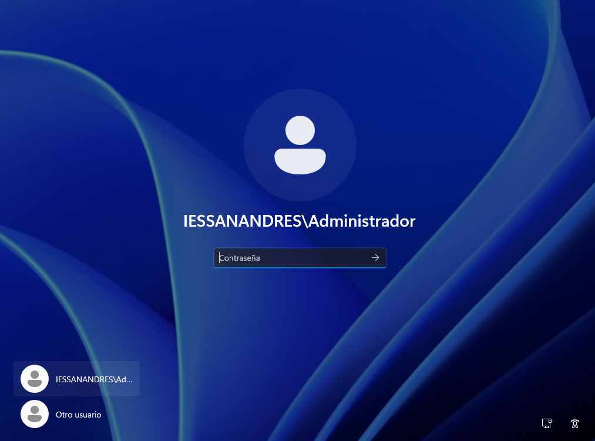

Cuando inicie el Administrador del servidor veremos que ha instalado el servidor AD DS Y el servidor DNS.

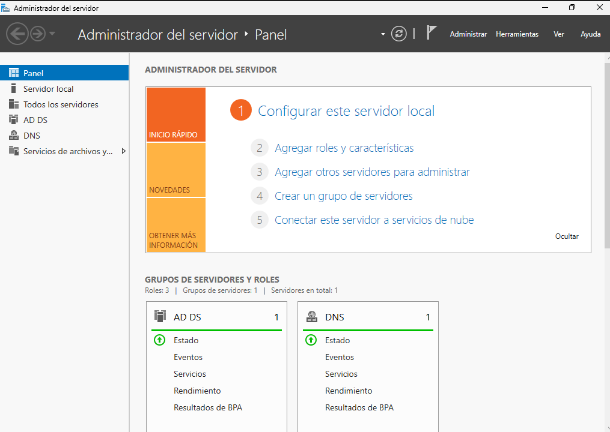

## Ejercicio 2 - Diseño de la Estructura de Unidades Organizativas (UO).

Para empezar a estructurar la jerarquía iremos desde el Adminsitrador del Servidor a Herramientas en el menú superior a la derecha. Haremos clic en **Centro de administración de Active Directory**. Esto nos abrirá una ventana nueva donde podremos configurar diferentes aspectos de Active Directory.

En el menú de la izquierda haremos clic en "iessanandres(local)", esto nos abrirá una estructura de carpetas en el panel central, siendo una de ellas lña carpeta Users. Si hacemos clic en esa carpeta nos aparecerá un puqueño menú a la derecha donde está la opción de **Nuevo**, si ponemos el ratón ahí veremos que podemos crear IbetOrgPerson, Grupos, Usuarios, Equipos y Unidades Organizativas, tal y como necesitamos.

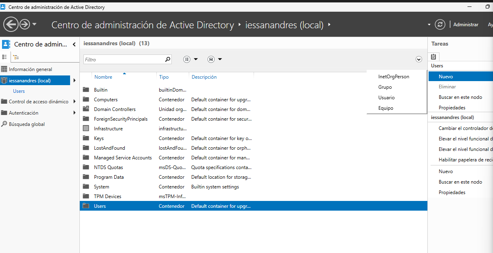

- IES San Andres (UO Raíz para la gestión del centro)
    - Alumnado
        - Informatica
            - DAM
            - DAW
            - ASIR
            - SMR
            - IAyBD
        - Administracion
            - AFI
            - GAD
            - SCO 
    - Profesorado
        - InformaticaProf
        - AdministracionProf
    - Personal_PAS (Personal de Administración y Servicios)
    - _Grupos (UO para almacenar todos los grupos de seguridad)
    - _Equipos (UO para los equipos del dominio)
        - Aulas_Informatica
        - Aulas_Administracion
        - Despachos

> **Justificación del cambio de la estructura:** Según como estaba planteada la estructura, los profesores se encontraban dentro del apartado de alumnos (que igual es una errata), cosa que no tenía mucho sentido.

Para realizar este ejercicio desde el Administrador del servidor de Windows Server vamos a Herramientas > Usuarios y **Equipos de Active Directory**.

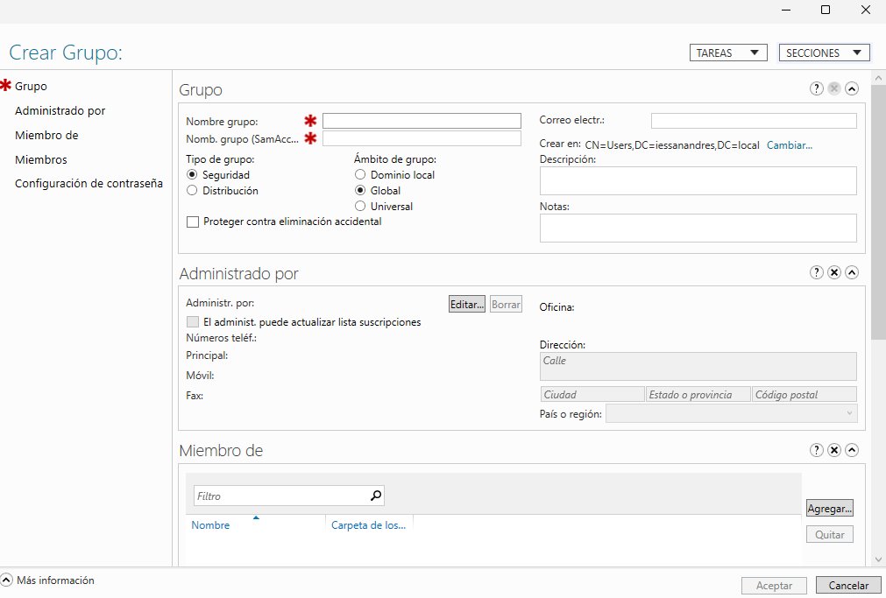

Dede esta ventana iremos creando la estructura creando equipos correspondientes a cada escalón en la estructura. Haremos todo como Unidades Organizativas.

La estructura deberá quedar así:

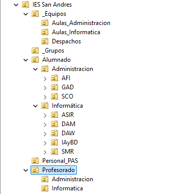

## Ejercicio 3 - Creación de Usuarios y Grupos.

Probaremos la estructura de la siguiente manera:

### 1. Crear Usuarios

Para crear los usuarios dentro de la Unidad organizativa haremos clic derecho y le daremos a **Nuevo > Usuario**.

Nos pedirá en primera instancia indicar el nombre del usuario así como el nombre con el que se le va a referenciar y en segundo lugar nos aparecerá una ventana para indicar su contraseña

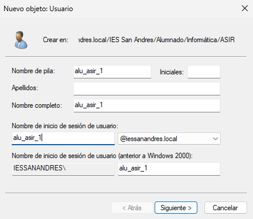

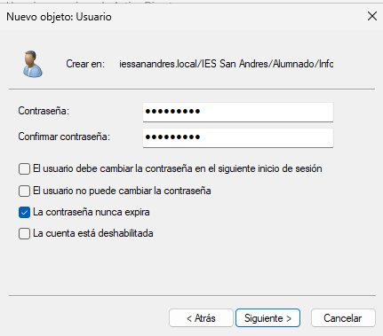

> A la hora de asignar la contraseña hay que tener cuidado con la directiva de contraseñas, la complejidad de contraseñas está activada por lo que hay que poner una contraseña de más de 8 carácteres con mayúsculas, minúsculas y algún carácter numérico.

Haremos este proceso para crear los siguientes usuarios:

- 2 usuarios en la UO ASIR

El nombre de estos usuarios será **alu_asir_1**, y **alu_asir_2**

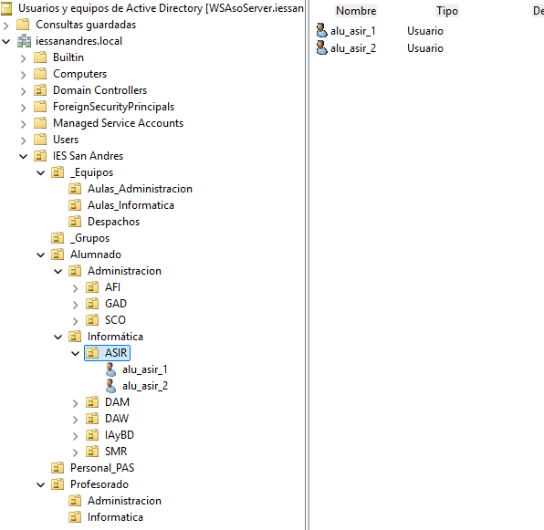

- 2 usuarios en la UO AFI

El nombre de estos usuarios será **alu_afi_1**, y **alu_afi_2**

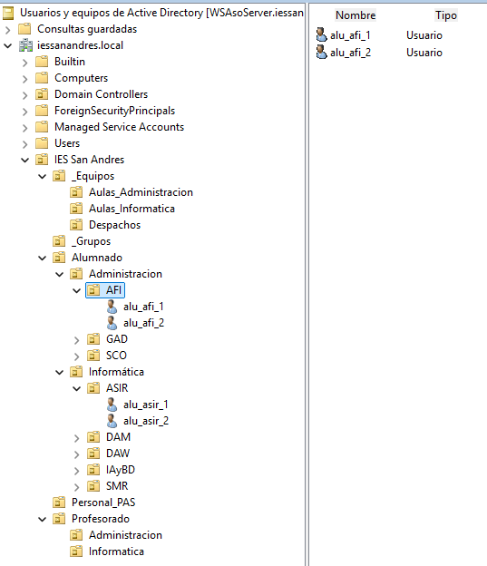

- 1 usuario en la UO Profesorado > Informática

El nombre de estos usuarios será **prof_info_1**

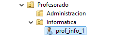

- 1 usuario para la UO Personal_PAS

El nombre de estos usuarios será **pas_1**

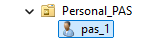

El resultado de la estructua con todos los usuarios es la siguiente:

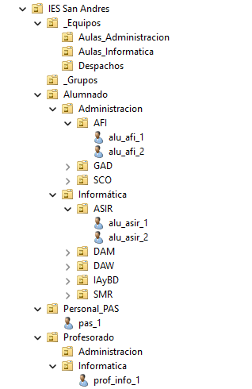

### 2. Crear Grupos de Seguridad

Para este ejercicio crearemos Grupos dentro de la UO de _Grupos, para ello haciendo clic derecho sobre **_Grupos** escogeremos **Nuevo > Grupo**.

Nos aparecerá una ventana para rellenar los datos del grupo:

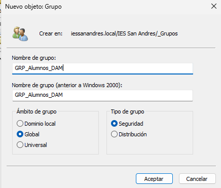

Añadiremos los siguientes grupos:

- GRP_Alumnos_DAM
- GRP_Alumnos_AFI
- GRP_Profesores_Informatica
- GRP_Personal_PAS
- GRP_Alumnos_General (Un grupo que contendrá a todos los alumnos)
- GRP_Profesores_General (Un grupo que contendrá a todos los profesores)

La estructura final es la siguiente:

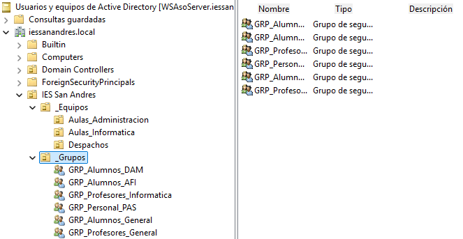

### 3. Asignar Miembros

Para asignar miembros hay 2 métodos:

- Asignarlo desde el usuario yendo a propiedades del usuario > Miembro de y Agregar al grupo al que pertenece

- Desde el grupo, accedemos a propiedades del grupo > Miembros y añadimos los miembros a mano.

Las dos opciones son válidas, en este caso hice la primera opción.

Accedemos a las propiedades de los usuarios (Clic derecho > Propiedades) Y vamos a la pestaña Miembro de:

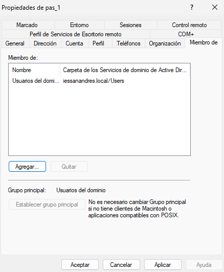

le daremos a Agregar y en el cuadro de texto escribiremos el nombre del grupo.

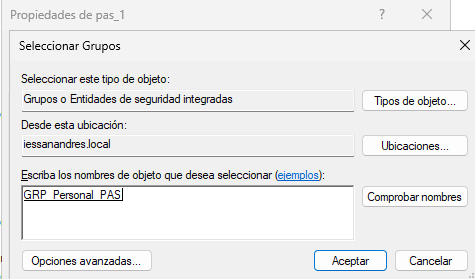

Después de esto le damos a confirmar.

> Para añadir grupos dentro de grupos se puede hacer también desde Propiedades del Grupo.

El resultado de las asignaciones es el siguiente viendolo desde los grupos viendo quiénes son los miembros.

- GRP_Profesores_General:

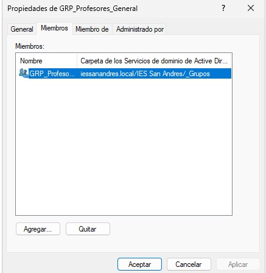

- GRP_Alumnos_General:

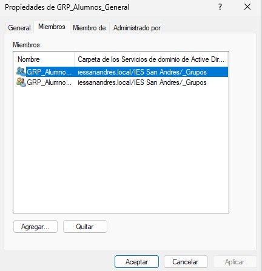

- GRP_Personal_PAS:

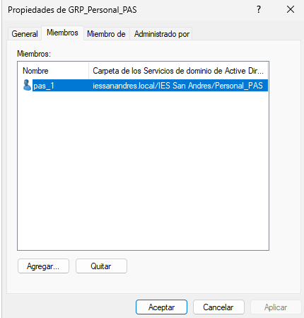

- GRP_Profesores_Informatica:

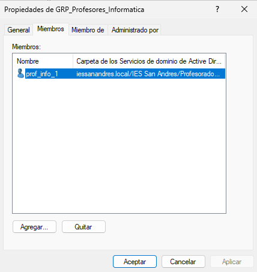

- GRP_Alumnos_AFI

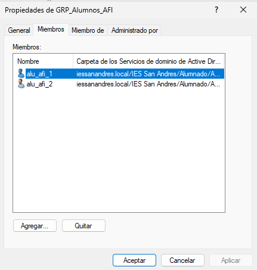

> Como el la creación de usuarios la hicimos de alumnos de asir pero los grupos pide expresamente el grupo de alumnos de DAM, he dejado el grupo de alumnos de DAM vacío y los alumnos de ASIR sin asignar, ya que no tiene sentido que pertenezcan a un grupo que no es el suyo.

## Ejercicio 4 - Restricción de Horas de Inicio de Sesión.

Para asignar un Horario a un usuario se hace desde las propiedades del Usuario en la pestaña Cuenta.

En este caso como nos piden varios usuarios podemos seleccionar varios usuarios a la vez, de la misma manera haremos clic derecho e iremos al apartado Propiedades y a la pestaña Cuenta.

Activaremos el *checkbox* de Horario de sesión y le daremos al botón de la derecha para configurarlo

La forma de configurarlo es marcar con cuadraditos azules las horas activas correspondientes a cada día de la semana. Para que nos quede claro que hemos seleccionado podemos leer la parte de abajo de la izquierda que aparece escrito.

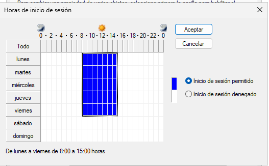

Para ahora comprobar a al usuario del profesor y el personal pas lo haremos de forma individual. Se hace de la misma manera, accedemos a las propiedades del usuario y vamos a la pestaña de Cuenta, ahí buscaremos un botón que indique **Horas de inicio de sesión**

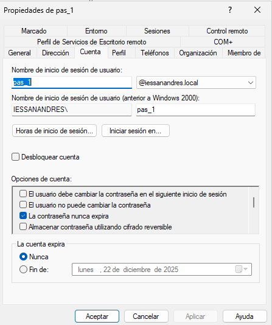

Una vez le hemos dado comprobarmos los cuadraditos azules que deben estar marcados todos, de esta forma:

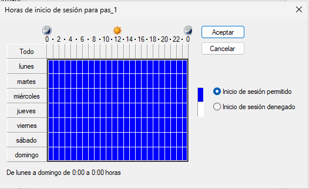

Lo comprobamos también en el usuario del profesor:

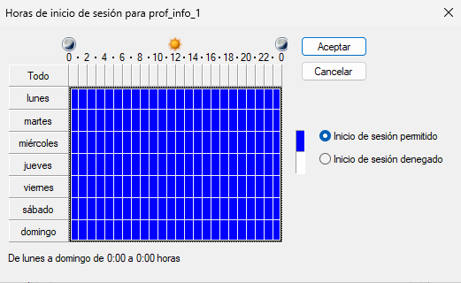

------------

#### [Volver a Unidad 5](../index.md)