#### [Volver a Unidad 5](../index.md)

------------

# Unidad 5 - Práctica 2: Carpetas personales y compartidas por un grupo.

## Ejercicio 1 - Creación de usuarios y grupos.

### Crea una carpeta personal para cada alumno de ASIR.

En nuestro Windows Server, en C:\ crearemos una carpeta que será la que usaremos para compartir con cada alumno de ASIR.

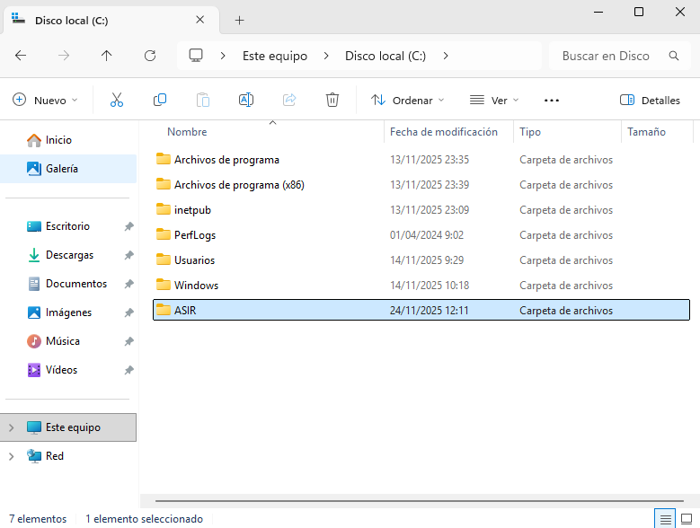

Para ahora compartirlo, haremos clic derecho en la carpeta e iremos a **Propiedades**. Y accederemos a la pestaña **Compartir** y haremos clic en el botón de **Uso compartido avanzado**.

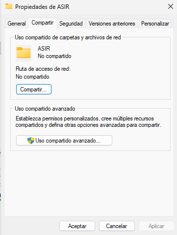

Esto nos abrirá una ventana donde deberemos marcar el checkbox (que por defecto aparece desactivado). Una vez hecho esto le damos a Aplicar o Aceptar.

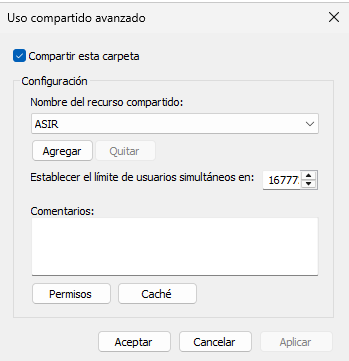

Si ahora nos fijamos en la ventana de propiedades en la pestaña compartir, veremos que nos pone la ruta de acceso a la carpeta, que en mi caso es: `\\Wsasoserver\asir` 

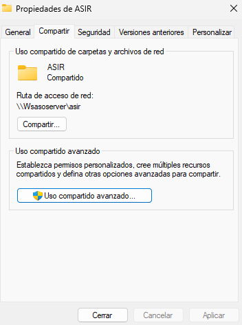

Ahora, siguiendo desde las propiedades de la carpeta, accedemos a la pestaña **Seguridad**, donde le daremos al botón `Editar` para agregar los usuarios de asir. También deberemos eliminar Usuarios de los permisos.

> Es posible que al eliminar Usuarios en permisos de error por la herencia, en ese caso en las propeiedades de la carpeta en la pestaña seguridad accedemos al botón de **Opciones avanzadas** y habrá que darle al botón de **Deshablitar herencia**. De esta manera si nos dejará eliminar al grupo Usuarios para uqe no tengan permisos.

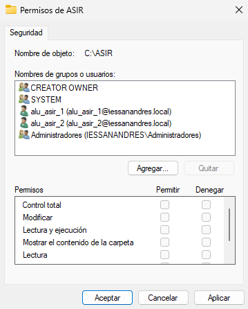

Una vez hemos hecho esto ya podemos comprobar que estamos compartiendo propiamente la carpeta, siguiendo en sus propiedades vamos a la pestaña **Compartir** y le damos al botón `Compartir`. Nos saldrá una lista de los usuarios y grupos con los que se está compartiendo.

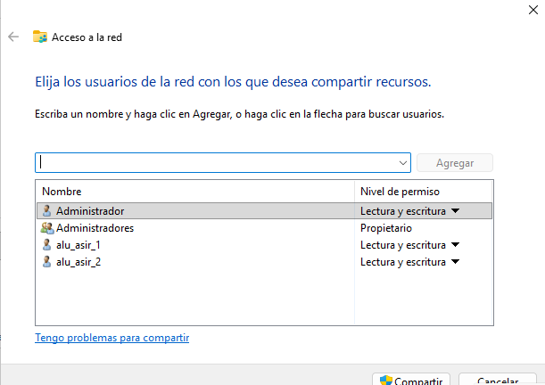

Le daremos al botón `Compartir`, esperaremops un poco y nos saldrá que la carpeta se ha compartido.

Ahora vamos al Adminsitrador del servidor > `Herramientas` > `Usuarios y grupos de Active Directory`. Buscamos a nuestos usuarios alu_asir y seleccionamos ambos y hacemos clic derecho > Propiedades.

Vamos a la pestaña `Perfil`, ahí marcaremos el checkbox correspondiente a **Carpeta particular**, marcaremos el primer botón de radio y pondremos la ruta absoluta de la carpeta que queremos compartirles/asignareles, en mi caso es `C:\ASIR`.

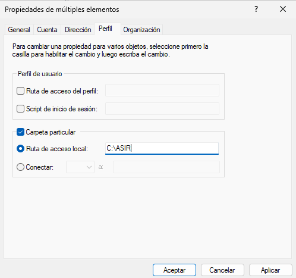

De esta manera ya tenemso una carpeta compartida para todos los alumnos de asir.

## Ejercicio 2 - Carpetas personales.

### Una carpeta para cada usuario dentro de C:\shares y realiza los pasos necesarios para que ambos usuarios puedan ver esta carpeta como una unidad de red identificada con la letra H:

Desde el Administrador del servidor accederemos a Administrar > Añadir roles y características

Cuando nos aparezca el paso de elegir el rol buscaremos el rol de **Servicios de archivos y almacenamiento**. Desplegamos ese rol, desplegamos **Servicios de iSCSI y archivo** y finalmente seleccionamos la casilla de `Administrador de recursos del servidor de arcivos`.

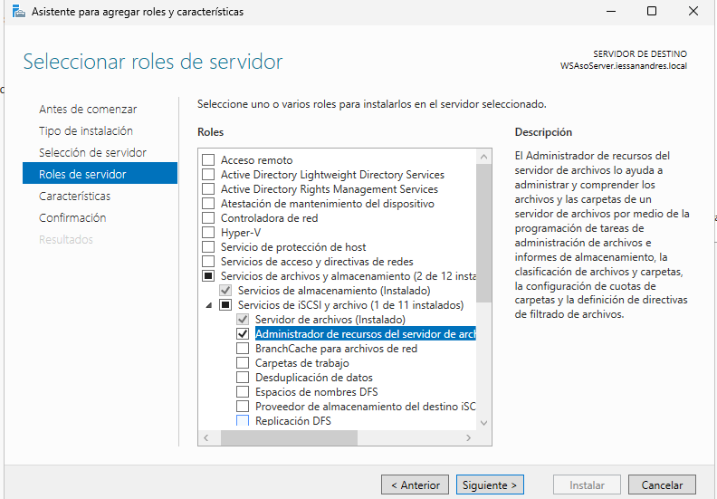

Una vez instalado, en el menú de la izquierda nos aparece una sección nueva, la sección de Servicios de archivo y almacenamiento. A la que haremos clic.

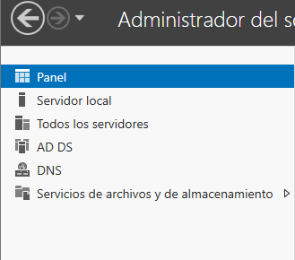

Se nos abrirá otro menú lateral izquierdo donde deberemos hacer clic a Recursos compartidos, Una vez hemos hecho clic, en la parte central haremos clic a cualquier espacio en blanco y le daremos a **Nuevo recurso compartido...**

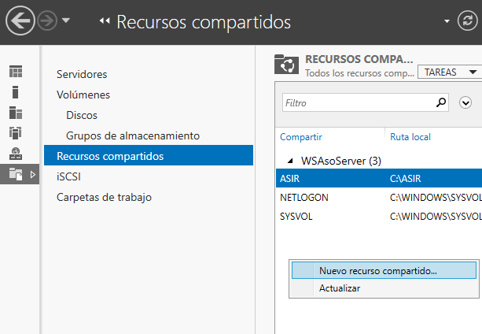

Dejaremos todos los valores por defecto a excepción de la parte que indica poner el nombre, que pondremos compartida por darle un nombre ya que este servicio utiliza automaticamente la carpeta C:\shares. 

> Es probable que tengamos que crear la carpeta Shares en C:\ a mano para que funcione

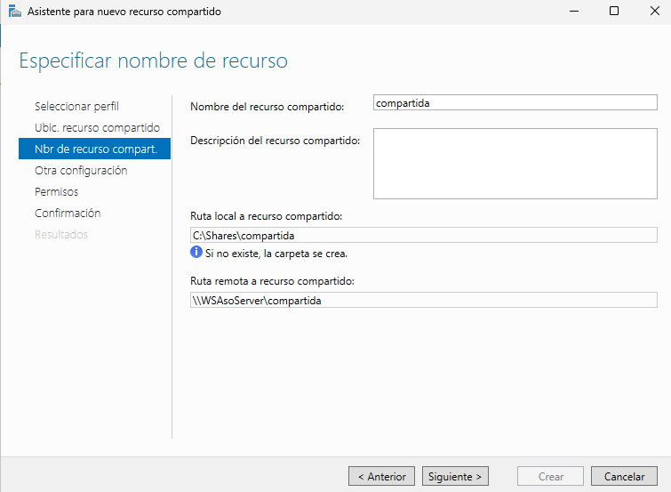

Una vez le demos a Crear, si se ha hecho correctamente aparecerá las dos barras en azul con el mensaje de Completada.

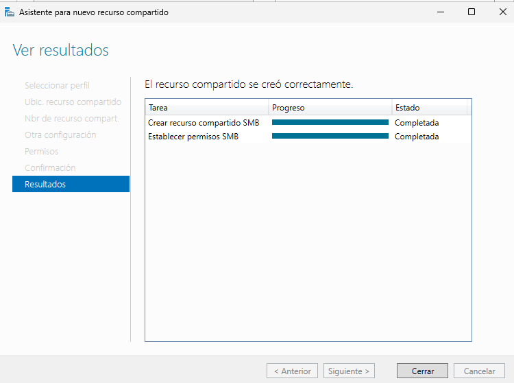

Para crear una carpeta que pertenezca a cada usuario en vez de crarla manualmente haremos lo siguiente:

Vamos a Usuarios y grupos de Active Diretory y buscamosun usuario que hayamos creado, por ejemplo en mi caso alu_asir_1. Le hacemos clic derecho y vamos a sus **Propiedades** a la pestaña **Perfil**. Ahí cambiaremos el botón de radio de Carpeta particular a **Conectar:** e introduciremos la ruta absoluta de la carpeta de la siguiente manera:
`\\Wsasoserver\compartida\%username%`

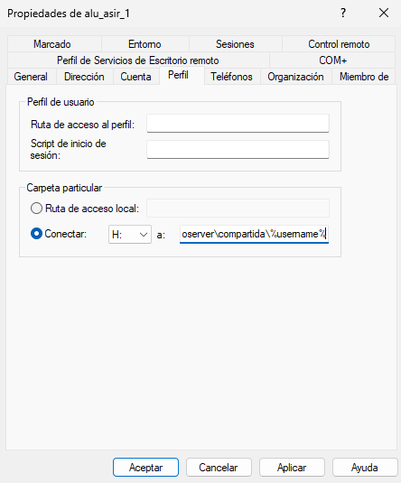

Haremos esto con ambos usuarios y comprobaremos desde el Explorador de archivos que se han creado solas las carpetas.

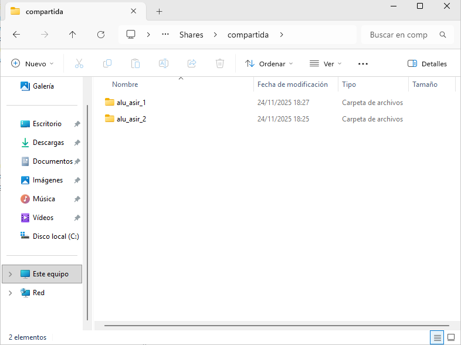

##### Comprobación:

Desde una máquina de W10, con un adaptador en Host Only, corroboramos que la IP pertenece a la misma red que nuestro servidor y que tiene conectividad haciendo un ping.

Ahora, para conectarla a nuestro dominio, desde Configuración > Sistema > Acerca de iremos a las opciones del menú derecho que aparecen como hipervínculos y le damos a **Configuración avanzada del sistema**.

En configuración avanzada vamos a la pestaña **Nombre de equipo**, buscaremos un botón que ponga **Cambiar...** y ahí aparecera un apartado que diga **Miembro de** con opción a insertar un dominio. Introduciremos ahí nuestro dominio `iessandres.local`. Y se reiniciará el equipo. Ahora accederemos con los usuarios alu_asir_1 y alu_asir_2 para comprobar que funciona.

- alu_asir_1:

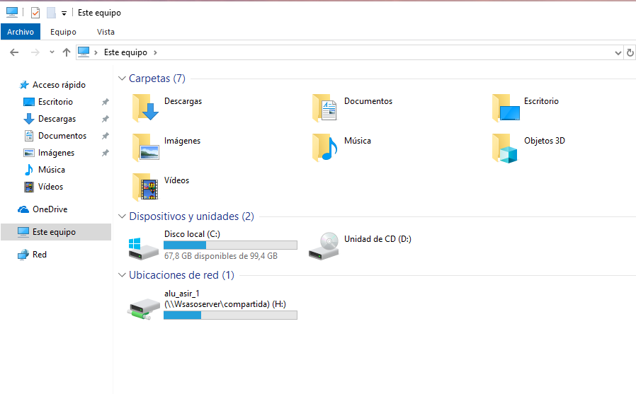

- alu_asir_2:

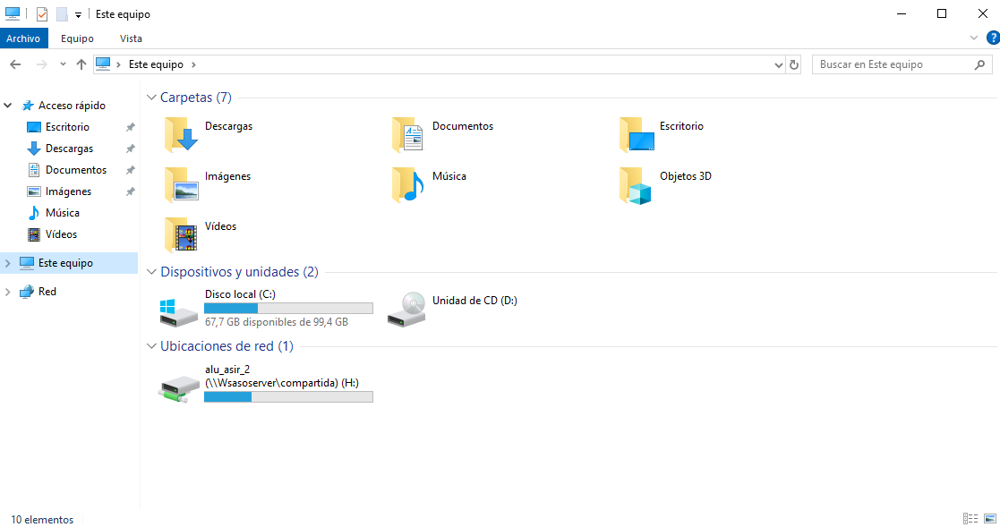

## Ejercicio 3 - Carpetas compartidas por un grupo.

### En C:\shares una carpeta llamada apuntes, los alumnos de ASIR pueden acceder a ella como un espacio de almacenamiento compartido con permiso de lectura.

Creamos manualmente desde el explorador de archivos una carpeta que se llame apuntes, desde sus **propiedades**, vamos a la pestaña **Compartir** y ahí le damos al botón **Compartir**. Aquí añadiremos el grupo GRP_Alumnos_ASIR

> Si no tenemos este grupo creado, lo creamos y asignamos a los alumnos de ASIR.

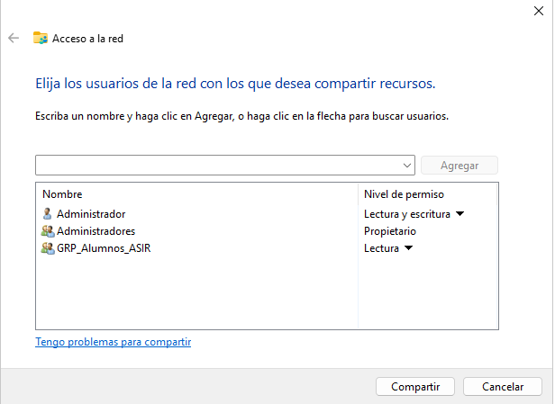

Para que se automonte deberemos crear un .bat que crearemos en `\\localhost\NETLOGON` (simplemente lo escribirmos en el explorador de archivos donde iría la carpeta de la ruta donde estamos situados), el .bat contiene la siguiente línea

`net use I: \\wsasoserver\compartida\apuntes`

> Es importante poner una letra diferente, si volviesemos a poner H: daría conflicto porque en el ejercicio anterior usamos esa letra.

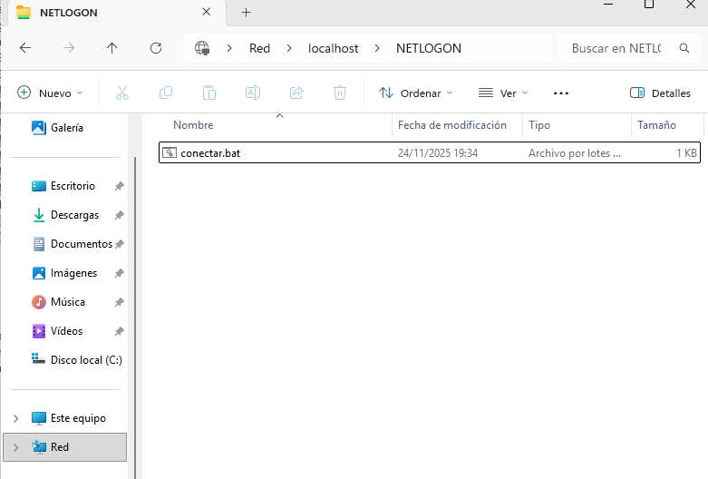

Ahora desde Usuarios y Grupos de Active Directory accederemos a las propiedades de los usuarios de asir y vamos a la pestaña **Perfil**. Ahí añademos un script de inicio de sesión, de esta manera solo se automontará esta carpeta para estos usuarios.

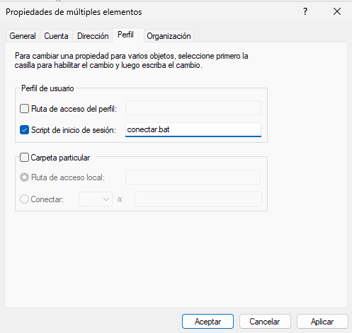

Si ahora cerramos sesión en nuestro ciente y volvemos a iniciar sesión deberá aparecer otra unidad montada, que es la de apuntes.

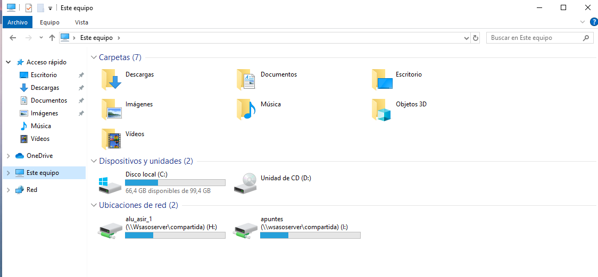

### Otra carpeta llamada práctica en la que tengan permiso de lectura y escritura

> Aunque el enunciado pone práctica, mejor ponerlo sin tilde, el cmd no sabe interpretar tildes si no se lo indicamos, así que es más facil poner todo sin tildes.

Ahora repetiremos el mismo proceso pero con otra carpeta que se llame práctica.

Creamos la carpeta dentro de Shares, y en sus propiedades la compartimos con el grupo

A la hora de compartir le pondremos los permisos de lectura y escritura en vez de solo lectura.

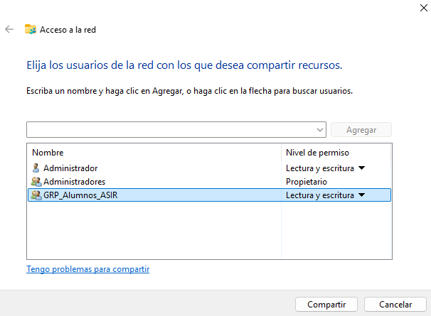

En el .bat en el que hemos montado la otra carpeta añadimos otra línea para montar esta carpeta:

`net use J: \\wsasoserver\compartida\practica`

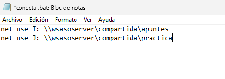

Como ya está el script configurado en los perfiles de los usuarios solo queda ver que funcione iniciando sesión en los clientes.

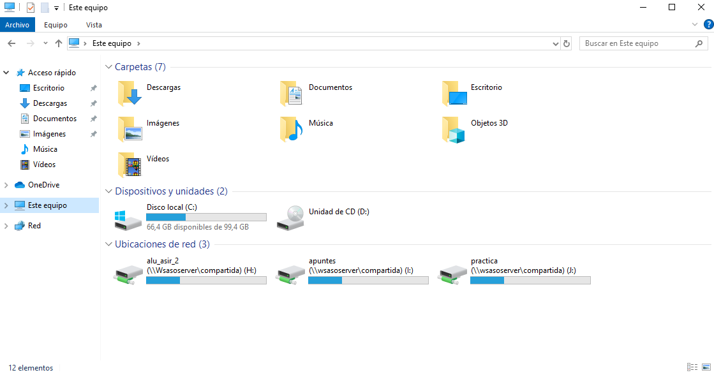

------------

#### [Volver a Unidad 5](../index.md)