#### [Volver a Unidad 5](../index.md)

------------

# Unidad 5 - Práctica 3: Aplicación de GPOs y Seguridad.

## Parte I

### Ejercicio 1 - Creación del GPO “Restricciones Alumnos”.

Desde Administrador del Servidor > Herramientas accederemos a **Administración de directivas de grupo** (La primera opción del desplegable). 

En la estructura de carpetas de la izquierda desplegamos nuestro dominio y buscamos la UO Alumnado.

Haremos clic derecho y le daremos a la siguinete opción:

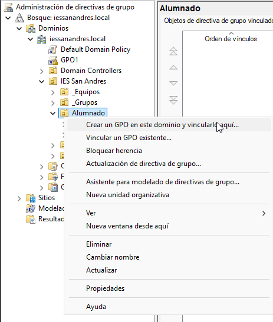

Lo llamaremos: `GPO_ALU_RESTRICCIONES`.

Una vez creado aparecerá así dentro de la estructura:

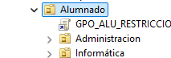

Para asignarle Directivas a este GPO le haremos clic derecho y le daremos a Editar. Eso nos abrirá una ventana donde podremos buscar las siguientes directivas:

- Bloqueo del Panel de Control: navega a Plantillas administrativas > Panel de control. Habilita la política “Prohibir el acceso al Panel de control y a la configuración del equipo”.

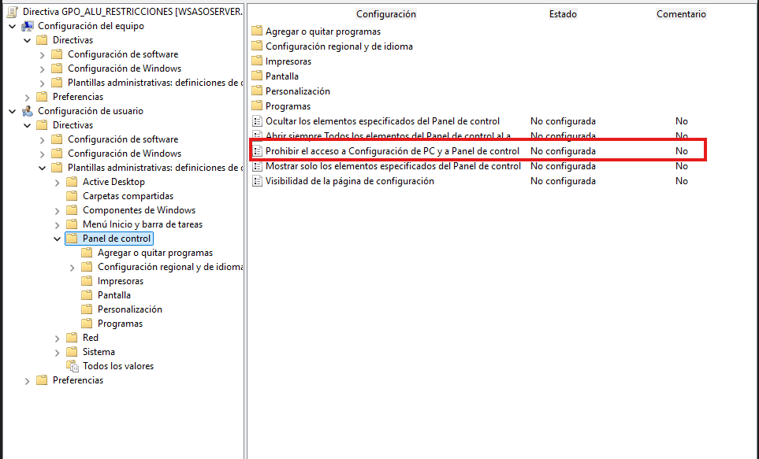

- Establecer Fondo de Escritorio: navega a Plantillas administrativas > Escritorio > Escritorio. Habilita la política “Fondo de escritorio” y establece una ruta de red válida (ej. \\servidor_dc\recursos\fondo.jpg).

Para establecer esto primero necesitamos configurar un recurso compartido para que todos puedan acceder a esa carpeta. Primero creamos la carpeta con su imagen dentro y luego creamos el recurso compartido desde Administrador del servidos en el menú izquierdo.

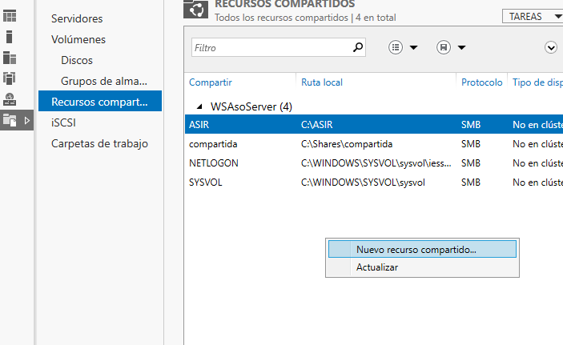

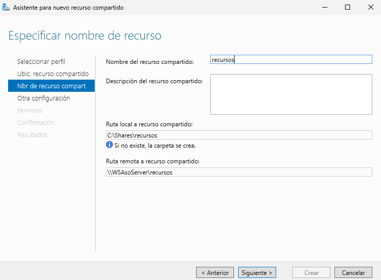

Ahora configuraremos la directiva, deberemos habilitar Active Desktop y despues habilitar Tapiz del escritorio y ponerla la ruta.

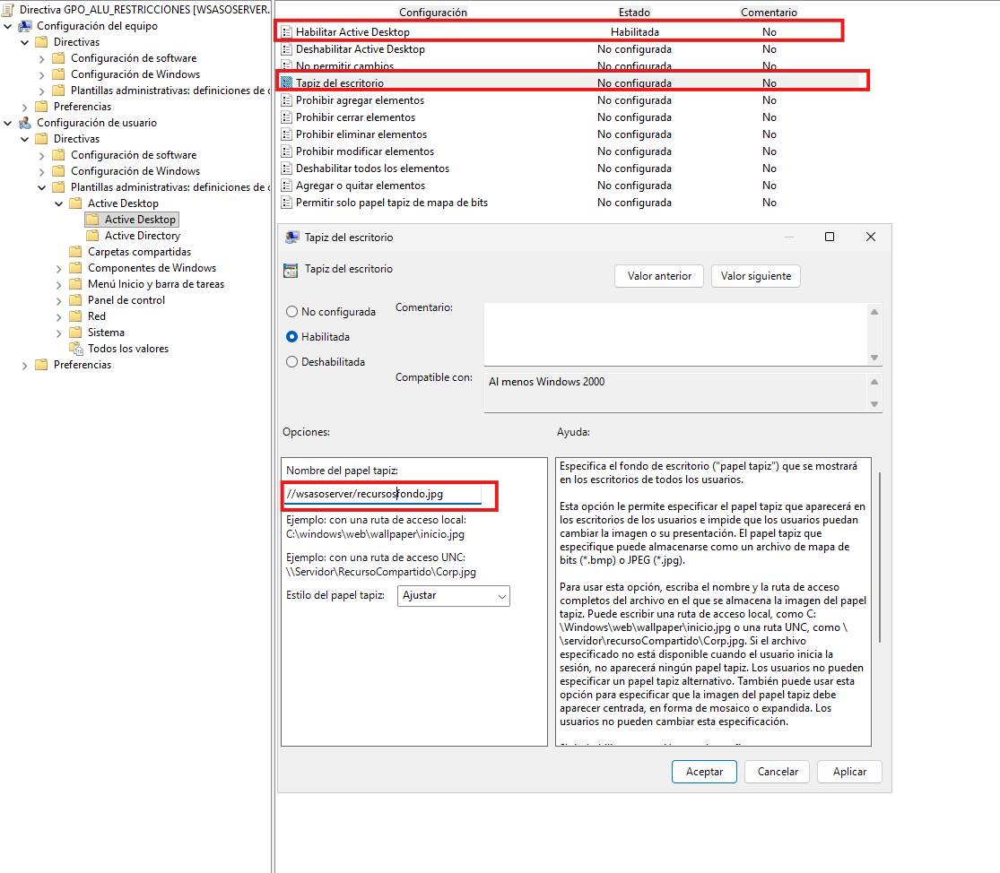

- Ocultar unidades de disco: navega a Plantillas administrativas > Componentes de Windows > Explorador de archivos. Habilita la política “Ocultar estas unidades específicas en Mi PC” y selecciona la opción “Restringir las unidades A, B, C y D”.

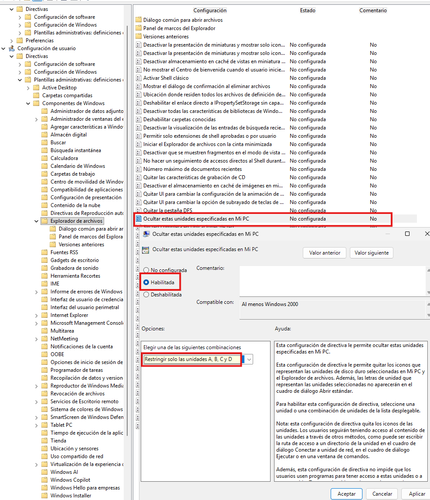

### Ejercicio 2 - Verificación de usuarios.

Para comprobar que lo que hemos hecho funciona deberemos iniciar sesión desde algun cliente que además sea alumno, por ejemplo alu_asir_1 o alu_asir_2.

Una vez iniciemos sesión deberemos abrir el CMD para ejecutar el siguiente comando `gpupdate /force`. Esto nos permite forzar a que se apliquen los cambios de las directivas, sino tardría un buen rato en aplicarse.

Observaremos las dos siguientes cosas:

- El fondo de pantalla. (el que puse era una captura de color negro)
- Intentar abrir el panel de control.

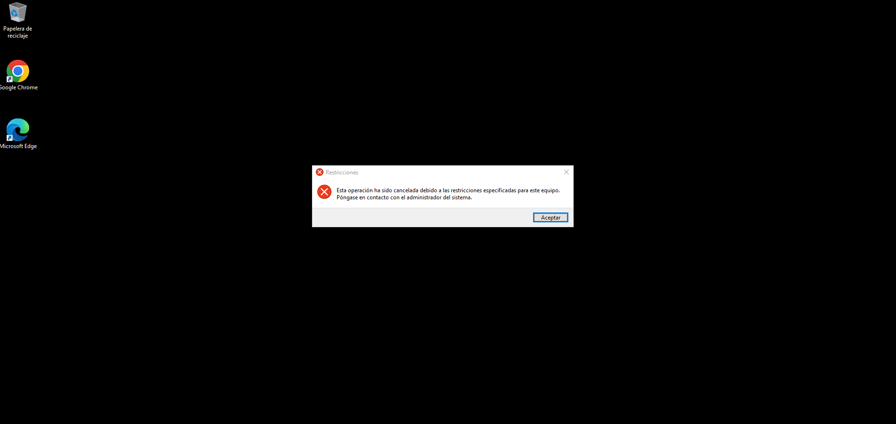

--------------

## Parte II

### Ejercicio 1 - Política de seguridad (UO Equipos).

Primero crearemos el GPO llamado `GPO_SEG_BASE`, para ello podemos crearlo aparte o crearlo directamente vinculado a Aulas_Informática.

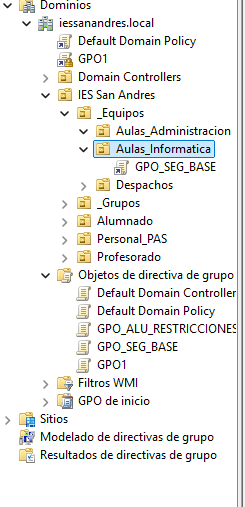

- Le ponemos la directiva de seguridad: Configuración de seguridad > Directivas de cuentas > Directiva de contraseña > “Longitud mínima de la contraseña”:  8 caracteres.

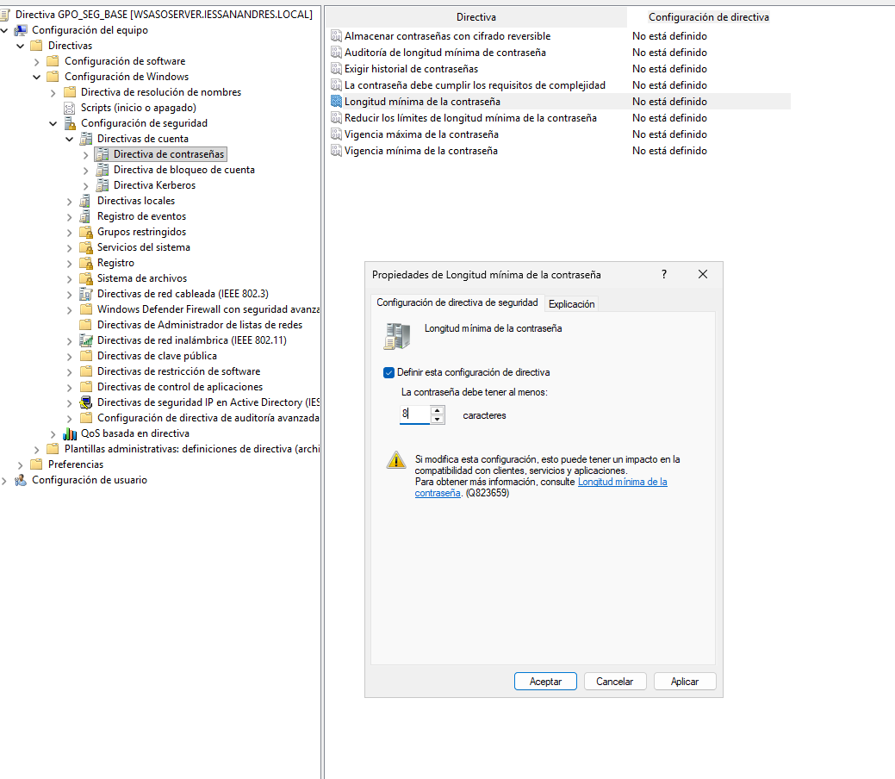

- Le ponemos la directiva de Configuración de seguridad > Directivas locales > Opciones de seguridad.
Establece “Cuentas: Cambiar nombre de la cuenta de administrador” a AdministradorLocal1

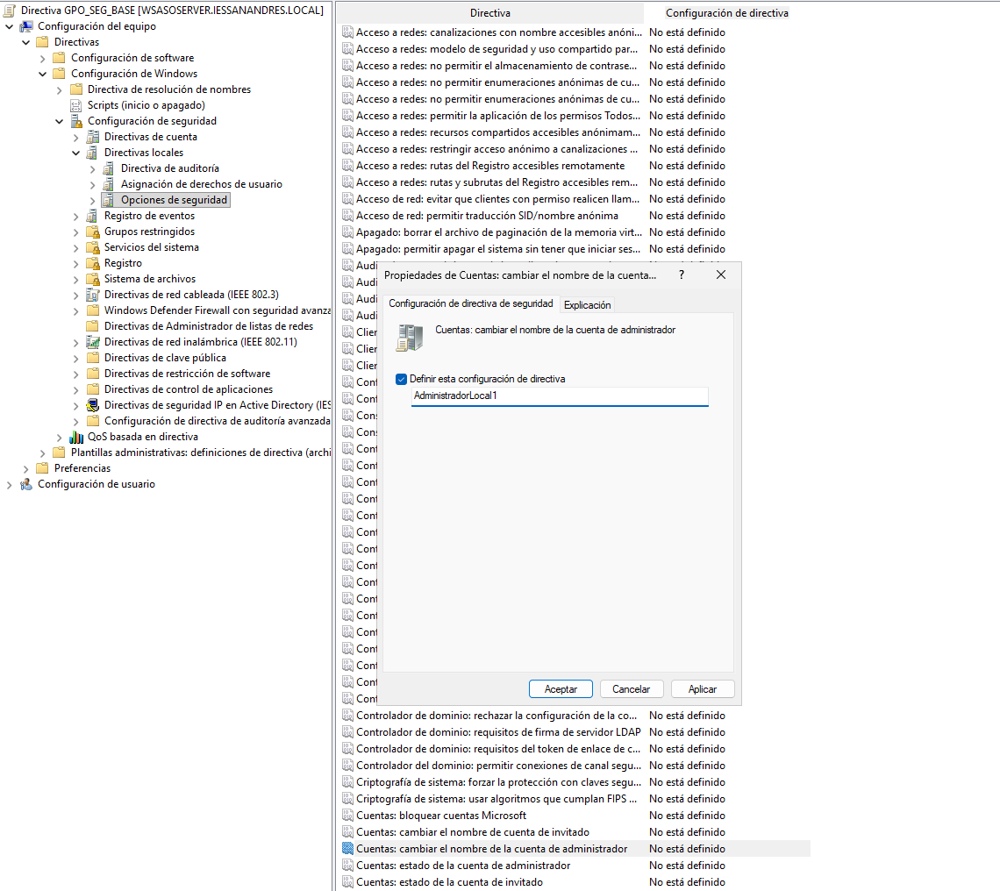

### Ejercicio 2 - Mapeo de unidad específica (UO Administración).

Creamos la GPO asignada a la UO Alumnado > Administgracón  que lo llamaremos `GPO_ADM_UNIDAD_Z`.

- Le ponemos la directiva: Configuración de Usuario > Preferencias > Configuración de Windows > Asignaciones de Unidad con las siguientes especificaciones:
    - Acción: crea una nueva Asignación de Unidad.
    - Ubicación: \\wsasoserver\compartida\administracion (Asume que esta ruta existe).
    - Etiqueta: Recursos_ADM
    - Letra de Unidad: Z:

> Será necesario crear de verdad el recurso compartido porque sino al hacerlo da error. Entonces primero crearemos el recurso compartido y luego configuraremos la directiva.

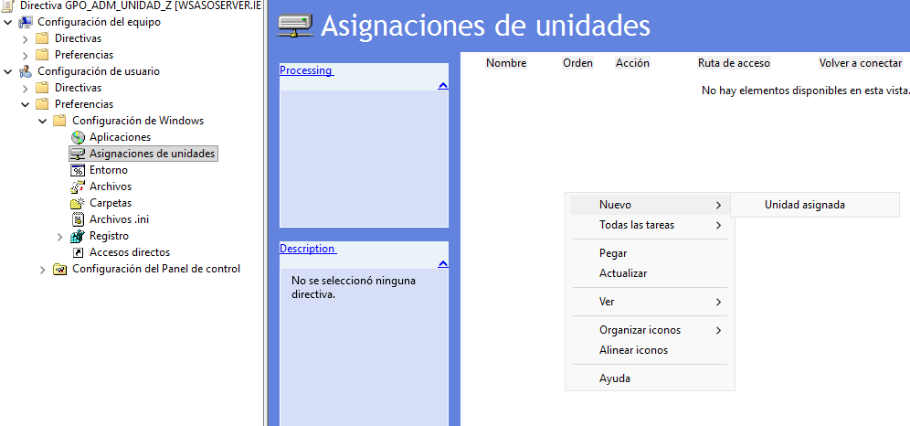

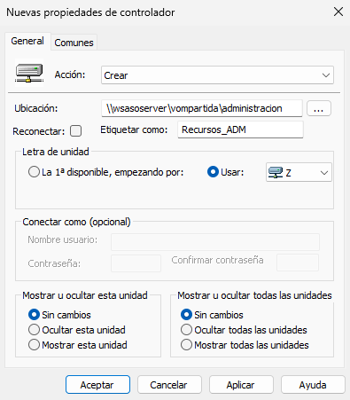

### Ejercicio 3 - Verificación de Recurso.

Desde el cliente de W10 comprobaremos que con un alu_asir_1 por ejemplo no se puede ver la carpeta pero con alu_afi_1 sí

En alu_asir_1 no aparece el volumen Z.

En alu_afi_1 sí aparece el volumen Z.

------------

#### [Volver a Unidad 5](../index.md)