#### [Volver a Unidad 5](../index.md)

------------

# Unidad 5 - Práctica 4: Directivas de seguridad, GPP y Filtros WMI.

## Parte I - Endurecimiento de la seguridad

Para estos ejercicios trabajaremos en Administración de Directivas de Grupo. Es la primera opción de Herramientas dentro del Administrador del servidor.

Crearemos un GPO vinculado a la UO `_Equipos`, la llamaremos `GPO_Harden_Security_Equipos`.

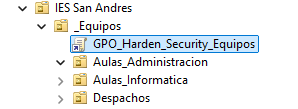

Para asignarle las directivas convnientes en cada ejercicio, a ese GPO le daremos clic derecho > Editar. Ahí entonces podremos buscar las directivas en cuestión:

### Ejercicio 1 - Protección de cuentas y acceso.

- Renombrar cuenta de administrador a `Admin_Local_IES`.

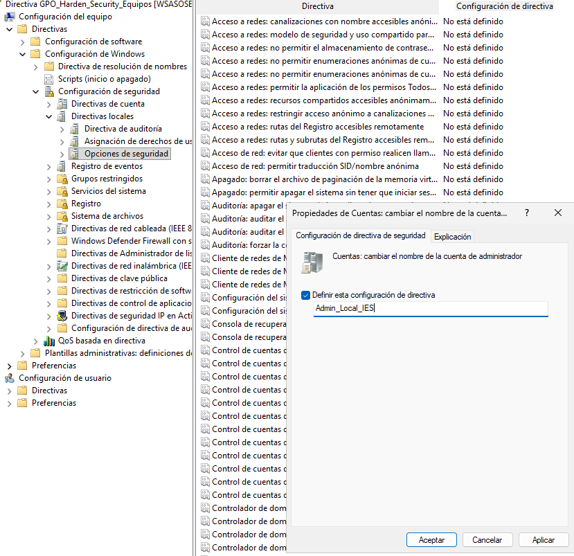

- Inicio de sesión interactivo: que no requiera pulsar **Ctrl+Alt+Supr** para iniciar sesión.

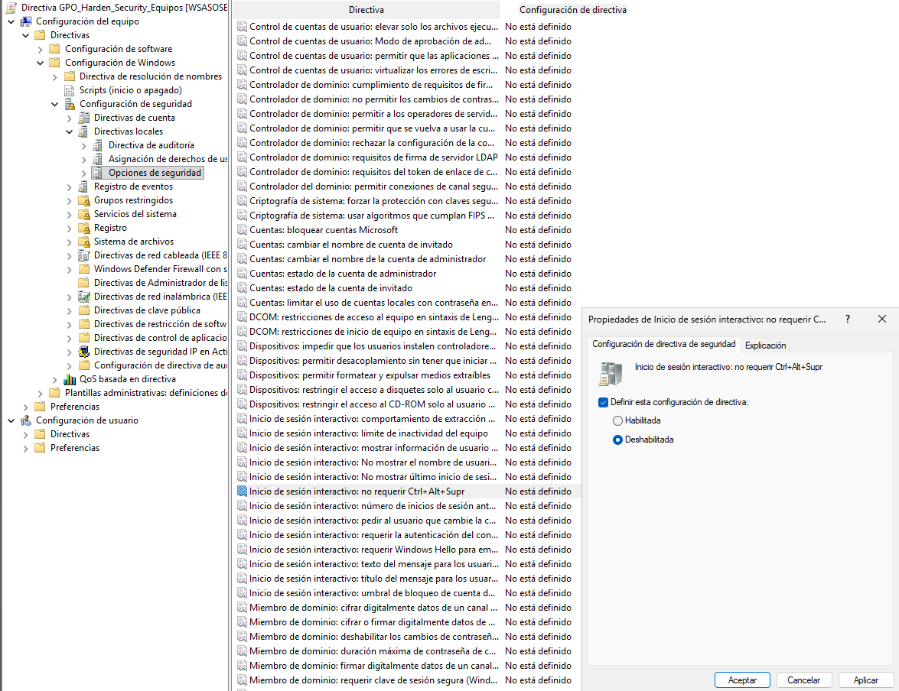

### Ejercicio 2 - Aviso legal (Consentimiento Informado).

Mensaje legal a los usuarios.
- Título: *Aviso de Seguridad del IES San Andrés*

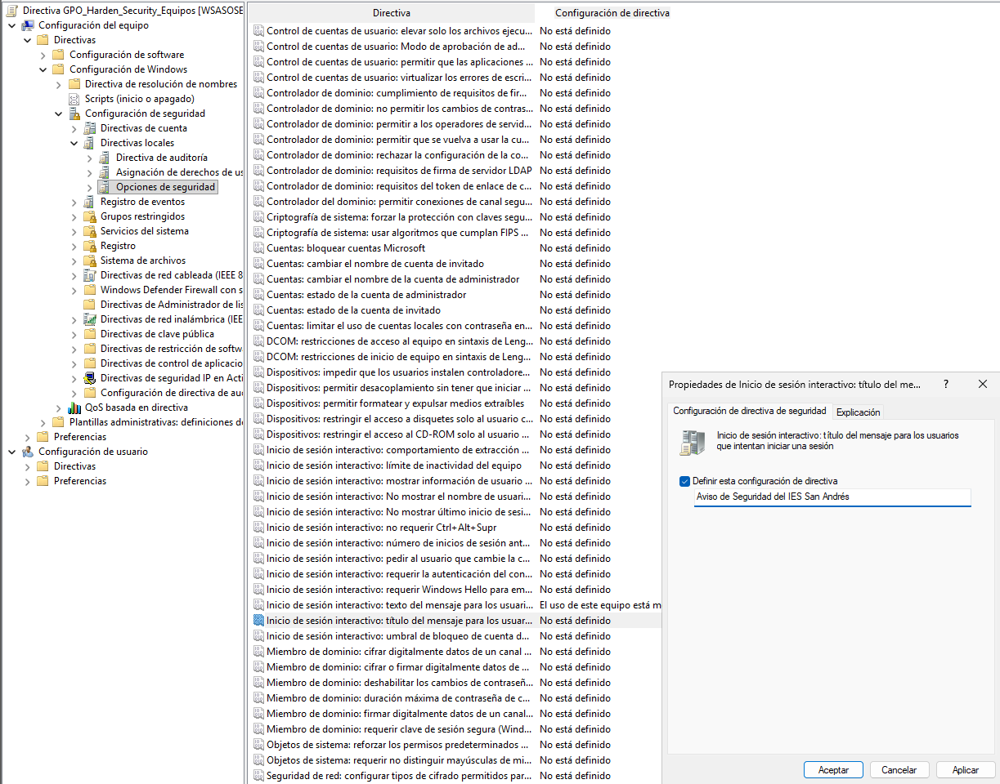

- Texto: *El uso de este equipo está monitorizado. El acceso está restringido únicamente a personal y alumnado autorizado.*

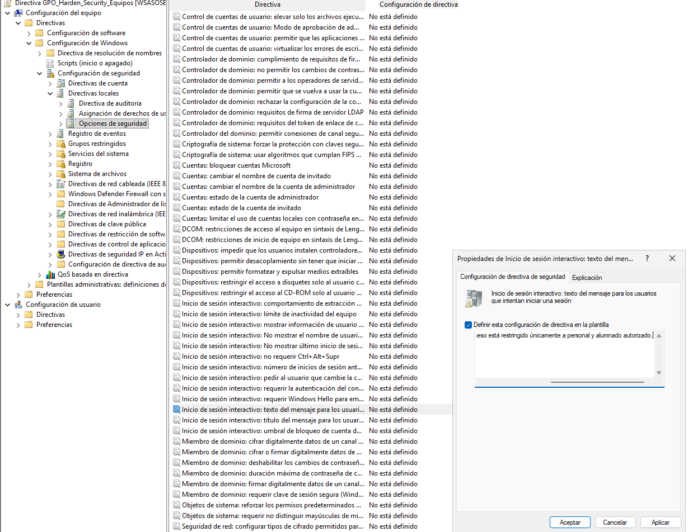

### Ejercicio 3 - Privacidad y apagado.

- Privacidad: inicio de sesión interactivo para que no muestre el último nombre de usuario que inició sesión.

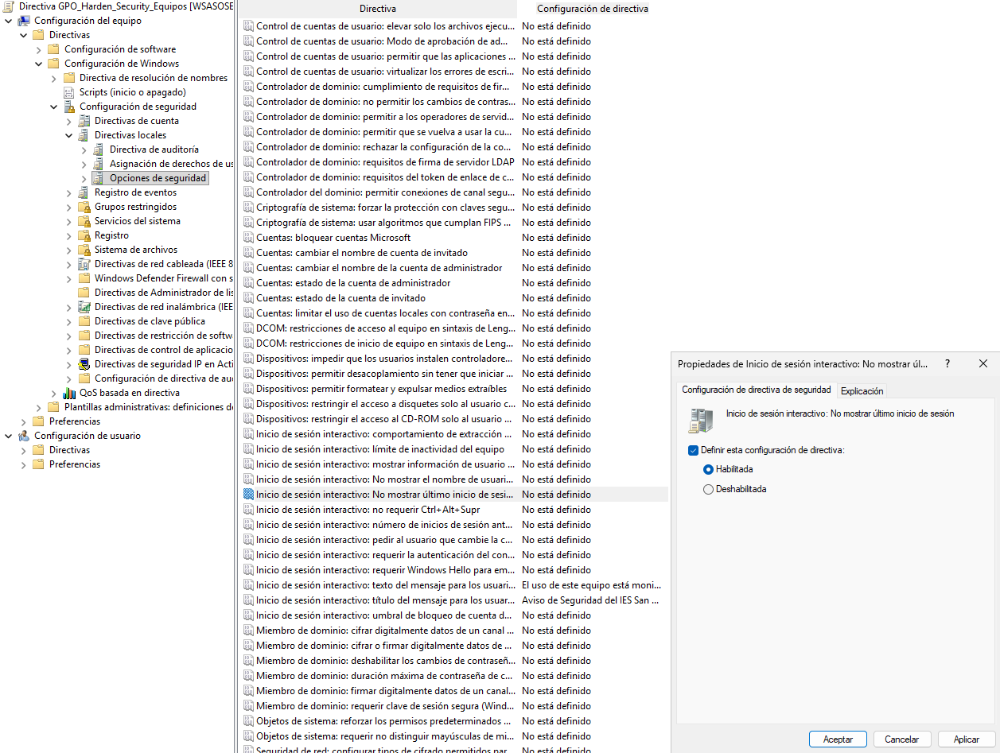

- Apagado: Deshabilitar apagar el sistema sin tener que iniciar sesión. 

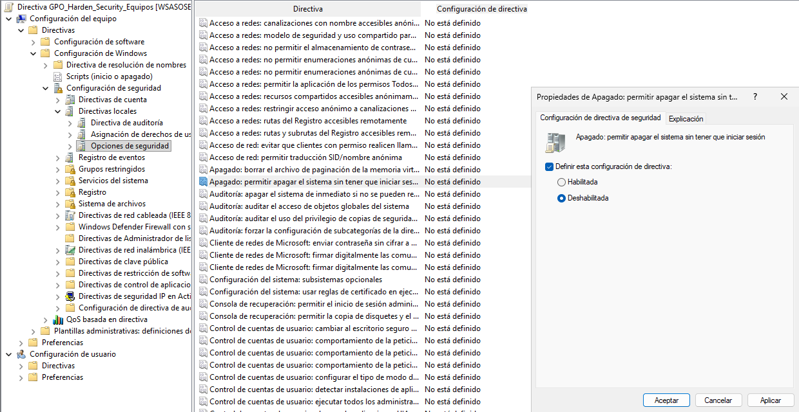

------------

## Parte II - Preferencias de Grupo (GPP) y segmentación

Las GPP funcionan igual que las GPO pero en vez de escoger Directivas en la estructura de carpetas cuando vamos a asignarle algo a una GPO, iremos a la carpeta Preferencias y lo seleccionaremos desde ahí.

Crearemos una GPO llamada `GPO_Configuracion_Usuario_Dinamica` que va a estar vincula a la UO raíz de todo el dominio.

### Ejercicio 1 - Mapeo de unidades de red (Drive Maps).

- Crea una unidad de red mapeada (letra P:) que apunte a una carpeta compartida del servidor (Recursos_Profesores).
- Requisito: Usa Item-Level Targeting (Destinatarios) para que esta unidad SOLO se monte si el usuario pertenece al grupo GRP_Profesores_General.

Primero crearemos una carpeta llamada `recursos_profesores` dentro de la carpeta `Shares`en **C:\\**. En las propiedades de desta carpeta iremos a la pestaña **Compartir** y buscaremos el botón de `Configuración avanzada`. Ahí añadiremos el grupo `GRP_Profesores_General` y le daremos todos los permisos y se lo quitaremos al resto.

Una vez hecho esto deberemos ir a nuestra ventana donde configuramos los GPOs y le darmos clic derecho y editar el GPO que hemos creado para el ejercicio.

Se nos abrirá el menú donde normalmente solemos buscar las directivas, pero esta vez abriremos el desplegable `Preferencias`, depsues desplegaremos `Confiugración de Windows` y buscaremos la opción `Asignaciones de unidades`, donde despues de hacerle clic deberemos hacer clic derecho sobre cualquier espacio en blanco y le darmos a **Nueva propiedad de contador**. 

Se nos abrirá una ventana que rellenaremos de la siguiente manera:

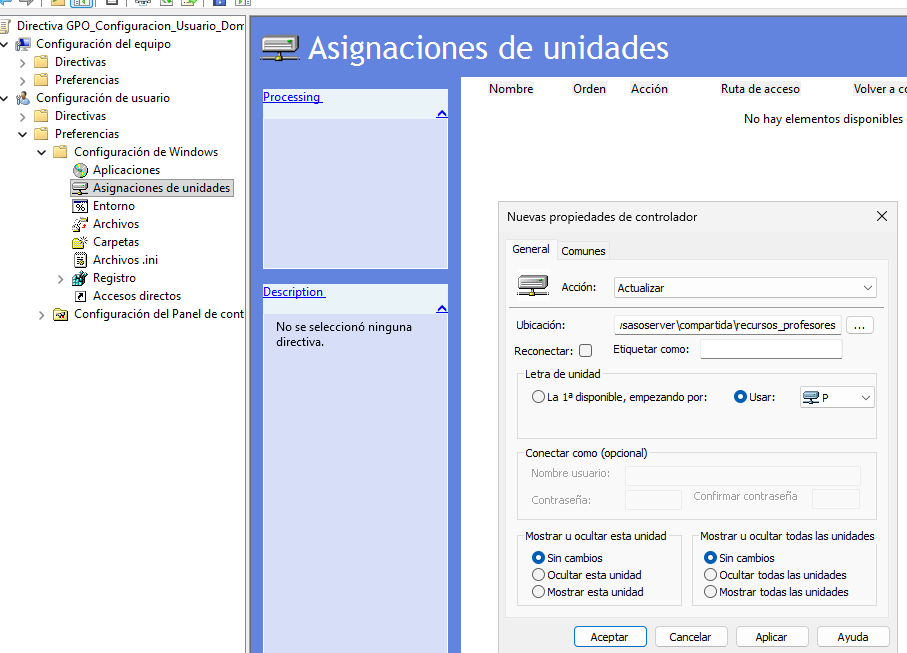

Para ponerle el requisito de que solo afecte a el grupo de GRP_Profesores_General deberemos ir a la pestaña `Comunes`, ahí marcaremos el último *checkbox* y le daremos el botón de Destinatarios para seleccionar a que objeto queremos que haga referencia.

Se nos abrirá una ventana donde deberemos darle a el desplegable de arriba a la izquierda donde pone **Nuevo elemento**, ahí se nos desplegará una lista de objetos del sistema donde deberemos seleccionar Grupos de seguridad que tiene un icono de dos cabezas.

Ahora especificaremos que grupo queremos que haga referencia y le damos a Aplicar.

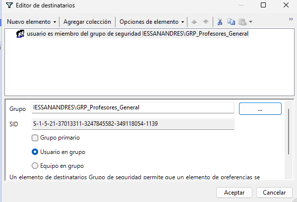

### Ejercicio 2 - Accesos Directos (Shortcuts).

- Crea un acceso directo en el Escritorio que apunte a http://intranet.iessanandres.local (puedes inventar la URL).
- Requisito: Usa Item-Level Targeting para que este acceso directo SOLO aparezca a los miembros del grupo GRP_Alumnos_ASIR.

Le daremos clic derecho > Editar al GPO que hemos creado para esta tarea, iremos al desplegable de `Preferencias` y en `Configuración de Windows` buscaremos la opción de **Accesos directos**. Haremos clic derecho sobre cualquier espacio en blanco y le daremos a **Nuevo** > **Acceso directo**.

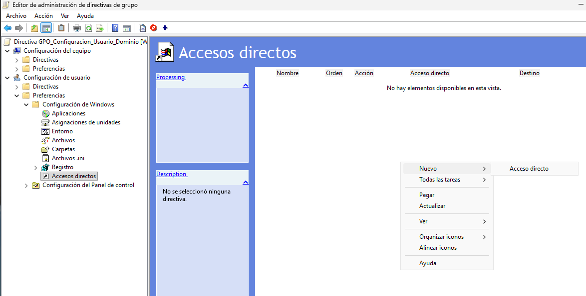

Rellenaremos la ventana de configuración del acceso directo de la siguiente manera:

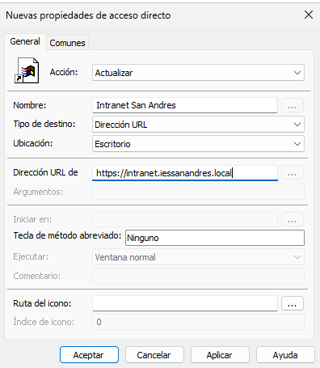

Para asignarlo concretamente al grupo GRP_Alumnos_DAM, lo haremos de la misma manera que el ejercicio anterior,en la misma ventana iremos a la pestaña de Comunes, marcaremos el úñtimo *checkbox* y añadiremos un nuevo elemento que será un grupo de seguridad donde seleccionaremos el grupo que queremos que afecte.

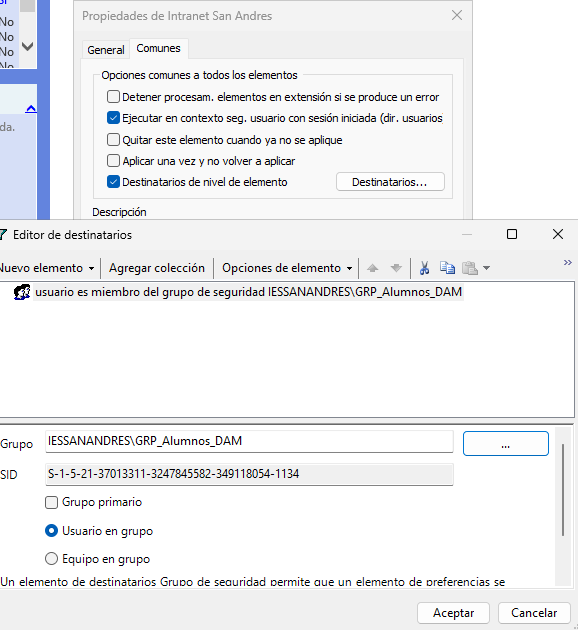

#### Comprobaciones:

- Comprobación Ejercicio1 desde usuario prof_info_1

El resultado es un volumen de disco que puede visualizarse desde el Explorador de archivos.

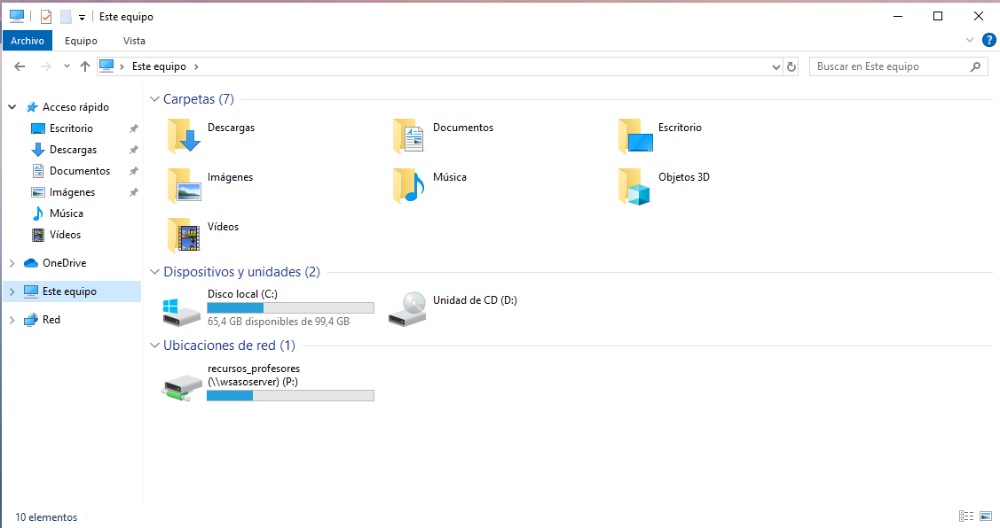

- Comprobación Ejercicio2 desde usuario alu_dam_1 

> Fue necesario crear el usuario y añadirlo al grupo GRP_Alumnos_DAM. 

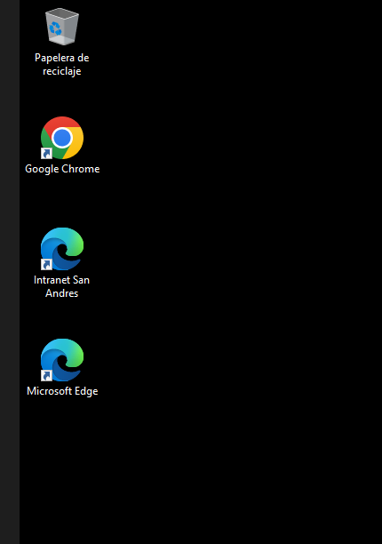

------------

## Parte III - Filtrado WMI Avanzado.

### Ejercicio 1 - Gestión de Memoria Virtual.

Haremos los siguientes pasos: 

- Crear una GPO llamada `GPO_HighPerf_Security`.

- Habilitar la directiva: Computer Configuration -> Policies -> Windows Settings -> Security Settings -> Local Policies -> Security Options.

- Crea y vincula un Filtro WMI que haga que esta GPO solo se aplique a equipos que tengan más de 4 GB de memoria RAM.

### Ejercicio 2 - Diferenciación de Sistema Operativo (Workstation vs Server).

Haremos los siguientes pasos: 

- Crear una GPO llamada `GPO_Clientes_UAC`.

- Configurar la directiva de UAC para deshabilitar la detección de instalaciones.

- Crear y vincular un Filtro WMI que seleccione únicamente sistemas operativos de escritorio (no servidores)

------------

#### [Volver a Unidad 5](../index.md)