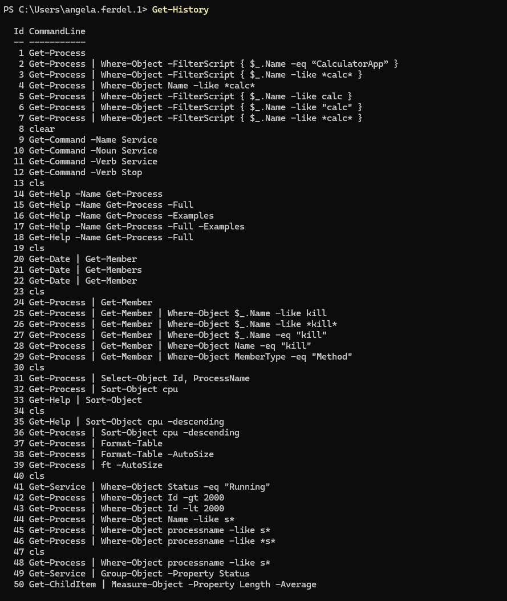
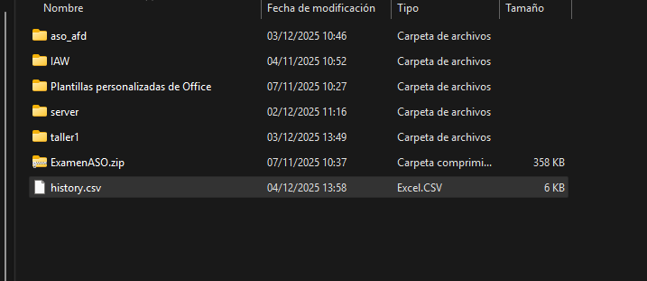
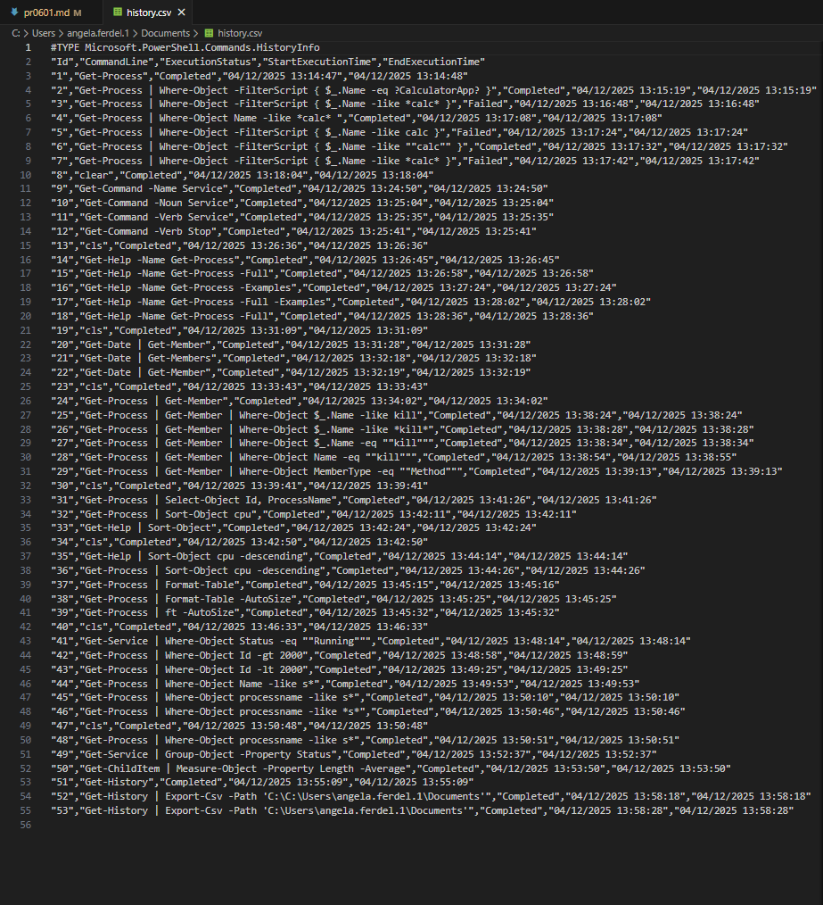

#### [Volver a Unidad 6](../index.md)

------------

# Unidad 6 - Práctica 1: Introducción a Powershell.

## Bloque 1: Descubrimiento y ayuda.

1. Búsqueda por nombre (Sustantivo):

- Lista todos los comandos disponibles en el sistema que tengan la palabra Service en su nombre (noun) para identificar qué herramientas tienes para gestionar servicios.

`Get-Command -Noun Service`

```
CommandType     Name                                               Version    Source
-----------     ----                                               -------    ------
Cmdlet          Get-Service                                        3.1.0.0    Microsoft.PowerShell.Management
Cmdlet          New-Service                                        3.1.0.0    Microsoft.PowerShell.Management
Cmdlet          Restart-Service                                    3.1.0.0    Microsoft.PowerShell.Management
Cmdlet          Resume-Service                                     3.1.0.0    Microsoft.PowerShell.Management
Cmdlet          Set-Service                                        3.1.0.0    Microsoft.PowerShell.Management
Cmdlet          Start-Service                                      3.1.0.0    Microsoft.PowerShell.Management
Cmdlet          Stop-Service                                       3.1.0.0    Microsoft.PowerShell.Management
Cmdlet          Suspend-Service                                    3.1.0.0    Microsoft.PowerShell.Management
```

2. Búsqueda por acción (Verbo): 

- Lista todos los comandos disponibles cuya acción sea Stop (detener), independientemente de lo que detengan.

`Get-Command -Verb Stop`

```
CommandType     Name                                               Version    Source
-----------     ----                                               -------    ------
Function        Stop-DscConfiguration                              1.1        PSDesiredStateConfiguration
Function        Stop-Dtc                                           1.0.0.0    MsDtc
Function        Stop-DtcTransactionsTraceSession                   1.0.0.0    MsDtc
Function        Stop-EtwTraceSession                               1.0.0.0    EventTracingManagement
Function        Stop-NetEventSession                               1.0.0.0    NetEventPacketCapture
Function        Stop-PcsvDevice                                    1.0.0.0    PcsvDevice
Function        Stop-ScheduledTask                                 1.0.0.0    ScheduledTasks
Function        Stop-StorageDiagnosticLog                          2.0.0.0    Storage
Function        Stop-StorageJob                                    2.0.0.0    Storage
Function        Stop-Trace                                         1.0.0.0    PSDiagnostics
Cmdlet          Stop-AppvClientConnectionGroup                     1.0.0.0    AppvClient
Cmdlet          Stop-AppvClientPackage                             1.0.0.0    AppvClient
Cmdlet          Stop-Computer                                      3.1.0.0    Microsoft.PowerShell.Management
Cmdlet          Stop-DtcDiagnosticResourceManager                  1.0.0.0    MsDtc
Cmdlet          Stop-Job                                           3.0.0.0    Microsoft.PowerShell.Core
Cmdlet          Stop-Process                                       3.1.0.0    Microsoft.PowerShell.Management
Cmdlet          Stop-ReFSDedupJob                                  2.0.0.0    Microsoft.ReFsDedup.Commands
Cmdlet          Stop-Service                                       3.1.0.0    Microsoft.PowerShell.Management
Cmdlet          Stop-Transcript                                    3.0.0.0    Microsoft.PowerShell.Host
Cmdlet          Stop-VM                                            2.0.0.0    Hyper-V
Cmdlet          Stop-VMFailover                                    2.0.0.0    Hyper-V
Cmdlet          Stop-VMInitialReplication                          2.0.0.0    Hyper-V
Cmdlet          Stop-VMReplication                                 2.0.0.0    Hyper-V
Cmdlet          Stop-VMTrace                                       2.0.0.0    Hyper-V
```

3. Uso de la ayuda:

- Muestra por pantalla la ayuda detallada del comando Get-Process, pero asegúrate de que se muestren específicamente los ejemplos de uso.

`Get-Help -Name Get-Process -Examples`

```
NOMBRE
    Get-Process

ALIAS
    gps
    ps


NOTAS
    Get-Help no encuentra los archivos de Ayuda para este cmdlet en el equipo. Mostrará solo una parte de la Ayuda.
        -- Para descargar e instalar los archivos de Ayuda para el módulo que incluye este cmdlet, use Update-Help.
        -- Para ver en línea el tema de Ayuda de este cmdlet, escriba "Get-Help Get-Process -Online" o
           vaya a https://go.microsoft.com/fwlink/?LinkID=113324.

```

## Bloque 2: Exploración de objetos

1. Introspección de tipos:

- Ejecuta el comando para obtener la fecha actual (Get-Date) pero canaliza su salida para ver la lista de sus Miembros (Members).

Comando para ver la fecha:

`Get-Date`

Comando para ver su lista de Miembros:

`Get-Date | Get-Member`

```
   TypeName: System.DateTime

Name                 MemberType     Definition
----                 ----------     ----------
Add                  Method         datetime Add(timespan value)
AddDays              Method         datetime AddDays(double value)
AddHours             Method         datetime AddHours(double value)
AddMilliseconds      Method         datetime AddMilliseconds(double value)
AddMinutes           Method         datetime AddMinutes(double value)
AddMonths            Method         datetime AddMonths(int months)
AddSeconds           Method         datetime AddSeconds(double value)
AddTicks             Method         datetime AddTicks(long value)
AddYears             Method         datetime AddYears(int value)
CompareTo            Method         int CompareTo(System.Object value), int CompareTo(datetime value), int IComparab...
Equals               Method         bool Equals(System.Object value), bool Equals(datetime value), bool IEquatable[d...
GetDateTimeFormats   Method         string[] GetDateTimeFormats(), string[] GetDateTimeFormats(System.IFormatProvide...
GetHashCode          Method         int GetHashCode()
GetObjectData        Method         void ISerializable.GetObjectData(System.Runtime.Serialization.SerializationInfo ...
GetType              Method         type GetType()
GetTypeCode          Method         System.TypeCode GetTypeCode(), System.TypeCode IConvertible.GetTypeCode()
IsDaylightSavingTime Method         bool IsDaylightSavingTime()
Subtract             Method         timespan Subtract(datetime value), datetime Subtract(timespan value)
ToBinary             Method         long ToBinary()
ToBoolean            Method         bool IConvertible.ToBoolean(System.IFormatProvider provider)
ToByte               Method         byte IConvertible.ToByte(System.IFormatProvider provider)
ToChar               Method         char IConvertible.ToChar(System.IFormatProvider provider)
ToDateTime           Method         datetime IConvertible.ToDateTime(System.IFormatProvider provider)
ToDecimal            Method         decimal IConvertible.ToDecimal(System.IFormatProvider provider)
ToDouble             Method         double IConvertible.ToDouble(System.IFormatProvider provider)
ToFileTime           Method         long ToFileTime()
ToFileTimeUtc        Method         long ToFileTimeUtc()
ToInt16              Method         int16 IConvertible.ToInt16(System.IFormatProvider provider)
ToInt32              Method         int IConvertible.ToInt32(System.IFormatProvider provider)
ToInt64              Method         long IConvertible.ToInt64(System.IFormatProvider provider)
ToLocalTime          Method         datetime ToLocalTime()
ToLongDateString     Method         string ToLongDateString()
ToLongTimeString     Method         string ToLongTimeString()
ToOADate             Method         double ToOADate()
ToSByte              Method         sbyte IConvertible.ToSByte(System.IFormatProvider provider)
ToShortDateString    Method         string ToShortDateString()
ToShortTimeString    Method         string ToShortTimeString()
ToSingle             Method         float IConvertible.ToSingle(System.IFormatProvider provider)
ToString             Method         string ToString(), string ToString(string format), string ToString(System.IForma...
ToType               Method         System.Object IConvertible.ToType(type conversionType, System.IFormatProvider pr...
ToUInt16             Method         uint16 IConvertible.ToUInt16(System.IFormatProvider provider)
ToUInt32             Method         uint32 IConvertible.ToUInt32(System.IFormatProvider provider)
ToUInt64             Method         uint64 IConvertible.ToUInt64(System.IFormatProvider provider)
ToUniversalTime      Method         datetime ToUniversalTime()
DisplayHint          NoteProperty   DisplayHintType DisplayHint=DateTime
Date                 Property       datetime Date {get;}
Day                  Property       int Day {get;}
DayOfWeek            Property       System.DayOfWeek DayOfWeek {get;}
DayOfYear            Property       int DayOfYear {get;}
Hour                 Property       int Hour {get;}
Kind                 Property       System.DateTimeKind Kind {get;}
Millisecond          Property       int Millisecond {get;}
Minute               Property       int Minute {get;}
Month                Property       int Month {get;}
Second               Property       int Second {get;}
Ticks                Property       long Ticks {get;}
TimeOfDay            Property       timespan TimeOfDay {get;}
Year                 Property       int Year {get;}
DateTime             ScriptProperty System.Object DateTime {get=if ((& { Set-StrictMode -Version 1; $this.DisplayHin...
```

> El resultado del comando está cortado porque es muy largo.

- ¿Cuál es el TypeName del objeto devuelto?.

Una vez ejecutas el comando `Get-Date | Get-Member` en la primera línea especifica su TypeName. En este caso: `System.DateTime`

2. Identificación de Propiedades vs Métodos: 

- Usando el comando Get-Member sobre un proceso cualquiera (ej: Get-Process), identifica el nombre de un Método que permita finalizar (matar) el proceso.

Se puede buscar filtrando con el parámetro -MemberType.

`Get-Process | Get-Member -MemberType Method`

Veremos que en la columna MemberType existen diferentes tipos entre ellos Method. Uno de ellos se llama Kill y su descripción es `void kill()`

También es posible filtrar el resultado para que solo nos aparezcan métodos o que en su nombre lleve la palabra Kill.

`Get-Process | Get-Member | Where-Object Name -eq "kill"`

```
   TypeName: System.Diagnostics.Process

Name MemberType Definition
---- ---------- ----------
Kill Method     void Kill()
```

`Get-Process | Get-Member | Where-Object MemberType -eq "Method"`

```
   TypeName: System.Diagnostics.Process

Name                      MemberType Definition
----                      ---------- ----------
BeginErrorReadLine        Method     void BeginErrorReadLine()
BeginOutputReadLine       Method     void BeginOutputReadLine()
CancelErrorRead           Method     void CancelErrorRead()
CancelOutputRead          Method     void CancelOutputRead()
Close                     Method     void Close()
CloseMainWindow           Method     bool CloseMainWindow()
CreateObjRef              Method     System.Runtime.Remoting.ObjRef CreateObjRef(type requestedType)
Dispose                   Method     void Dispose(), void IDisposable.Dispose()
Equals                    Method     bool Equals(System.Object obj)
GetHashCode               Method     int GetHashCode()
GetLifetimeService        Method     System.Object GetLifetimeService()
GetType                   Method     type GetType()
InitializeLifetimeService Method     System.Object InitializeLifetimeService()
Kill                      Method     void Kill()
Refresh                   Method     void Refresh()
Start                     Method     bool Start()
ToString                  Method     string ToString()
WaitForExit               Method     bool WaitForExit(int milliseconds), void WaitForExit()
WaitForInputIdle          Method     bool WaitForInputIdle(int milliseconds), bool WaitForInputIdle()
```


## Bloque 3: El Pipeline (selección y ordenación)

1. Selección de columnas:

- Obtén la lista de todos los procesos, pero muestra por pantalla únicamente las propiedades Id y ProcessName. El resto de información debe ser descartada.

`Get-Process | Select-Object Id, ProcessName`

```
   Id ProcessName
   -- -----------
 9096 AdobeCollabSync
13524 AdobeCollabSync
 8572 AggregatorHost
 3740 amdfendrsr
16680 amdow
16720 AMDRSServ
 2088 AMDRSSrcExt
 4396 AppHelperCap
11372 ApplicationFrameHost
 6976 armsvc
 4236 atieclxx
 3752 atiesrxx
17648 backgroundTaskHost
12172 BridgeCommunication
16168 CcmExec
 1160 chrome
 3304 chrome
 3432 chrome
 5576 chrome
 6448 chrome
 9320 chrome
10992 chrome
```

> El resultado del comando está cortado porque es muy largo.

2. Ordenación básica:

- Lista todos los procesos del sistema, ordenados por su consumo de CPU de forma descendente (el que más consume primero).

`Get-Process | Sort-Object cpu -descending`

```
Handles  NPM(K)    PM(K)      WS(K)     CPU(s)     Id  SI ProcessName
-------  ------    -----      -----     ------     --  -- -----------
   2164      85   164460     303552     235,23  15888   1 chrome
   3408      17    10548      26076     230,73  15000   1 VBoxSVC
   1698      64   552464     390596     173,72  10480   1 chrome
   8445     138   292468     441232     110,56  10932   1 explorer
    459      80   470500     537100      97,66  19224   1 chrome
   7619      42   156548      31380      47,52  12292   1 AMDRSServ
    581      26    18272      22492      36,58  11716   1 AdobeCollabSync
   2439      43    72124     115032      34,75  15628   1 WindowsTerminal
    577      23     8876      39472      31,70  14880   1 ctfmon
    558      50   268428     306140      30,75  11424   1 Code
    450      35    22948      57844      23,98   5416   1 chrome
    315      27    49844      95388      22,44  17528   1 chrome
   1472      37   282408     149180      20,08  11416   1 Code
    370      27    45452     105576      17,14  11556   1 chrome
```

> El resultado del comando está cortado porque es muy largo.

3. Formato de tabla:

- Obtén los servicios del sistema y fuerza la salida para que se muestre como una tabla (Format-Table) que se auto-ajuste (-AutoSize) al ancho de la ventana.

Podemos hacerlo empleando el nombre completo del comando para dar el formato de tabla:

`Get-Service | Format-Table -AutoSize`

O podemos emplear el aslias, que lo hac eun poco más corto:

`Get-Service | ft -AutoSize`

```
Status  Name                                      DisplayName
------  ----                                      -----------
Stopped AarSvc_1357e3                             Agent Activation Runtime_1357e3
Running AdobeARMservice                           Adobe Acrobat Update Service
Stopped ADPSvc                                    ADPSvc
Stopped ALG                                       Servicio de puerta de enlace de nivel de aplicación
Running AMD Crash Defender Service                AMD Crash Defender Service
Running AMD External Events Utility               AMD External Events Utility
Stopped AppIDSvc                                  Identidad de aplicación
Running Appinfo                                   Información de la aplicación
Stopped AppMgmt                                   Administración de aplicaciones
Stopped AppReadiness                              Preparación de aplicaciones
Stopped AppVClient                                Microsoft App-V Client
Running AppXSvc                                   Servicio de implementación de AppX (AppXSVC)
Stopped ApxSvc                                    Servicio de proxy de dispositivo de audio virtual de Windows
Stopped AssignedAccessManagerSvc                  Servicio AssignedAccessManager
Running AudioEndpointBuilder                      Compilador de extremo de audio de Windows
Running Audiosrv                                  Audio de Windows
Stopped autotimesvc                               Hora de la red de telefonía móvil
Stopped AxInstSV                                  Instalador de ActiveX (AxInstSV)
Stopped BcastDVRUserService_1357e3                Servicio de usuario de difusión y GameDVR_1357e3
Stopped BDESVC                                    Servicio Cifrado de unidad BitLocker
```

> El resultado del comando está cortado porque es muy largo.

## Bloque 4: Filtrado y lógica (Where-Object)

1. Filtrado exacto: 

- Muestra una lista de los servicios cuyo estado (Status) sea exactamente igual (-eq) a “Running”.

`Get-Service | Where-Object Status -eq "Running"`

```
Status   Name               DisplayName
------   ----               -----------
Running  AdobeARMservice    Adobe Acrobat Update Service
Running  AMD Crash Defen... AMD Crash Defender Service
Running  AMD External Ev... AMD External Events Utility
Running  Appinfo            Información de la aplicación
Running  AppMgmt            Administración de aplicaciones
Running  AudioEndpointBu... Compilador de extremo de audio de W...
Running  Audiosrv           Audio de Windows
Running  BFE                Motor de filtrado de base
Running  BITS               Servicio de transferencia inteligen...
Running  BrokerInfrastru... Servicio de infraestructura de tare...
Running  Browser            Examinador de equipos
Running  camsvc             Servicio Administrador de funcional...
Running  cbdhsvc_13df71     Servicio de usuario del portapapele...
Running  CcmExec            Host de agente de SMS
Running  CDPSvc             Servicio de plataforma de dispositi...
Running  CDPUserSvc_13df71  Servicio de usuario de plataforma d...
Running  CertPropSvc        Propagación de certificados
Running  ClickToRunSvc      Microsoft Office Click-to-Run Service
Running  CmRcService        Control remoto de Configuration Man...
Running  CoreMessagingRe... CoreMessaging
Running  cplspcon           Intel(R) Content Protection HDCP Se...
Running  CryptSvc           Servicios de cifrado
Running  DcomLaunch         Iniciador de procesos de servidor DCOM
Running  DeviceAssociati... Servicio de asociación de dispositivos
Running  Dhcp               Cliente DHCP
Running  DiagTrack          Experiencias del usuario y telemetr...
Running  DispBrokerDeskt... Servicio de directivas de pantallas
Running  DisplayEnhancem... Servicio de mejora de visualización
Running  Dnscache           Cliente DNS
Running  DoSvc              Optimización de distribución
Running  DPS                Servicio de directivas de diagnóstico
Running  DsSvc              Servicio de uso compartido de datos
Running  DusmSvc            Uso de datos
Running  EventLog           Registro de eventos de Windows
Running  EventSystem        Sistema de eventos COM+
Running  FontCache          Servicio de caché de fuentes de Win...
```

> El resultado del comando está cortado porque es muy largo.

2. Filtrado numérico:

- Lista los procesos cuyo identificador (Id) sea mayor que (-gt) 2000.

`Get-Process | Where-Object Id -gt 2000`

```
Handles  NPM(K)    PM(K)      WS(K)     CPU(s)     Id  SI ProcessName
-------  ------    -----      -----     ------     --  -- -----------
    318      17     7204      14760       0,11  11072   1 AdobeCollabSync
    582      26    18272      22500      36,73  11716   1 AdobeCollabSync
    219      13     4336      15756              8612   0 AggregatorHost
    157      11     2772       9864              3852   0 amdfendrsr
    171      12     2304       2956       0,16   7100   1 amdow
   7619      42   156548      31380      47,59  12292   1 AMDRSServ
   1047      45   136180     134908       0,61  16800   1 AMDRSSrcExt
    315      18     4500      19932              4604   0 AppHelperCap
   1324      32    39028      68424       0,47   9116   1 ApplicationFrameHost
    142      11     2128       8580              6288   0 armsvc
    419      19     5484      22416              4340   1 atieclxx
    218      12     2300       9364              3872   0 atiesrxx
    632      27    22320       3088       0,28   2704   1 backgroundTaskHost
    561      28     7564      42064       0,36  14892   1 backgroundTaskHost
   2442      50    37316      82640              4432   0 CcmExec
    227      17    14924      28240       2,20   4388   1 chrome
    446      35    22928      57728      24,03   5416   1 chrome
    496      49   224280     282388       9,86   7828   1 chrome
   1698      64   552464     390596     173,73  10480   1 chrome
    458      40   109272     176564       5,17  11280   1 chrome
    370      27    45452     105576      17,16  11556   1 chrome
   2165      85   164404     303552     235,80  15888   1 chrome
    248      11     2344       9456       0,09  15916   1 chrome
    290      23    24572      67216       0,55  16288   1 chrome
    382      28    43288      96624       1,06  17524   1 chrome
    315      27    49844      95388      22,56  17528   1 chrome
    264      18     8360      24896       1,09  17800   1 chrome
    435      54   506444     139684       2,16  17960   1 chrome
    459      80   502916     569492      97,78  19224   1 chrome
   1138      36    41504      61476       0,50  20000   1 chrome
```

> El resultado del comando está cortado porque es muy largo.

3. Filtrado con comodines: 

- Busca y muestra todos los procesos cuyo nombre (Name) comience por la letra “s” utilizando el operador -like y el comodín adecuado.

`Get-Process | Where-Object Name -like s*`

`Get-Process | Where-Object ProcessName -like s*`

```
Handles  NPM(K)    PM(K)      WS(K)     CPU(s)     Id  SI ProcessName
-------  ------    -----      -----     ------     --  -- -----------
    568      30    52576      68772       2,31   1988   1 SCNotification
   1736      53    70020     149388       3,84  11908   1 SearchHost
    869      19    18448      39232             12648   0 SearchIndexer
    341      13     3660      17732       0,38  11840   1 SECOCL64
    575      16     8600      22488              6488   0 SECOMN64
      0       0      176     110452               284   0 Secure System
    504      22     8500      25000              5064   0 SecurityHealthService
    179      11     2096      13576       0,03   4860   1 SecurityHealthSystray
    990      19     7688      24264              1600   0 services
   1745      44    61328     124932       2,31  15308   1 ShellExperienceHost
   1014      29    33396      66164       0,53  11240   1 ShellHost
    735      23     7936      49992      10,53   8824   1 sihost
     58       4     1180       1732               892   0 smss
    444      22     6088      21972              7092   0 spoolsv
   1794      52    77576     150948       3,17  11508   1 StartMenuExperienceHost
    380      17     4860      24704       0,44    996   1 svchost
    108      13     1672       7300              1204   0 svchost
    119       9     1636       9076              1768   0 svchost
    500      20     5716      16448              1776   0 svchost
   1364      26    12216      39720              1836   0 svchost
   1491      21     8704      18836              1960   0 svchost
    356      15     3524      14324              2008   0 svchost
    161      30     6328      12000              2108   0 svchost
    140      10     1984       8628              2116   0 svchost
    214      13     2040      10600              2124   0 svchost
    505      19     3936      12620              2232   0 svchost
    337      17     6580      17400              2248   0 svchost
    255      12     3008      10968              2300   0 svchost
    262      15     3476      14540              2344   0 svchost
```
> El resultado del comando está cortado porque es muy largo.

## Bloque 5: Agrupación y estadísticas

1. Agrupación de datos: 

- Agrupa todos los servicios del sistema en función de su Status. El comando debe devolverte cuántos hay en cada grupo.

`Get-Service | Group-Object -Property Status`

```
Count Name                      Group
----- ----                      -----
  181 Stopped                   {AarSvc_13df71, ADPSvc, ALG, AppIDSvc...}
  136 Running                   {AdobeARMservice, AMD Crash Defender Service, AMD External Events Utility, Appinfo...}
```

2. Cálculo estadístico: 

- Obtén el listado de archivos del directorio actual (Get-ChildItem). Usando una tubería, calcula el promedio (Average) de la propiedad Length (tamaño) de todos los archivos.

`Get-ChildItem | Measure-Object -Property Length -Average`

```
Count    : 2
Average  : 99
Sum      :
Maximum  :
Minimum  :
Property : Length
```

## Bloque 6: Gestión del Historial

1. Consulta de actividad: 

- Muestra por pantalla la lista de los últimos comandos que has ejecutado en la sesión actual.

`Get-History`

> Foto del resultado de los comandos donde se ve que he ido realizando la práctica y ejecutando los diversos comandos.



2. Exportación de datos:

- Exporta todo tu historial de comandos actual a un archivo en formato CSV llamado historial_lab.csv.

En este caso voy a hacer el archivo CSV en mi carpeta documenos de mi usuario:

`Get-History | Export-Csv -Path 'C:\Users\angela.ferdel.1\Documents\history.csv'`



Si lo abrimos por ejemplo desde el Visual Studio Code podemos ver su contenido y ver que realmente es el historial de ocmando que hemos empleado.



------------

#### [Volver a Unidad 6](../index.md)