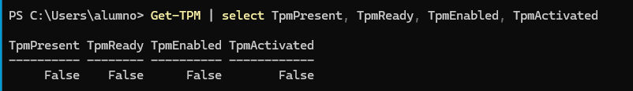
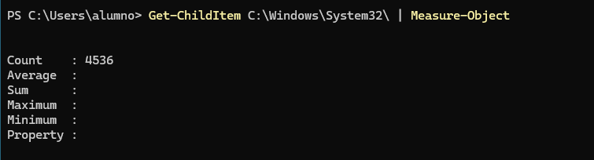
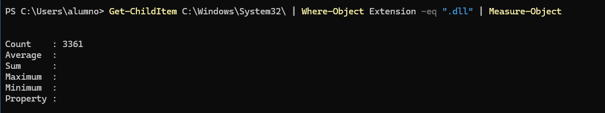
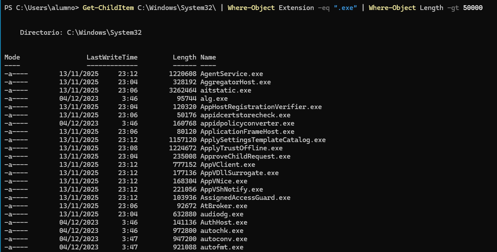
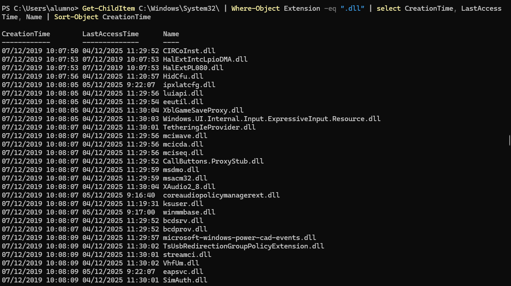
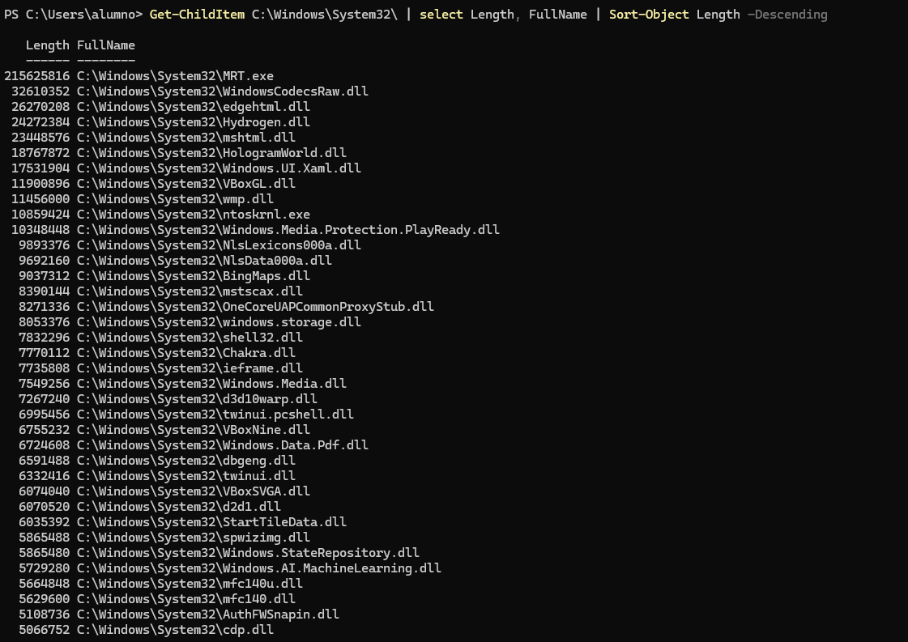
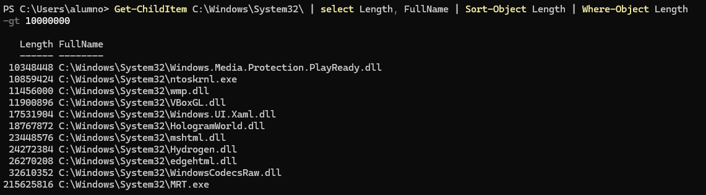
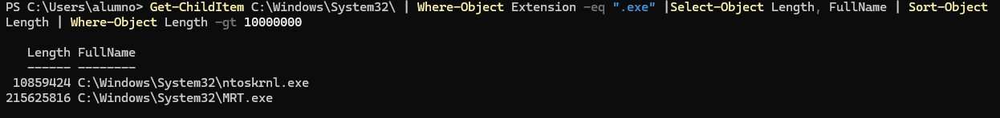
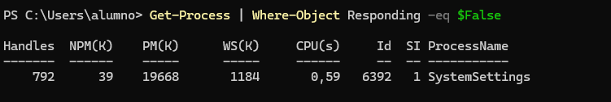
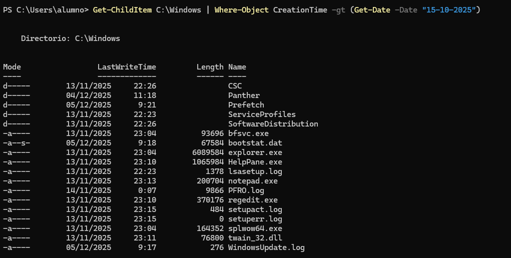

#### [Volver a Unidad 6](../index.md)

------------

# Unidad 6 - Práctica 2: El pipeline en Powershell.

## Parte 1

1. El comando `Get-Date` muestra la fecha y hora actual. Muestra por pantalla únicamente el año en que estamos.

`Get-Date -Format "yyyy"`

2. Uno de los requisitos de Windows 11 es que es procesador tenga TPM habilitado. Powershell dispone del comando `Get-TPM` que nos muestra información sobre este módulo. Muestra por pantalla, en formato tabla, las propiedades `TpmPresent`, `TpmReady`, `TpmEnabled` y `TpmActivated`.

Por defecto ya lo muestra en formato tabla:

`Get-TPM | select TpmPresent, TpmReady, TpmEnabled, TpmActivated`

## Parte 2

1. Muestra por pantalla el número de ficheros y directorios que hay en ese directorio.

`Get-ChildItem C:\Windows\System32\ | Measure-Object`

2. Los objetos devueltos por el comando anterior tienen una propiedad denominada Extension, que indica la extensión del archivo. Calcula el número de ficheros en el directorio que tienen la extensión .dll.

`Get-ChildItem C:\Windows\System32\ | Where-Object Extension -eq ".dll" | Measure-Object`

3. Muestra los ficheros del directorio con extensión .exe que tengan un tamaño superior a 50000 bytes.

`Get-ChildItem C:\Windows\System32\ | Where-Object Extension -eq ".exe" | Where-Object Length -gt 50000`

4. Muestra los ficheros de este directorio que tengan extensión .dll, ordenados por fecha de creación y mostrando únicamente las propiedades de fecha de creación (CreationTime), último acceso (LastAccessTime) y nombre (Name).

`Get-ChildItem C:\Windows\System32\ | Where-Object Extension -eq ".dll" | select CreationTime, LastAccessTime, Name | Sort-Object CreationTime`

5. Muestra el tamaño (Length) y nombre completo (FullName) de todos los ficheros del directorio ordenados por tamaño en sentido descendente.

`Get-ChildItem C:\Windows\System32\ | select Length, FullName | Sort-Object Length -Descending`

6. Muestra el tamaño y nombre completo de todos los ficheros del directorio que tengan un tamaño superior a 10MB (10000000 bytes) ordenados por tamaño.

`Get-ChildItem C:\Windows\System32\ | select Length, FullName | Sort-Object Length | Where-Object Length -gt 10000000`

7. Muestra el tamaño y nombre completo de todos los ficheros del directorio que tengan un tamaño superior a 10MB y extensión .exe ordenados por tamaño.

`C:\Windows\System32\ | Where-Object Extension -eq ".exe" |Select-Object Length, FullName | Sort-Object Length | Where-Object Length -gt 10000000`

## Parte 3

1. Muestra todos los procesos que tienen el estado Responding puesto a False, es decir, todos los procesos del sistema que se hayan colgado.

`Get-Process | Where-Object Responding -eq $False`

2. Muestra todos los ficheros de C:\Windows que hayan sido creados con fecha posterior al 15 de octubre de este año.

`Get-ChildItem C:\Windows | Where-Object CreationTime -gt (Get-Date -Date "15-10-2025")`

------------

#### [Volver a Unidad 6](../index.md)