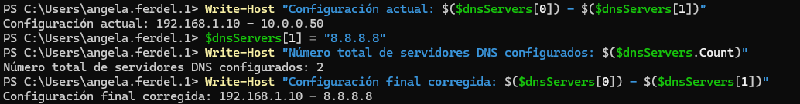
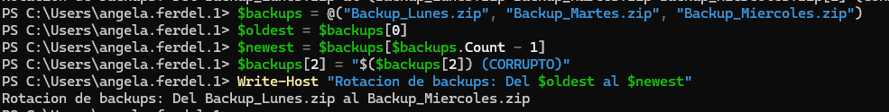
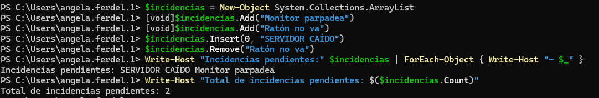
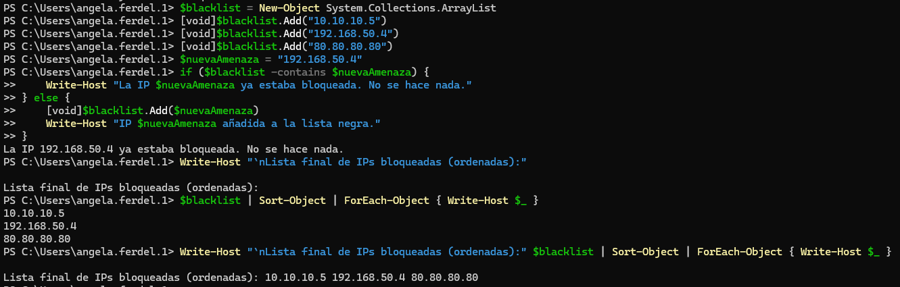
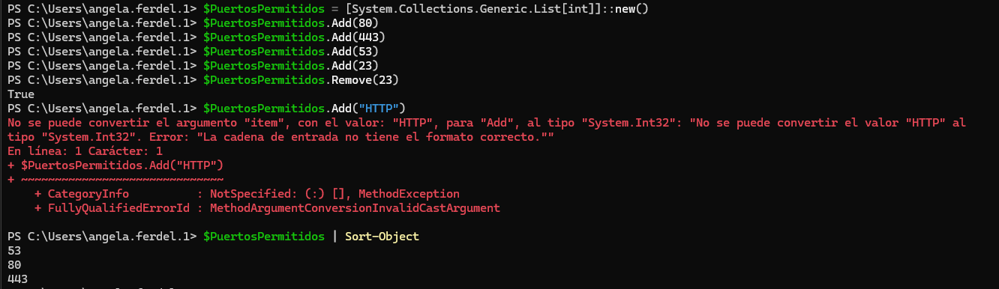
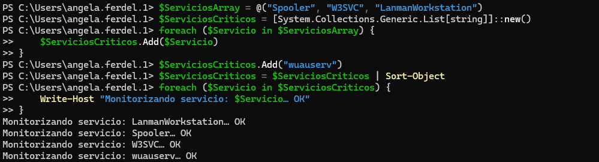
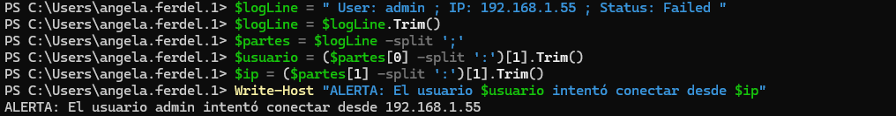
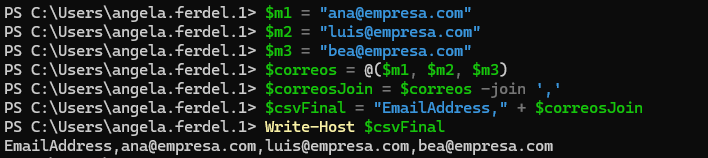

#### [Volver a Unidad 6](../index.md)

------------

# Unidad 6 - Práctica 4: Manipulación de colecciones en PowerShell.

## Bloque I - Arrays fijos

### 1. Reconfiguración de DNS y Verificación

Pasos a realizar: 

- Declara el array con los valores iniciales: 192.168.1.10 (Primario) y 10.0.0.50 (Secundario erróneo).
- Muestra en pantalla: “Configuración actual: [Primario] - [Secundario]”.
- Accede directamente al índice correspondiente y cambia la IP del secundario por la de Google: 8.8.8.8.
- Muestra en pantalla el número total de servidores DNS configurados.
- Muestra la configuración final corregida.

```
    $dnsServers = @("192.168.1.10", "10.0.0.50")

    Write-Host "Configuración actual: $($dnsServers[0]) - $($dnsServers[1])"

    $dnsServers[1] = "8.8.8.8"

    Write-Host "Número total de servidores DNS configurados: $($dnsServers.Count)"

    Write-Host "Configuración final corregida: $($dnsServers[0]) - $($dnsServers[1])"
```



### 2. Rotación de logs de backups (LIFO - Last In, First Out)

Pasos a realizar:

- Declara el array con las siguientes cadenas: Backup_Lunes.zip, Backup_Martes.zip, Backup_Miercoles.zip.
- Guarda en una variable $oldest el primer elemento.
- Guarda en una variable $newest el último elemento.
- El backup del Miércoles ha salido corrupto. Modifica el último elemento del array añadiéndole el texto “ (CORRUPTO)” al final del nombre.
- Imprime un resumen: “Rotación de backups: Del [Viejo] al [Nuevo]”.

```
$backups = @("Backup_Lunes.zip", "Backup_Martes.zip" "Backup_Miercoles.zip")

$oldest = $backups[0]

$newest = $backups[$backups.Count - 1]

$backups[2] = "$($backups[2]) (CORRUPTO)"

Write-Host "Rotación de backups: Del $oldest al $newest"
```



## Bloque II - ArrayLists

### 3. Gestión de Cola de incidencias (Priorización)

Pasos a realizar:

- Crea un ArrayList vacío.
- Añade las incidencias: “Monitor parpadea” y “Ratón no va”. (Recuerda ocultar la salida por pantalla del .Add()).
- Llega una urgencia: Inserta en la posición 0 la incidencia: “SERVIDOR CAÍDO”.
- El técnico resuelve la incidencia del “Ratón”. Búscala por su nombre y elimínala de la lista.
- Imprime la lista actual de tareas pendientes y cuenta cuántas quedan.

```
$incidencias = New-Object System.Collections.ArrayList

[void]$incidencias.Add("Monitor parpadea")
[void]$incidencias.Add("Ratón no va")

$incidencias.Insert(0, "SERVIDOR CAÍDO")

$incidencias.Remove("Ratón no va")

Write-Host "Incidencias pendientes:"
$incidencias | ForEach-Object { Write-Host "- $_" }

Write-Host "Total de incidencias pendientes: $($incidencias.Count)"
```



### 4. Validación de lista negra de IPs (Seguridad)

Pasos a realizar:

- Inicializa un ArrayList con las IPs ya bloqueadas: 10.10.10.5, 192.168.50.4, 80.80.80.80.
- Declara una variable $nuevaAmenaza = "192.168.50.4".
- Usa una estructura if para:
    - Si la IP ya está en la lista, muestra: “La IP [IP] ya estaba bloqueada. No se hace nada.”
    - Si no está, añádela a la lista y muestra: “IP [IP] añadida a la lista negra.”
- Muestra la lista final ordenada alfabéticamente

```
$blacklist = New-Object System.Collections.ArrayList
[void]$blacklist.Add("10.10.10.5")
[void]$blacklist.Add("192.168.50.4")
[void]$blacklist.Add("80.80.80.80")

$nuevaAmenaza = "192.168.50.4"

if ($blacklist -contains $nuevaAmenaza) {
    Write-Host "La IP $nuevaAmenaza ya estaba bloqueada. No se hace nada."
} else {
    [void]$blacklist.Add($nuevaAmenaza)
    Write-Host "IP $nuevaAmenaza añadida a la lista negra."
}

Write-Host "`nLista final de IPs bloqueadas (ordenadas):"
$blacklist | Sort-Object | ForEach-Object { Write-Host $_ }
```



## Bloque III - Listas genéricas

### 5. Hardening de puertos de Firewall (List[int])

Pasos a realizar:

- Instancia una nueva lista genérica que solo acepte Enteros: [System.Collections.Generic.List[int]]::new().
- Añade los puertos estándar: 80, 443, 53.
- Por error, alguien abrió el puerto Telnet (23). Añádelo a la lista.
- Auditoría de seguridad: Elimina el puerto 23 de la lista.
- Intenta añadir (solo escribe la línea comentada) el texto “HTTP” a la lista y explica en un comentario qué error daría.
- Muestra la lista de puertos permitidos ordenada de menor a mayor.

```
$PuertosPermitidos = [System.Collections.Generic.List[int]]::new()

$PuertosPermitidos.Add(80)
$PuertosPermitidos.Add(443)
$PuertosPermitidos.Add(53)

$PuertosPermitidos.Add(23)

$PuertosPermitidos.Remove(23)

$PuertosPermitidos.Add("HTTP")

$PuertosPermitidos | Sort-Object
```



> Al intentar añadir el puerto **HTTP** da error porque no permite strings.

### 6. Inventario de servicios críticos (List[string])

Pasos a realizar:

- Crea una lista genérica de Strings a partir de un array existente (::new($array)): Array origen: Spooler, W3SVC, LanmanWorkstation.
- Te das cuenta de que falta el servicio de actualizaciones. Añade “wuauserv”.
- Ordena la lista alfabéticamente.
- Recorre la lista (foreach) y para cada elemento muestra el mensaje: “Monitorizando servicio: [NombreServicio]… OK”.

```
$ServiciosArray = @("Spooler", "W3SVC", "LanmanWorkstation")

$ServiciosCriticos = [System.Collections.Generic.List[string]]::new()

foreach ($Servicio in $ServiciosArray) {
    $ServiciosCriticos.Add($Servicio)
}

$ServiciosCriticos.Add("wuauserv")

$ServiciosCriticos = $ServiciosCriticos | Sort-Object

foreach ($Servicio in $ServiciosCriticos) {
    Write-Host "Monitorizando servicio: $Servicio… OK"
}
```



## Bloque IV - Manipiulación de texto

### 7. Análisis de Log de usuario

**Entrada:** $logLine = " User: admin ; IP: 192.168.1.55 ; Status: Failed " (Nota los espacios extra al principio y final).

Pasos a realizar:

- Limpia los espacios en blanco sobrantes del principio y el final de la cadena original.
- Divide la cadena usando el punto y coma ; como separador.
- El primer elemento será “User: admin”. Vuelve a dividirlo para quedarte solo con “admin”.
- El segundo elemento es la IP. Límpialo para obtener solo “192.168.1.55”.
- Muestra un mensaje final claro: “ALERTA: El usuario [Usuario] intentó conectar desde [IP]”.

```
$logLine = " User: admin ; IP: 192.168.1.55 ; Status: Failed "

$logLine = $logLine.Trim()

$partes = $logLine -split ';'

$usuario = ($partes[0] -split ':')[1].Trim()

$ip = ($partes[1] -split ':')[1].Trim()

Write-Host "ALERTA: El usuario $usuario intentó conectar desde $ip"
```



### 8. Generador de CSV para recursos humanos

Pasos a realizar:

- Tienes tres variables con correos: $m1="ana@empresa.com", $m2="luis@empresa.com", $m3="bea@empresa.com".
- Crea un array temporal que contenga esas tres variables.
Utiliza el operador -join para crear una única cadena de texto separada por comas ,.
- Al resultado final, añádele manualmente el encabezado “EmailAddress,” al principio.
- Muestra el resultado, que debería parecerse al contenido de un archivo .csv.

```
$m1 = "ana@empresa.com"
$m2 = "luis@empresa.com"
$m3 = "bea@empresa.com"

$correos = @($m1, $m2, $m3)

$correosJoin = $correos -join ','

$csvFinal = "EmailAddress," + $correosJoin

Write-Host $csvFinal
```



------------

#### [Volver a Unidad 6](../index.md)