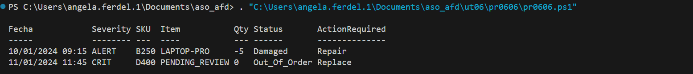

#### [Volver a Unidad 6](../index.md)

------------

# Unidad 6 - Práctica 6: Limpieza de logs (II).

Se pide realizar un script que de formato a una serie de logs.

Para ello creamos un script y lo guardamos con extensión .ps1

Se ejecuta desde línea de comandos para comprobar que funciona.

## Datos de entrada

```
$movimientosCrudos = @"
[LOG-OK] SKU:A199 :: 2024.01.10_08:00 :: Item:Smartphone_X :: Qty:50 :: Status:In_Stock
[LOG-ALERT] SKU:B250 :: 10-01-2024 09:15 :: Item:LAPTOP-PRO :: Qty:-5 :: Status:Damaged
[LOG-OK] SKU:C312 :: 2024/01/10_10:30 :: Item:tablet_air :: Qty:120 :: Status:In_Stock
[LOG-CRIT] SKU:D400 :: 11/01/2024_11:45 :: Item:UNKNOWN_ITEM :: Qty:0 :: Status:Out_Of_Order
"@
```

## Script

```powersehll
$movimientosCrudos = @"
[LOG-OK] SKU:A199 :: 2024.01.10_08:00 :: Item:Smartphone_X :: Qty:50 :: Status:In_Stock
[LOG-ALERT] SKU:B250 :: 10-01-2024 09:15 :: Item:LAPTOP-PRO :: Qty:-5 :: Status:Damaged
[LOG-OK] SKU:C312 :: 2024/01/10_10:30 :: Item:tablet_air :: Qty:120 :: Status:In_Stock
[LOG-CRIT] SKU:D400 :: 11/01/2024_11:45 :: Item:UNKNOWN_ITEM :: Qty:0 :: Status:Out_Of_Order
"@ -split "`r`n"

$objetos = foreach ( $linea in $movimientosCrudos){

    #Si empeza por [LOG-OK] nos lo saltamos usando un if
    if ( $linea.StartsWith("[LOG-OK]")){ continue }

    #Dividimos cada linea en partes separadas por '::'
    $partes = $linea -split"::"

    #Cogemos el nivel de importancia y el numero SKU
    $Severity = $partes[0].Split(']')[0].Replace('[', '').Split("-")[1].Trim()
    $SKU = $partes[0].Split(':')[1].Trim()

    #Pasamos la fecha a un formato limpio
    $fechaLimpia = $partes[1].Replace('_', ' ').Replace('-', '/').Replace('.', '/')
    $timeStamp = (Get-Date $fechaLimpia).ToString("dd/MM/yyyy HH:mm")

    #Seleccionamos los items
    $item = $partes[2].Split(':')[1].Trim().ToUpper()
    #Si el item es unknown le colocamos un valor diferente
    if ( $item -eq "UNKNOWN_ITEM" ) { $item = "PENDING_REVIEW" }

    #Cogemos el valor qty
    $qty = $partes[3].Split(':')[1].Trim()

    #Cogemos el valor Status
    $status = $partes[4].Split(':')[1].Trim()

    #Si el valor es Damaged o Out_Of_Order guardaremos el valor para una nueva columna
    if ( $status -eq "Damaged" ) { $accionRequerida = "Repair" }
    elseif ( $status -eq "Out_Of_Order" ) { $accionRequerida = "Replace" }
    else { 
        $accionRequerida = ""
    }

    [PSCustomObject]@{
        Fecha    =   $timeStamp
        Severity =   $Severity
        SKU      =   $SKU
        Item     =   $item
        Qty      =   $qty
        Status   =   $status
        ActionRequired = $accionRequerida
    }
}

$objetos | Export-Csv -Path "reporte_inventario.csv"
$objetos | Format-Table -AutoSize
```

## Comprobación de la ejecución



------------

#### [Volver a Unidad 6](../index.md)
