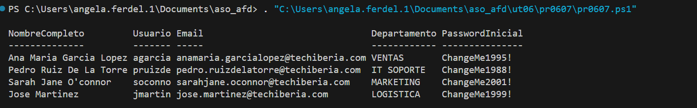

#### [Volver a Unidad 6](../index.md)

------------

# Unidad 6 - Práctica 7: Limpieza de datos de usuarios.

Se pide crear un script para limpiar los datos de los usuarios que se le pasan al administrador en texto plano.

Como campos adicionales se pide crear un usuario, un correo electrónico y una contraseña para cada usuario.

## Datos de entrada

Los datos de entrada se guardan en un fichero llamado `nuevos_empleados_raw.txt`

```
GARCIA LOPEZ, ANA MARIA|MAD-VENTAS-01|1995/05/12
RUIZ DE LA TORRE, PEDRO|BCN-IT_SOPORTE-02|1988/11/23
O'CONNOR, SARAH JANE|BIO-MARKETING-05|2001/02/15
MARTINEZ, JOSE|SEV-LOGISTICA-09|1999/12/30
```

## Script

```poweshell
$datosUsuarios = Get-Content -Path "C:\Users\angela.ferdel.1\Documents\aso_afd\ut06\pr0607\nuevos_empleados_raw.txt"

$objetos = foreach ($linea in $datosUsuarios) {

    $partes = $linea.Split("|")

    $nombre = $partes[0].Split(",")[1].Trim()
    $apellidos = $partes[0].Split(",")[0].Trim()

    $nombreCompleto = $nombre + " " + $apellidos
    $nombreCompleto = ($nombreCompleto -split ' ' | ForEach-Object { $_.Substring(0,1).ToUpper() + $_.Substring(1).ToLower() }) -join ' '

    $limpioNombre = ($nombre -replace "[^a-zA-Z]","")
    $limpioApellidos = ($apellidos -replace "[^a-zA-Z]","")

    $primerApellido = $apellidos.Split(" ")[0] -replace "[^a-zA-Z]",""
    if($primerApellido.Length > 6) {
        $SamAccountName = (
            $limpioNombre.Substring(0,1) +
            $limpioApellidos.Substring(0,5)
        ).ToLower()
    } else {
        $SamAccountName = (
            $limpioNombre.Substring(0,1) +
            $primerApellido 
        ).ToLower()
    }
   
    $correo = (
        (($nombreCompleto.Split(" ") | ForEach-Object { $_ -replace "[^a-zA-Z]"}) -join '.') +
        "@techiberia.com"
    ).ToLower()

    $departamento = $partes[1].Split("-")[1].Replace("_"," ").Trim()

    $anhoNacimiento = $partes[2].Split("/")[0].Trim()
    $pass = "ChangeMe" + $anhoNacimiento + "!"

    [PSCustomObject] @{
        NombreCompleto  =   $nombreCompleto
        Usuario         =   $SamAccountName
        Email           =   $correo
        Departamento    =   $departamento
        PasswordInicial =   $pass
    }

}

$objetos | Export-Csv -Path "uusarios_importar.csv"
$objetos | Format-Table -AutoSize
```

## Comprobación de la ejecución



------------

#### [Volver a Unidad 6](../index.md)
