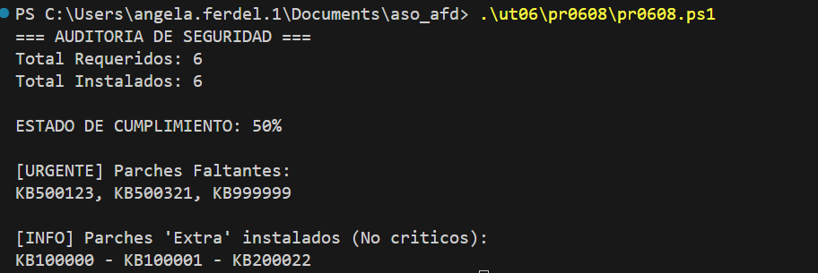

#### [Volver a Unidad 6](../index.md)

------------

# Unidad 6 - Práctica 8: Comparación de listas.

En este ejercicio trataremos los datos de un array o lista para darles un formato y presentar los datos para una auditoría.

## Datos de entrada

```powershell
# Lista de parches CRÍTICOS requeridos por el boletín de seguridad
$kbsRequeridos = @("KB500123", "KB409999", "KB890830", "KB500556", "KB500321", "KB999999")

# Lista de parches INSTALADOS actualmente en el servidor 
# Nota: Están desordenados y podría haber parches viejos que no son críticos.
$kbsInstalados = @("KB100000", "KB500556", "KB409999", "KB100001", "KB890830", "KB200022")
```

## Script

```powershell
# Lista de parches CRÍTICOS requeridos por el boletín de seguridad
$kbsRequeridos = @("KB500123", "KB409999", "KB890830", "KB500556", "KB500321", "KB999999")

# Lista de parches INSTALADOS actualmente en el servidor 
# Nota: Están desordenados y podría haber parches viejos que no son críticos.
$kbsInstalados = @("KB100000", "KB500556", "KB409999", "KB100001", "KB890830", "KB200022")

$kbsFaltantes = @()
$kbsExtra = @()

foreach ($datoRequerido in $kbsRequeridos) {
    if ($datoRequerido -notin $kbsInstalados) {
        $kbsFaltantes += $datoRequerido
    }
}

foreach ($datoInstalado in $kbsInstalados) {
    if ($datoInstalado -notin $kbsRequeridos) {
        $kbsExtra += $datoInstalado
    }
}

$porcentaje = (100 * ($kbsRequeridos.Length - $kbsFaltantes.Length) / $kbsRequeridos.Length).ToString() + "%"

"=== AUDITORIA DE SEGURIDAD ==="
"Total Requeridos: $($kbsRequeridos.Length)"
"Total Instalados: $($kbsInstalados.Length)"
""
"ESTADO DE CUMPLIMIENTO: $porcentaje"
""

"[URGENTE] Parches Faltantes:"
($kbsFaltantes -join ", ")

""
"[INFO] Parches 'Extra' instalados (No criticos):"
($kbsExtra -join " - ")
```

> Otras formas de imprimirlo por panatalla es poniendo `Write-Host` delante de cada linea que queremos imprimir, por ejemplo:

`Write-Host "=== AUDITORIA DE SEGURIDAD ==="`

>Otra forma es metinedo todo lo que queremos imprimir en una variable y luego la llamamos:

``` 
$reporteSeguridad = @"
    lo que queremos imprimir iría aquí escrito
"

$reporteSeguridad 
```


## Comprobación de la ejecución



------------

#### [Volver a Unidad 6](../index.md)

