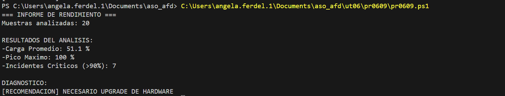

#### [Volver a Unidad 6](../index.md)

------------

# Unidad 6 - Práctica 9: Análisis de carga del procesador.

Para este script, deberemos utilizar un array de datos para hacer calculos sobre el comprotamiento de la CPU.

## Datos de entrada

```
$muestrasCPU = @(15, 12, 18, 20, 45, 88, 95, 99, 100, 98, 55, 22, 15, 10, 12, 14, 95, 99, 100, 10)
```

## Script

```powershell
$muestrasCPU = @(15, 12, 18, 20, 45, 88, 95, 99, 100, 98, 55, 22, 15, 10, 12, 14, 95, 99, 100, 10)
$suma=0
$maximo=0
$contadorCritico=0
$mensaje=''

foreach ($dato in $muestrasCPU) {
    $suma += $dato
    if($dato -gt $maximo){
        $maximo=$dato
    }
    if($dato -gt 90){
        $contadorCritico++ 
    }
}
$cargaPromedio = $suma / $muestrasCPU.Length
if($cargaPromedio -gt 70 -or $contadorCritico -gt 3){
    $mensaje="[RECOMENDACION] NECESARIO UPGRADE DE HARDWARE"
} else {
    $mensaje = "[RECOMENDACION] FALSA ALARMA. EL SERVIDOR AGUANTA"
}

"=== INFORME DE RENDIMIENTO ==="
"Muestras analizadas: "+$muestrasCPU.Length
" "
"RESULTADOS DEL ANALISIS:"
"-Carga Promedio: "+$cargaPromedio+" %"
"-Pico Maximo: "+$maximo+" %"
"-Incidentes Criticos (>90%): "+$contadorCritico
" "
"DIAGNOSTICO:"
$mensaje
```

## Comprobación de la ejecución



------------

#### [Volver a Unidad 6](../index.md)
